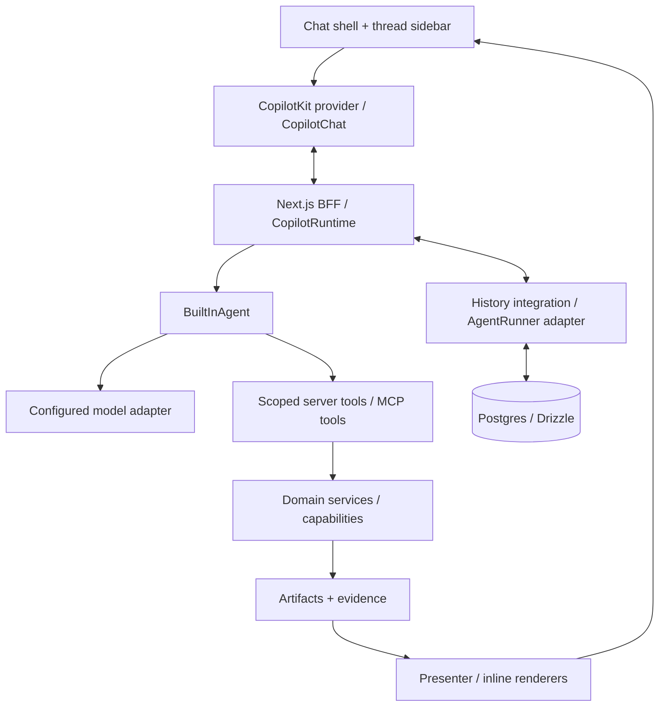

# PRD — AI-native Chat Core

Ngày cập nhật: **2026-10-06**. Sản phẩm: **Hackathon Starter Kit**. Phạm vi bản này: **yêu cầu sản phẩm, catalog feature và roadmap hiện hành**.

Đây là PRD hiện hành cho phần platform mình xây. Core là một app chat AI kiểu ChatGPT: có khung chat, lịch sử hội thoại, agent gọi tools và kết quả xuất hiện ngay trong cuộc trò chuyện. Các problem templates do bạn xây sẽ cắm vào core này. Đọc [phân công](build-ownership.md) và [problem templates](problem-templates.md) để ghép hai phần.

## 1. Mục tiêu sản phẩm

Khi nhận đề thi, team có sẵn một app chat hoạt động và một nền tảng dùng chung. Để đổi bài toán, team bổ sung **schema + prompt + workflow + sources + rules + presenter + 1–2 custom tools + branding**; không phải dựng lại chat, runtime, history hay transport.

Người dùng có thể:

- Tạo cuộc trò chuyện, gửi câu hỏi và thấy câu trả lời stream.
- Quay lại hội thoại cũ sau reload hoặc restart server và hỏi tiếp đúng context.
- Đưa tài liệu/dữ liệu vào cuộc trò chuyện khi adapter tương ứng được bật.
- Theo dõi agent gọi tool, đọc nguồn, xem kết quả và xác nhận hành động khi cần.
- Dùng cùng core cho nhiều domain; xem card, bảng, biểu đồ hoặc report do template cung cấp.

Core không cam kết tự giải mọi đề bằng một prompt. Khả năng xử lý domain phụ thuộc tools, dữ liệu, rules và capabilities đã được tích hợp.

### Kết quả cần đạt

| Kết quả | Cách nghiệm thu |
|---|---|
| Có app chat dùng được | Gửi câu hỏi → stream → hoàn tất; stop/error/retry có hành vi rõ |
| Có lịch sử bền vững | Tạo hai thread, reload và restart, mở lại đúng messages và hỏi tiếp |
| Agent làm việc được | Gọi một server tool thật, thấy tiến trình và kết quả trong chat |
| Đổi domain dễ | Thêm domain config/tool/presenter mà không sửa chat shell hoặc protocol |
| Starter độc lập | Không cần secrets/tài liệu repo thi; no-env chat hiện notice `Chưa kết nối` |

## 2. Phạm vi và quyết định nền tảng

- **Chat-first**: live chat và durable history đi trước custom workflow engine, ingestion hoặc analytics đầy đủ.
- **Design giống bố cục ChatGPT, theme trắng cố định** theo ảnh/yêu cầu user; main trắng, sidebar xám nhẹ, transcript/composer giữa. [White UI design](superpowers/specs/2026-10-05-chat-white-ui-design.md) và [UI plan](superpowers/plans/2026-10-05-chat-white-ui-implementation-plan.md) đã triển khai ở C01; browser dark preference không đổi theme.
- **Một người dùng local** cho baseline; chưa xây multi-user login, multi-tenant management, tenant switching hoặc tenant RBAC. Giữ server-owned identity/adapter boundary để mở rộng sau; các IDs trong contracts không đồng nghĩa phải xây tenant product features.
- **Thông báo lỗi thống nhất trong khung chat: `Chưa kết nối`**. Thiếu config, mất kết nối và mọi technical failure đi qua cùng notice; không đưa lỗi SDK/provider/tool/MCP hoặc stack trace lên UI. Chi tiết chỉ giữ trong server diagnostics đã loại secrets. Không fallback sang demo assistant replies.
- **CopilotKit OSS làm nền mặc định**: tái sử dụng chat UI, runtime, agent loop, tool calling, shared state và HITL. Intelligence là extension tùy chọn có điều kiện, không là prerequisite. [OSS vs Intelligence](https://docs.copilotkit.ai/concepts/oss-vs-enterprise).
- **Next.js App Router + TypeScript + Next.js BFF**; **Postgres local Docker + Drizzle** là đích lưu trữ của app. Docker project, ports và volumes riêng cho starter.
- **Package manager là Bun 1.4.2**, chốt theo yêu cầu user ngày 2026-10-06: dùng `bun.lock`, `bun install --frozen-lockfile`, `bun add --exact` và `bun run <script>` trong toàn bộ spec/plan. Next.js/Vitest vẫn dùng Node 24 LTS; unit tests chạy qua `bun run test`.
- **CopilotKit v2** khi tích hợp; kiểm tra release ổn định và compatibility trước khi pin. Không tự nâng packages hiện có trong lần cập nhật PRD này.
- Luồng mặc định: **CopilotChat → CopilotRuntime → BuiltInAgent → configured model + tools**. Dùng model instance tương thích AI SDK trước khi chọn Factory mode; Factory chỉ khi cần kiểm soát model loop đặc biệt. [Runtime](https://docs.copilotkit.ai/backend/copilot-runtime), [model selection](https://docs.copilotkit.ai/model-selection), [custom agent](https://docs.copilotkit.ai/backend/custom-agent).
- App tự sở hữu tích hợp Postgres/history và thread sidebar cho baseline OSS. Không giả định CopilotKit đã có Postgres runner dựng sẵn. [AgentRunner](https://docs.copilotkit.ai/backend/agent-runner).
- **pgEdge MCP host local chỉ dành cho coding agent** để kiểm tra/query database khi phát triển. Không đăng ký vào CopilotKit/app agent, không đưa URL/token pgEdge vào app config hoặc domain packs. App dùng PostgreSQL qua Drizzle/repositories; business MCP tools có server riêng trong app.
- **MCP TypeScript SDK chính thức** từ [modelcontextprotocol/typescript-sdk](https://github.com/modelcontextprotocol/typescript-sdk) là lựa chọn user yêu cầu cho MCP adapter. Ưu tiên stable v2 cho code mới; kiểm chứng CopilotKit/AI SDK bridge và pin exact versions lúc triển khai C03.
- Starter dùng cấu hình riêng. BTC Gateway chỉ là binding tùy chọn nếu sau này chủ động cấu hình; không đọc key, tài liệu hay config của repo thi.
- Mình xây shared platform; bạn xây FE composition và backend flow của problem templates. Generic cards là phần mở rộng của platform, không phải điều kiện để hoàn tất chat core.

## 3. Đọc trạng thái feature cho đúng

**Ưu tiên:** P0 = bắt buộc để nghiệm thu chat core; P1 = bổ sung khả năng plug-and-play sau core; P2 = tùy chọn theo đề.

**Trạng thái repo:** `Có implementation` = code đã tồn tại; `Contract/validator` = đã có schema hoặc boundary, chưa có luồng chạy hoàn chỉnh; `Fixture` = dữ liệu giả có nhãn; `Chưa xây` = chưa có implementation.

**Nguồn cung cấp:** `SDK` là khả năng đã có trong hệ sinh thái CopilotKit, cần cài/wire/config; `App` là phần starter phải xây; `Intelligence` có điều kiện entitlement/license. **SDK có feature không có nghĩa repo đã triển khai feature đó.**

### Inventory baseline tại lúc viết PRD — 2026-10-05

Snapshot này giữ để đọc nền ban đầu. Trạng thái hiện hành xem mục 10: chat UI/runtime và Docker đã có implementation; durable history và agent-to-MCP bridge chưa có.

| Phần hiện có | Trạng thái và giới hạn |
|---|---|
| Next.js/React/TypeScript bootstrap | Có implementation; trang `/` là workspace chat trắng với actual CopilotKit v2 UI |
| Chat C01 UI/runtime/model | Có implementation; stream, Stop, manual Retry, New chat, readiness/no-env và masked errors; transcript/runner ephemeral, reload reset |
| `/api/health`, `/api/domains` | Có implementation; health báo `mode: skeleton`, domains trả bốn manifests |
| `/api/demo/:domainId`, dataset rows API | Fixture có validation/pagination; production từ chối fixture API |
| `/playground` | Danh sách link tới fixture JSON; chưa phải gallery React cards |
| `src/contracts` | Contract/validator cho artifacts, documents, datasets, evidence, sources, runs, domains, errors, result views và UI blocks |
| UI block registry | 19 block schemas; chưa có `BlockRenderer` hoặc generic card implementations |
| Artifact schema registry | Có implementation cho đăng ký kind/version và validation dữ liệu JSON; chưa persist artifacts |
| Workflow/domain validation | Có implementation kiểm tra cấu trúc/dependencies/catalogs; chưa execute workflow |
| Capability/ports/services/agent definitions | Interface/boundary; chưa có executor, agent loop, repositories hoặc model calls |
| Source catalog | Có constructor/duplicate validation; catalog mặc định rỗng, chưa có source profiles/crawler |
| Bốn domain seeds | Dataset analysis, document review, research report, risk analyzer; workflows rỗng, dùng synthetic fixtures |
| `/api/runs` | Placeholder trả `501 feature_unavailable`; chưa tạo business run |
| Feature flags | Server container đang tắt runs/artifacts/uploads/datasets/storage/model/sources/parsers |
| Toolchain checks/tests | Check, 123 unit/integration tests, domain validation, build, 21 actual SDK chat browser cases và 1 baseline case đạt với controlled OpenAI provider; chưa kiểm tra external model |

**Chưa có tại snapshot baseline này:** packages CopilotKit/AI SDK/MCP SDK, chat UI/provider/runtime, live model, thread storage/history, Postgres migrations/compose, pgEdge MCP integration, workflow runner, generic cards và reusable capability algorithms. Các bảng feature dưới đây đều là **yêu cầu cần tích hợp/xây**, trừ inventory nêu trên.

## 4. Trải nghiệm người dùng

### Luồng chính

1. Mở app: sidebar có New chat và danh sách hội thoại; vùng chat mới có hướng dẫn ngắn và composer.
2. Gửi câu hỏi: app tạo thread khi cần, hiện user message, stream assistant response và cho phép Stop.
3. Agent cần tool: hiện tên/trạng thái tool; kết quả được dùng để trả lời hoặc render inline.
4. Tool có tác động cần xác nhận: hiện nội dung hành động; chỉ execute sau approval hợp lệ.
5. Reload/mở lại app: chọn thread cũ, đọc lịch sử và hỏi tiếp; không nhân đôi messages/tool calls.
6. Chọn domain hoặc đưa input: tools/context/presenter của pack được đăng ký; giữ nguyên chat shell.

### Bố cục

- Visual direction: [ChatGPT-style white workspace](superpowers/specs/2026-10-05-chat-white-ui-design.md); desktop sidebar 280px, transcript/composer cột tối đa 768px, mobile drawer và theme trắng cố định.
- Sidebar trái: New chat, lịch sử, rename/archive/delete; search history bổ sung ở P1.
- Trung tâm: transcript, Markdown/code, tool progress, citations và inline result blocks.
- Composer: multiline, gửi, Stop khi đang chạy; attachments/microphone chỉ hiện khi feature sẵn sàng.
- Result/source panel tùy chọn: xem artifact/report/evidence mà vẫn giữ conversation context.
- Responsive: sidebar đóng/mở trên mobile; bàn phím, focus, scroll và contrast đủ dùng.

### Notice và error behavior đã chốt

- Copy duy nhất cho technical unavailable/failure trên chat là **`Chưa kết nối`**, hiển thị bằng notice trong khung chat. Đây là trạng thái hệ thống, không phải assistant answer giả lập.
- Áp dụng cho thiếu model/config, network/runtime/stream errors, timeout, provider rejection/rate limit và lỗi tool/MCP/history/storage khi chúng ảnh hưởng thao tác chat. Nội bộ vẫn phân biệt đúng cause/status; UI dùng cùng copy.
- Không render raw error messages, HTTP status/provider names, stack traces, SDK default error bubbles/toasts hoặc technical fallback text do model tạo. Khi integrate SDK phải kiểm chứng cả error surfaces và tool-result projection, không chỉ catch fetch ở composer.
- Một failure chỉ tạo một notice đang hiển thị; repeated errors không spam transcript/toasts. Notice được thay/cập nhật khi reconnect hoặc retry thành công. Không lưu notice thành model conversation message.
- Lỗi giữa stream giữ nội dung đã nhận; execution ghi failed/interrupted đúng nguyên nhân, UI thêm notice chung và kết thúc loading. Nội dung partial không được đánh dấu completed.
- Khung chat vẫn xem được khi chưa config. Không tự gửi request nếu đã biết model chưa sẵn; gửi/retry khi unavailable dùng cùng notice. Retry là hành động rõ ràng, không tạo user messages trùng.
- Stop do người dùng chủ động, empty state, input validation và thiếu evidence là trạng thái thông thường của sản phẩm; không tự biến chúng thành exception hoặc in lỗi kỹ thuật. Lỗi execution thực sự vẫn dùng notice trên.
- Server logs có error code/correlation ID đủ debug; loại credentials và sensitive payload. Fallback UI không được che mất trạng thái lỗi trong persistence hoặc biến failure thành success.

Đây là kiến trúc đích. `threadId` xác định hội thoại; agent execution ID xác định lần agent chạy; business `runId` xác định workflow nghiệp vụ. Không dùng ba ID thay thế nhau. Tool nhẹ có thể gọi service trực tiếp; chỉ tạo business run khi thực sự cần workflow/artifacts.

## 5. Catalog feature của core

### A. Chat UI và hội thoại

CopilotKit có chat/popup/sidebar và điểm tùy biến giao diện; app chọn **CopilotChat trong workspace shell** cho trải nghiệm toàn màn hình. [Prebuilt components](https://docs.copilotkit.ai/prebuilt-components).

| ID | Feature / yêu cầu | Dùng lại / phần app xây | Ưu tiên |
|---|---|---|---|
| CHAT-01 | Chat toàn màn hình, multiline composer, Enter gửi/Shift+Enter xuống dòng | SDK chat; App shell, layout, labels và responsive | P0 |
| CHAT-02 | Stream assistant message; hiện trạng thái đang trả lời/tool đang chạy | SDK transport/chat; App states và scroll behavior | P0 |
| CHAT-03 | Stop execution; giữ nội dung nhận được với trạng thái interrupted | SDK lifecycle; App đồng bộ status/history và hủy tác vụ con | P0 |
| CHAT-04 | Markdown/code, copy nội dung, empty/loading/error/unavailable states | SDK renderer/customization; App cấu hình actions và thông báo | P0 |
| CHAT-05 | Retry lượt lỗi theo hành động rõ ràng, không tạo messages trùng | App policy và stable IDs; kiểm chứng hành vi SDK khi tích hợp | P0 |
| CHAT-06 | Suggested prompts/follow-up và domain-aware empty state | SDK extension points; App nội dung theo pack | P1 |
| CHAT-07 | Edit message, regenerate, branch conversation | App semantics/history/versioning; không giả định tự có đủ trong SDK | P2 |

### B. Threads và durable history

`InMemoryAgentRunner` không bảo toàn history sau restart. SDK có SQLite runner bền vững, nhưng baseline đã chọn Postgres nên cần integration riêng. Transcript gửi lên mỗi turn và history lưu server phải có một policy tránh lặp. [Runners](https://docs.copilotkit.ai/backend/agent-runner), [message history](https://docs.copilotkit.ai/backend/message-history).

| ID | Feature / yêu cầu | Dùng lại / phần app xây | Ưu tiên |
|---|---|---|---|
| HIST-01 | New chat; list/switch threads; active thread có URL ổn định | App thread repository/BFF/sidebar + SDK thread binding | P0 |
| HIST-02 | Persist user/assistant messages, tool calls/results và execution status | App Postgres integration với runner/event lifecycle | P0 |
| HIST-03 | Reload/restart mở lại đúng transcript và hỏi tiếp đúng context | App hydrate/reconcile; giữ tool call/result pairs hợp lệ | P0 |
| HIST-04 | Rename, archive, delete hội thoại; xác nhận delete trong UI | App thread metadata/actions và lifecycle dữ liệu liên quan | P0 |
| HIST-05 | Local operator identity do server sở hữu; một thread active execution tại một thời điểm | App identity boundary và concurrency; chưa xây multi-tenant UX/auth | P0 |
| HIST-06 | Search history, pagination và sort theo lần cập nhật | App indexed queries + sidebar search | P1 |
| HIST-07 | Reconnect/replay execution đang chạy khi mất kết nối | App/runner khả năng resume; không đánh đồng reopen transcript với resume | P1 |
| HIST-08 | Export conversation; retention policy; multi-device sync | App storage/API policy; sync chỉ khi auth/deployment hỗ trợ | P2 |

**Threads Drawer có sẵn trong hệ sinh thái nhưng cần Intelligence/entitlement**, nên không là sidebar mặc định của bản OSS. Có thể thay sidebar riêng bằng nó sau khi chủ động chọn integration phù hợp. [Threads Drawer](https://docs.copilotkit.ai/prebuilt-components/copilot-threads-drawer).

### C. Runtime, agent, model và độ tin cậy

| ID | Feature / yêu cầu | Dùng lại / phần app xây | Ưu tiên |
|---|---|---|---|
| AGENT-01 | Runtime self-host trên Next BFF; AG-UI streaming frontend/backend | SDK `CopilotRuntime`/handler/provider; App endpoint và server config | P0 |
| AGENT-02 | Một BuiltInAgent mặc định, system prompt và tools theo domain | SDK agent loop; App config/registration | P0 |
| AGENT-03 | Multi-step tool → result → assistant answer có giới hạn | SDK `maxSteps`; App chọn budget phù hợp, không để mặc định một bước khi cần tool loop | P0 |
| AGENT-04 | Model/gateway adapter dùng endpoint/model đã cấu hình | SDK custom language model; App server-only settings và compatibility | P0 |
| AGENT-05 | Timeout, cancellation, transient retry; nội bộ giữ đúng lỗi, chat chỉ notice `Chưa kết nối` | SDK `maxRetries`/lifecycle; App deadline, error projection và storage | P0 |
| AGENT-06 | Theo dõi token/call/time, cap output và chặn vượt budget | SDK params/usage khi có; App cost guard, usage records | P1 |
| AGENT-07 | Chọn model từ allowlist theo pack hoặc UI | App router/config; không nhận arbitrary provider credentials từ client | P1 |
| AGENT-08 | Fallback đổi model/provider theo cấu hình rõ ràng | App policy riêng: trigger, allowed targets, budget, audit; mặc định tắt | P2 |
| AGENT-09 | Nhiều agent và delegation log | SDK agent routing/shared state; App roles/delegate tools và giới hạn vòng lặp | P2 |
| AGENT-10 | Factory/custom framework khi BuiltInAgent không đủ | SDK adapter/factory; App tự wire model calls/tools/MCP/state cần thiết | P2 |

`maxRetries` là retry, **không phải bằng chứng automatic model/provider failover**. PRD không coi AGENT-08 là feature dựng sẵn đã xác nhận. [Advanced configuration](https://docs.copilotkit.ai/advanced-configuration). Delegation qua tools là pattern có ví dụ chính thức, cần app quản lý scope/cancellation/budget. [Sub-agents](https://docs.copilotkit.ai/multi-agent/subagents).

### D. Tools, MCP và approval — contracts liên quan đã có; execution chưa xây

| ID | Feature / yêu cầu | Dùng lại / phần app xây | Ưu tiên |
|---|---|---|---|
| TOOL-01 | MCP tools do team tự viết logic cho bài toán, có schema input/output và được agent gọi từ backend | Official MCP server SDK expose business handlers; official MCP client SDK discovery/call; CopilotKit bridge; App policy/output validation | P0 |
| TOOL-02 | Hiện tool arguments/status/result trong chat | SDK `useRenderTool`; App typed renderer, giới hạn nội dung hiển thị | P0 |
| TOOL-03 | Tool Registry theo domain/capability/readiness; enforce permissions | App registry/scope/budgets; không viết lại SDK tool protocol | P0 |
| TOOL-04 | Frontend tools cho selection/navigation hoặc UI interaction | SDK `useFrontendTool`; App allowlisted UI actions | P1 |
| MCP-01 | Kết nối MCP server cấu hình server-side; discover/call tools | Official MCP TypeScript SDK client/transport; bridge sang CopilotKit tools; App auth/lifecycle/timeout/name collisions | P0 cho connector C03; nhiều connectors là mở rộng P1 |
| MCP-02 | pgEdge Postgres MCP chạy local cho coding agent query/read DB khi phát triển | Dev tooling riêng; Docker server đã chạy; read-only DB grants và cấu hình MCP ở coding-agent client | Ngoài runtime/backlog tính năng app; không thuộc C03 |
| MCP-03 | MCP Apps tương tác khi server cung cấp UI tương thích | SDK runtime middleware; App sandbox/render policy; khác MCP tools thông thường | P2 |
| HITL-01 | Approval trước tool có external side effect | SDK HITL UI; App server enforcement với pending/approve/reject/expiry | P1, bắt buộc trước khi bật tool có side effect |

Server tools dùng schema/backend handler; renderers chỉ hiển thị. MCP có lựa chọn connection per-run hoặc client do app sở hữu; không cần tự viết JSON-RPC client. [Server tools](https://docs.copilotkit.ai/server-tools), [frontend tools](https://docs.copilotkit.ai/frontend-tools), [MCP servers](https://docs.copilotkit.ai/mcp-servers).

HITL SDK cung cấp giao diện tương tác; app phải kiểm tra approval gắn đúng owner/thread/action/arguments trước khi execute. Tool chỉ đọc không bị chặn bởi approval không cần thiết. [Human-in-the-loop](https://docs.copilotkit.ai/human-in-the-loop).

### E. Context, memory, knowledge — chưa xây; domain/source contracts đã có

| ID | Feature / yêu cầu | Dùng lại / phần app xây | Ưu tiên |
|---|---|---|---|
| CTX-01 | Context hội thoại gồm messages hợp lệ trong token budget | SDK history input; App history projection/trimming | P0 |
| CTX-02 | Publish selected domain/record/UI context cho agent đọc | SDK `useAgentContext`; App values; identity gửi từ UI không là quyền server | P1 |
| CTX-03 | Shared state để UI thấy tiến trình/summary/selection | SDK `useAgent`; App schema/reconciliation; business status do server quyết định | P1 |
| MEM-01 | Memory explicit: preferences/facts, xem/sửa/forget, scope owner/workspace | App Memory service; optional Intelligence integration | P2 |
| RAG-01 | Retrieval docs/web/database → context có source/evidence | App indexing/retrieval tools; vectors tùy chọn | P1 theo Knowledge Assistant |
| SRC-01 | Source profiles cho legal/stats/web/uploads và domain-specific sources | App catalogs/adapters; source profile mặc định hiện rỗng | P1 |

Chat history, shared state, long-term memory và RAG là bốn nhu cầu khác nhau. SDK có context/state channels; **User Memories dài hạn thuộc Intelligence có điều kiện entitlement và backend tương ứng**. Baseline không giả định memory tự bật. [Read-only context](https://docs.copilotkit.ai/shared-state/agent-readonly), [shared state](https://docs.copilotkit.ai/shared-state), [User Memories](https://docs.copilotkit.ai/intelligence/memories).

### F. Kết quả inline, attachments và voice — schemas/fixtures có; UI/live adapters chưa xây

| ID | Feature / yêu cầu | Dùng lại / phần app xây | Ưu tiên |
|---|---|---|---|
| RESULT-01 | Một typed inline result renderer để chứng minh tool integration | SDK `useRenderTool`/`useComponent`; App renderer tối thiểu | P0 |
| RESULT-02 | Evidence/citations mở đúng nguồn/locator, phân biệt thiếu evidence | App evidence store/presenter; SDK hỗ trợ chỗ render | P1 |
| RESULT-03 | Domain result → generic UI blocks → chat/dashboard/report | App artifact/presenter/BlockRenderer contracts; cards xây sau chat | P1 |
| FILE-01 | Attach picker/drag-drop/previews; giới hạn file theo config | SDK attachment UI; App upload/storage/scope/readiness | P1 |
| FILE-02 | Parse PDF/DOCX/TXT/CSV/XLSX/JSON/URL thành input typed | App ingestion adapters; không coi attachment UI là parser | P1 theo adapter |
| VOICE-01 | Microphone → transcript → composer | SDK transcription flow; App transcription service/model config | P2 |
| VOICE-02 | TTS hoặc hội thoại voice hai chiều | App abstraction/integration riêng; chưa xác nhận là full flow dựng sẵn | P2 |

Generative UI có thể render component đã đăng ký với schema; app không chạy model-generated JS/JSX. Attachments phụ thuộc model và storage; STT cần transcription provider. [Your components](https://docs.copilotkit.ai/generative-ui/your-components/display-only), [attachments](https://docs.copilotkit.ai/multimodal-attachments), [voice](https://docs.copilotkit.ai/voice).

### G. Vận hành và extension ecosystem

| ID | Feature / yêu cầu | Trạng thái repo / nguồn cung cấp | Ưu tiên |
|---|---|---|---|
| OPS-01 | No-env boot; mọi technical unavailable/failure trên chat → notice `Chưa kết nối` | Skeleton/fixture gating có; chat readiness/error projection chưa xây | P0 |
| OPS-02 | Thread/tool/storage authorization và server-only credentials | Scope contracts có; server identity/enforcement chưa xây | P0 |
| OPS-03 | Preflight: DB/model/MCP/feature readiness chỉ kiểm tra phần bật | Chưa xây script tổng hợp; health skeleton có | P1 |
| OPS-04 | Pre-submit, smoke, secret scan, provider/network verification | Checks/tests nền có; readiness/scan scripts chưa xây | P1 |
| OPS-05 | Debug runtime/agent/tool errors và usage/cost | SDK debugging ecosystem; App structured logs/status/monitor | P1 |
| OPS-06 | Intelligence AG-UI Streams / User Memories | Optional, có điều kiện; chưa tích hợp | P2 |
| OPS-07 | Automatic Learning / Product Analytics / Channels | Optional Intelligence ecosystem; ngoài baseline, chưa tích hợp | P2 |
| OPS-08 | A2UI/declarative hoặc MCP Apps surfaces | Optional SDK runtime middleware; ngoài renderer baseline, chưa tích hợp | P2 |

Các extension Intelligence không được bật ngầm hoặc coi là yêu cầu bắt buộc của starter local. [Ecosystem boundary](https://docs.copilotkit.ai/concepts/oss-vs-enterprise), [runtime middleware](https://docs.copilotkit.ai/backend/copilot-runtime).

## 6. Data và plugin contract của app

Đây là yêu cầu logic, chưa là migrations hoặc routes đã tồn tại:

| Entity / boundary | Nội dung cần lưu hoặc cung cấp |
|---|---|
| Thread | ID, owner/workspace, title, domain, created/updated timestamps, archive/delete lifecycle |
| Message / parts | Stable ID/order/role, text/attachments/tool call/result references, status, timestamps |
| Agent execution | Thread, agent/model, start/end/status, lỗi, usage; event/checkpoint data theo runner integration đã chọn |
| Attachment | Owner/thread/storage reference, filename/type/size, upload/parse status |
| Approval | Thread/execution/action/arguments identity, requester, decision/expiry, execution record |
| Business run / artifact | Contracts hiện có; chỉ tạo khi tool/workflow nghiệp vụ cần |
| Memory | Scoped explicit entry và lifecycle; optional |
| Domain Pack | Manifest + input schema + prompts + tools + optional workflow/sources/rules + presenter + feature requirements |

App repositories/BFF và runtime persistence phải dùng cùng stable identities và một policy append/reconcile, không ghi một transcript thành hai bản độc lập. Nếu custom Postgres runner chưa hỗ trợ reconnect/resume, feature đó phải báo unavailable; không âm thầm thay durable history bằng InMemory.

Tool output là JSON typed hoặc artifact reference. Presenter là pure projection; không gọi model/network. UI state không được tự sửa authoritative business result. Domain pack chỉ thấy tools/sources được đăng ký cho scope hiện tại.

Artifact envelope hiện có giữ `id`, `kind`, `version`, `runId`, `workspaceId`, `data`, `sourceIds`, `evidenceIds`, `createdAt` và `provenance`; `stepId` nằm trong provenance khi có. Khi triển khai phải tương thích contracts, không tạo shape song song tùy component.

## 7. Delivery slices và acceptance

Đây là thứ tự sản phẩm, **không phải implementation plan đã execute**. Các P0 trong catalog phải đạt trước khi gọi core hoàn tất.

| Slice | Deliverable | Acceptance chính |
|---|---|---|
| 1. Chat chạy được | Workspace chat + runtime + BuiltInAgent + configured model | Gửi text → stream → hoàn tất; Stop và model unavailable hoạt động; không cần workflow engine |
| 2. History bền vững | Postgres integration + thread sidebar/lifecycle | Hai thread độc lập; reload/restart giữ lịch sử; hỏi tiếp đúng context; không trùng messages |
| 3. Một tool thật | Scoped registry + deterministic server tool + inline result | Tool được validate/execute/render; assistant dùng result trả lời; failure và budget rõ |
| 4. MCP tools | Custom business MCP server + MCP client/agent bridge | Tools đúng allowlist/scope; service down/timeout có lỗi rõ; reconnect không leak connections; không advertise pgEdge DB tools cho app agent |
| 5. Domain plug-in | Một representative domain pack | Đổi schema/prompt/tools/presenter qua pack; không sửa chat transport/history; capability chưa có báo unavailable |

Slice 1–3 là release **chat core P0**. Slice 4–5 là release **plug-and-play P1**, cùng context/result/attachment extensions cần cho domain được chọn. Không bắt triển khai đủ 15 problem templates trước khi core có thể dùng.

### Gate nghiệm thu P0

- Chat keyboard/mobile dùng được; empty/loading/error/interrupted/unavailable states rõ.
- Model/tool streaming không làm treo composer; Stop hủy execution và các tác vụ con đã khởi tạo.
- History giữ đúng message order, tool call/result pairing và execution status sau refresh/restart.
- Rename/archive/delete có semantics rõ; archived thread không mất transcript; deleted thread không còn được hydrate/access qua API.
- Baseline local single-operator được khai báo rõ; identity do server xác định, client không tự nhận trusted operator. Không yêu cầu multi-tenant management hoặc login để nghiệm thu.
- Tool input/output hợp lệ; timeout/retry không lặp side effect ngoài policy. P0 mẫu dùng tool deterministic chỉ đọc.
- Thất bại provider không trở thành fake success; không auto dùng fixtures trong production.
- Mọi technical error/unavailable surface trong khung chat chỉ hiển thị đúng `Chưa kết nối`; không có raw SDK/provider/tool/MCP errors hoặc default error bubbles/toasts. Missing config, network error, timeout, mid-stream failure và tool/history failure đều có coverage; repeated errors chỉ một notice.
- Có smoke coverage cho chat → history → tool result, test scope/concurrency và failure paths cần thiết; existing skeleton tests không thay thế các checks này.

### Gate P1 quan trọng

- Trước khi bật side-effect tool: HITL server enforcement phải đạt, reject/expired/mismatched approval không execute.
- MCP kết nối local đúng config, query/read được giới hạn; unrestricted raw SQL không expose cho ordinary client.
- Citations resolve đúng source/locator; insufficient evidence không bị đổi thành verdict false.
- Attachment chỉ hiện supported formats; parse fail/limit/provider unavailable có trạng thái rõ.

## 8. Platform extensions giữ lại từ backlog trước

Những phần này vẫn do mình xây; chúng là machinery để templates reuse, **không làm đổi ưu tiên chat-first**. Trạng thái hiện tại chủ yếu contracts/fixtures hoặc chưa xây.

### Generic UI / frontend blocks

`WorkspaceShell`, `ChatPanel` wrapper quanh SDK, `MetricCard`, `ChartCard`, `DataTable`, `InsightCard`, `RecommendationCard`, `RiskScoreCard`, `WarningCard`, `EvidenceCard`, `SourceCard`, verdict renderer, `TimelineCard`, `ProgressCard`, `ActionCard`, `ComparisonCard`, `MapCard`, `PlaceCard`, `UploadPanel`, `ReportView`, Markdown/media và Loading/Empty/Error/Success/Partial/Unavailable states.

Thêm `BlockRenderer` + registry và `/playground` gallery thực với fixtures/interactions. Canonical 19 block types: `metric`, `chart`, `table`, `insight`, `recommendation`, `risk`, `warning`, `source`, `evidence`, `verdict`, `timeline`, `progress`, `action`, `map`, `place`, `comparison`, `report-section`, `markdown`, `media`.

Props lấy từ `src/contracts/ui/blocks.ts`; render context cung cấp datasets/artifacts/claims/evidence/sources/callbacks. Renderer không tự tính business scores, rank candidates hoặc parse tài liệu. [Frontend handoff](frontend-handoff.md).

### Backend reusable capabilities

| Capability | Input → output / gate |
|---|---|
| Ingestion | PDF/DOCX/TXT/CSV/XLSX/JSON/URL → documents/datasets; formats theo adapter readiness |
| Structured Extraction | Input + Zod schema + instructions → validated data; bounded repair |
| Research | Search → fetch/crawl → clean → dedupe → rank; source limits/deadline và fetch guards |
| Evidence/Citation | Claim ↔ source/locator/excerpt; phân biệt support với thiếu evidence |
| Analysis Engine | Artifacts/config → findings; tách fact/inference/calculation/recommendation |
| Risk/Score Engine | Signals/rules → score/factors/method/completeness; range/direction do domain quyết định |
| Recommendation Engine | Preferences/candidates/criteria → rank/reasons/actions; hard constraints/ties/no-match |
| Dataset Analytics | Dataset → stats/trends/outliers; deterministic calculation và partial-data policy |
| ChartSpec Generator | Metadata/analytics → validated chart spec; columns/aggregation đúng |
| Report Generator | Artifacts/evidence → sections/export data; provenance giữ nguyên |
| Verification | Claim/evidence → verdict/explanation; thiếu evidence không đồng nghĩa false |
| Planner/Optimizer | Goal/constraints → plan/timeline/violations; không gọi heuristic là proven optimum |
| Retrieval/Indexing | Documents/database → chunks/index; query → relevant evidence; pgvector optional |
| Geo utilities | Locations → places/distance; provider availability rõ |
| Memory | Scoped preferences/facts với inspect/update/forget lifecycle |
| Privacy/Redaction | Input/policy → redacted result; tránh raw sensitive logs |
| Voice abstraction | STT/TTS provider boundary; không là prerequisite boot |

### Core business machinery và infra

- `Capability<Input, Output>`, artifact/schema registry, executor validation/persistence.
- Workflow runner: sequential dependencies, budget/abort/retry và partial/failed status; parallel DAG/workers/durable business resume là extension sau.
- Domain Pack registry/validation, tool registry, presenter, run/session state và approval service.
- Source profiles: government/statistics, legal/VBPL, tourism, education, company/public sites, news/search, uploaded documents.
- Feature flags: RAG/voice/crawler/geo/MCP/models/storage; provider chưa có thì unavailable.
- Postgres Docker/Drizzle migrations/repositories; optional pgvector; pgEdge MCP là dev tooling của coding agent, tách khỏi app runtime/config; services/ports/volumes riêng.
- `AGENTS.md`, optional Codex/provider config, preflight/pre-submit, secret scan, network/provider verification, smoke checks, Git checklist và cost/token monitor.

Không crawl sẵn một kho lớn chỉ để đủ checklist. Ưu tiên adapter/source profile có thể cấu hình theo đề; templates dùng capabilities thực khi chúng sẵn sàng. Sáu archetype đầu tiên và mười lăm archetype tổng thể nằm trong [problem templates](problem-templates.md).

## 9. Ngoài baseline và tài liệu liên quan

Baseline không bao gồm full ChatGPT feature parity, billing, public share, organization admin, multi-agent swarm mặc định, autonomous external actions, production HA, mọi parser/provider cùng lúc hoặc Intelligence license setup. Các mục này chỉ bổ sung khi có nhu cầu cụ thể.

PRD này thay thế thứ tự workflow-first trong [Core P0 design cũ](superpowers/specs/2026-10-05-core-p0-design.md) và [Core P0 plan cũ](superpowers/plans/2026-10-05-core-p0-implementation-plan.md). Hai tài liệu đó giữ để tham khảo business machinery, **chưa execute và không là plan triển khai chat hiện hành**. Trước khi code core cần viết implementation plan theo slices và acceptance ở đây.

Đọc thêm: [CopilotKit research và caveats](research/2026-10-05-copilotkit-chat-core.md), [code structure](code-structure.md), [API contracts hiện có](api-contracts.md), [dependency pins hiện có](dependencies.md), [docs index](README.md).

Lần cập nhật này chỉ ghi PRD/docs. **Không cài SDK, không sửa product code, không tạo database/runtime/chat và không thao tác repo thi.**

## 10. Roadmap brainstorming từng phần với Superpowers

Yêu cầu hiện hành: xé nhỏ PRD để cùng brainstorm từng phần, giữ file này làm mục lục và nơi ghi quyết định. **Phân rã này là roadmap thiết kế, chưa phải technical spec hoặc implementation plan.** Không tạo đồng loạt nhiều plans rồi coi chúng là đã được review.

Mỗi phần là một sub-project architectural: làm rõ mục đích/constraints → hỏi từng câu → so sánh 2–3 hướng → chốt thiết kế → viết spec riêng → review spec → viết plan riêng → review plan → triển khai khi được yêu cầu. Ưu tiên tái sử dụng CopilotKit; không tự xây lại agent loop, streaming protocol hoặc MCP client đã có trong SDK.

### 10.1. Bốn phần core — C04 cũ đã gộp vào C03

| Thứ tự | Phần | Kết quả nhìn thấy được | Phụ thuộc | Trạng thái thiết kế |
|---|---|---|---|---|
| C01 | **Chat Foundation** | Mở app → gửi câu hỏi → stream → Stop/error/retry | Skeleton hiện có + configured model để chạy live | [Spec](superpowers/specs/2026-10-05-chat-foundation-design.md) và [plan](superpowers/plans/2026-10-05-chat-foundation-implementation-plan.md) đã có; UI/runtime đã có implementation. Docker no-config smoke pass; live model acceptance cần cấu hình model |
| C02 | **Threads & Durable History** | New chat/list/switch/rename/archive/delete; restart rồi hỏi tiếp | Interfaces chat/runtime/identity chốt ở C01 | User xác nhận đã handle riêng; không mở lại như phần mới cần planning. Tài liệu/code chưa đồng bộ vào checkout này không là bằng chứng phần này chưa được xử lý |
| C03 | **MCP Tools, Context & Inline Results** | Agent gọi custom business MCP tool → progress/result → trả lời; contract lưu call/result vào history | C01 cho live demo; C02 cho durable replay | [Spec](superpowers/specs/2026-10-06-chat-tools-context-design.md) và [implementation plan](superpowers/plans/2026-10-06-chat-tools-context-implementation-plan.md) đã có; implementation đang review trong [PR #4](https://github.com/baominh5xx2/template-codesdas/pull/4). Durable replay vẫn phụ thuộc C02 |
| C04 cũ | **Local MCP & pgEdge — ID đã nghỉ** | Business MCP client/bridge thuộc C03; pgEdge thuộc coding-agent dev tooling | Không còn là một phase app sau C03 | Giữ ID để đọc tài liệu cũ; không tạo backlog/spec/plan C04 riêng |
| C05 | **Domain Plug-in & Artifact Bridge** | Cắm một pack mới bằng config/tools/presenter; chat giữ nguyên | Integration boundaries C02/C03; app repositories cho result persistence | [Spec đã viết để review](superpowers/specs/2026-10-06-domain-artifact-bridge-design.md); chưa có implementation plan/code C05 |

C01–C03 tạo release **chat core P0**, gồm custom business MCP tools ở C03. C05 tạo release **plug-and-play P1**. Thứ tự nghiệm thu durable core: **C01 → C02 → C03 → C05**; user chọn brainstorm C03 trước C02, nên live tool demo có thể dùng chat hiện có, còn durable replay phụ thuộc C02. C04 cũ không còn là phase riêng. pgEdge chỉ phục vụ coding agent lúc phát triển; app/domain packs không kết nối pgEdge.

#### C01 — Chat Foundation

**Phạm vi:** workspace chat toàn màn hình, composer/transcript, runtime/BuiltInAgent/model wiring, streaming, Stop, error/retry và no-env unavailable. Định nghĩa identity mode, message/execution IDs và runtime adapter boundary để C02 tiếp nối.

**Feature mapping:** CHAT-01…05, AGENT-01…05, OPS-01; phần nền identity/server-only config của OPS-02. Feature OPS-02 phải hoàn tất xuyên C01–C03, không coi boundary declaration là enforcement đã xong.

**Đã chốt:** bản đầu phục vụ một người dùng local; chưa cần multi-tenant hoặc multi-user login. Giữ identity boundary để mở rộng sau, không dùng giá trị identity do client tự khai làm quyền truy cập. Khi chưa kết nối hoặc có technical failure, chat hiện đúng notice `Chưa kết nối`; mọi error surfaces phải đi qua policy ở mục 4, không dùng demo reply hoặc raw SDK errors.

**Technical design đã đề xuất trong [spec C01](superpowers/specs/2026-10-05-chat-foundation-design.md):** full-page CopilotChat, own model adapter, ephemeral transcript/runner cho C01, Stop giữ partial và manual Retry không duplicate. Các chi tiết kỹ thuật đã được viết để review, không còn là câu hỏi chặn việc tạo spec. Identity mode và error copy/no-env UX đã chốt, không hỏi lại.

**Đầu ra/handoff:** một chat vertical slice có thể kiểm chứng; interfaces cho thread binding, execution status và identity; danh sách những khả năng còn unavailable. Durable history, database và domain workflow thuộc các phần sau.

**Chốt được khi:** gửi text → stream → hoàn tất; Stop giữ partial response với status đúng; retry không nhân đôi user message; missing config và mọi technical failure chỉ hiện notice `Chưa kết nối`, không in lỗi kỹ thuật hoặc spam notice.

#### C02 — Threads & Durable History

**Phạm vi:** thread sidebar/lifecycle, Drizzle trên Postgres Docker đã setup, scoped repositories/BFF, persistence integration với runtime/runner, hydrate/reconcile và concurrency. Conversation context projection giữ đúng tool call/result pairs và token budget. Không setup lại Compose đã chạy.

**Feature mapping:** HIST-01…05, CTX-01, persistence/access checks của OPS-02. HIST-02 thiết kế lưu tool events từ đầu; C03 kiểm chứng bằng tool thật.

**Các điểm cần đối chiếu với phần C02 đang được handle riêng:** custom Postgres runner integration và event/message persistence; một nguồn transcript authoritative; append/dedupe; thread title; archive/delete semantics; restart/interrupted behavior; local identity mapping. Không mở lại C02 như một phần mới cần brainstorm chỉ vì checkout này chưa nhận tài liệu/code. Không đưa multi-tenant auth vào C02. Reconnect/resume execution đang chạy là HIST-07, không bắt buộc P0.

**Đầu ra/handoff:** thread/execution/storage contracts và API semantics cho UI, runtime và tools; migration/service lifecycle riêng cho starter. Không sử dụng database/container của repo thi.

**Chốt được khi:** hai thread độc lập; reload/restart giữ đúng history; hỏi tiếp có context; không duplicate; một thread không chạy hai executions cùng lúc; local identity không lấy quyền từ client. History/storage failures đi qua notice chung của chat.

#### C03 — MCP Tools, Context & Inline Results

**Phạm vi:** team viết logic bài toán trong business handlers → expose thành tools qua custom MCP server → official MCP SDK client chạy server-side discovery/allowlist/schema mapping → CopilotKit tool registration/call → progress/inline result → assistant trả lời. Ví dụ tool phân tích tín hiệu scam, tính điểm rủi ro hoặc lập kế hoạch; chọn một tool thuần tính toán để demo trước. Tool Registry là lớp metadata/policy cho MCP tools. Context/shared-state bridge mở theo mapping bên dưới; không cần xây đủ 19 generic cards.

**User đã chốt ngày 2026-10-06:** thêm business MCP servers qua config backend (URL/token + allowlist), chưa cần màn hình Settings. Tools C03 là logic team tự custom cho từng bài toán. Host business MCP server cùng app Next.js tại `/api/mcp/business`, module riêng để tách service sau. **pgEdge MCP chỉ cho coding agent dùng khi phát triển**, không thuộc app agent/bridge/config/domain packs. Business MCP token tách khỏi token pgEdge. Nếu business handler cần dữ liệu PostgreSQL, gọi app service/repository qua Drizzle.

**Technical design và implementation:** [C03 Business MCP Tools spec](superpowers/specs/2026-10-06-chat-tools-context-design.md) và [implementation plan](superpowers/plans/2026-10-06-chat-tools-context-implementation-plan.md) mô tả/triển khai typed tool catalog, official SDK HTTP server, per-run client/provider bridge sang BuiltInAgent, tool protocol preservation, status/result renderer và C02 handoff. Tool mẫu `calculate_budget` chạy deterministic logic không cần DB/API ngoài. Implementation trong worktree `chat-tools-mcp` đang review ở [PR #4](https://github.com/baominh5xx2/template-codesdas/pull/4). Automated acceptance checks được chạy sau khi hợp nhất thay đổi C01/C05 từ base; live-model smoke và C02 durable replay chưa được xác nhận.

**Feature mapping:** TOOL-01…04, MCP-01, RESULT-01, CTX-02…03; tool authorization của OPS-02. MCP-02 thuộc coding-agent dev tooling, nằm ngoài scope app. TOOL-04/CTX-02…03 là P1: có thể tách khỏi acceptance P0 nhưng phải có scope rõ trong spec/plan. MCP Apps (MCP-03) vẫn là X15.

**Các lựa chọn kỹ thuật đề xuất để review trong spec:** contract đăng ký handlers; Streamable HTTP + per-run client; discovery/namespacing/allowlist; schema/output validation; scope/readiness/budget; timeout/cancellation/cleanup; context ownership; progress/error projection; lưu call/result qua C02. Side-effect tools chỉ bật sau X08 approval. Coding-agent pgEdge grants/config không thuộc tool registry hoặc quyền của app agent.

**Đầu ra/handoff:** business MCP server skeleton/registration contract, một custom tool mẫu, MCP client/connector, policy/Tool Registry, SDK-to-agent bridge, minimal result renderer và history integration contract; domain packs C05 dùng lại các boundaries này. Browser không nhận token MCP. App không nhận cấu hình/credentials pgEdge; PostgreSQL persistence/business queries dùng app repositories.

**Chốt được khi:** agent gọi custom business MCP tool qua official SDK/bridge → hiện progress/result → trả lời dựa trên output thực của handler; thêm tool thứ hai bằng handler + schema + registration + backend allowlist mà không sửa chat transport. Missing server, token sai, denied tool, invalid input/output, timeout/cancel và cleanup có checks. Technical failures chỉ hiện `Chưa kết nối`; không leak token/connections. Live demo không cần pgEdge; mở lại history giữ đúng call/result là gate tích hợp C02. Infrastructure smoke trực tiếp không thay thế nghiệm thu agent-to-business-MCP này.

##### Official MCP SDK và compatibility — thuộc C03

**Hạ tầng hiện có:** [Compose local](docker-local.md) đã chạy app, Postgres và pgEdge MCP; auth/query/DB grants đã smoke test. C03 triển khai business MCP server cùng Next.js và production client/agent bridge; pgEdge vẫn chỉ dành cho coding agent. Không coi server pgEdge là business tools của app.

**Đã chốt theo user:** dùng [MCP TypeScript SDK chính thức](https://github.com/modelcontextprotocol/typescript-sdk) cho MCP adapter của starter. SDK cung cấp client/transport và server để expose custom business handlers; CopilotKit giữ agent loop/chat và nhận business tools qua bridge. pgEdge database tools chỉ được coding agent dùng qua cấu hình dev tooling riêng.

**Dependency policy, đối chiếu 2026-10-06:** C03 pin `@modelcontextprotocol/client` và `@modelcontextprotocol/server` ở stable version `2.3.1`. Không cài từ GitHub main hoặc prerelease. [SDK README](https://github.com/modelcontextprotocol/typescript-sdk), [v2 docs](https://ts.sdk.modelcontextprotocol.io/v2/).

**Compatibility đã kiểm chứng trong C03:** official MCP Client kết nối HTTP endpoint, initialize/list/call; bridge ánh xạ schema, result, abort và cleanup thành AI SDK ToolSet cho BuiltInAgent. Không truyền trực tiếp MCP `Client` vào `mcpClients`; CopilotKit vẫn điều khiển agent loop. C03 checks xác nhận client/server interoperability và boundary validation. [CopilotKit MCP clients](https://docs.copilotkit.ai/mcp-servers), [SDK client guide](https://github.com/modelcontextprotocol/typescript-sdk/blob/main/docs/get-started/first-client.md).

#### C04 cũ — đã gộp vào C03

ID này chỉ còn để giải thích references cũ. Business MCP client/transport/discovery/tool bridge/lifecycle thuộc C03; pgEdge server thuộc dev tooling của coding agent trong Compose local đã setup. References cũ về app-to-pgEdge không còn hiệu lực. Không có một feature hoặc plan C04 độc lập cần làm sau C03.

#### C05 — Domain Plug-in & Artifact Bridge

**Phạm vi:** pack registration/feature requirements, schema/prompt/tools/sources/rules/presenter boundary và artifact references. Chứng minh bằng một pack nhỏ; chỉ thêm business executor/workflow nếu pack này thực sự cần.

**Technical design đã viết:** [C05 Domain Plug-in & Artifact Bridge spec](superpowers/specs/2026-10-06-domain-artifact-bridge-design.md). Đề xuất extend DomainDefinition để workflow optional; một active pack qua config và thread pin ID/version; output binding từ tool C03 tạo scoped immutable artifact/ResultView; pure presenter và minimal inline renderer. Budget Review + Budget Compact chứng minh thay pack không sửa core. Đây là đề xuất để user review; không mở lại C02/C03 hoặc triển khai code trong phiên viết spec.

**Feature mapping:** RESULT-03, boundary SRC-01; Domain Pack/Artifact/Presenter/Run contracts ở mục 6 và machinery tối thiểu trong mục 8. RESULT-02 chỉ thuộc phần này khi demo pack cần evidence; implementation đầy đủ nằm ở X02.

**Các lựa chọn kỹ thuật đề xuất để review trong spec:** pack lifecycle/versioning; tool filtering theo domain; input/config validation; artifact persistence/provenance/publication idempotency; presenter → inline block; phân biệt thread/agent execution/business run. Chỉ bound tool result tạo business result run; không biến mọi chat turn thành một workflow nghiệp vụ.

**Đầu ra/handoff:** integration contract bạn xây templates có thể đọc và áp dụng, cùng representative fixture/smoke flow. Bạn vẫn tự compose domain FE/BE; mình cung cấp platform interfaces.

**Chốt được khi:** thêm/đổi pack không sửa transport/history; tool/result references resolve; capability thiếu báo unavailable; artifacts dùng đúng envelope hiện có.

### 10.2. Extensions — chỉ mở khi core hoặc đề bài cần

Đây là hàng chờ brainstorming, chưa có technical specs/plans mới. Mỗi dòng mở thành một phần riêng khi tới lượt; không gom toàn bộ thành một lần brainstorm lớn.

| ID | Phần mở riêng | Mapping / nội dung | Điều kiện mở |
|---|---|---|---|
| X01 | Upload & Ingestion | FILE-01…02; attachment storage + parsers từng format | Sau C02–C03; chọn formats theo đề |
| X02 | Sources, Research & Evidence | SRC-01, RESULT-02; search/crawl/clean/dedupe/rank, claim/source/locator | Sau C03/C05; có source/provider cụ thể |
| X03 | Retrieval / RAG | RAG-01; chunk/index/retrieve, optional pgvector | Sau X01 hoặc X02, tùy input Knowledge Assistant |
| X04 | Dataset Analytics & Chart Specs | Stats/trends/outliers + chart spec typed | Sau X01 và artifact bridge C05 |
| X05 | Extraction, Analysis & Risk | Structured extraction, analysis, scoring rules | Sau input/evidence boundary cần cho domain; tách extraction/analysis/scoring thành specs con khi scope lớn |
| X06 | Recommendation & Planner | Filter/rank/explain + constraints/plan/timeline | Sau C05 và data/analysis cần cho bài; brainstorm hai engines riêng nếu độc lập |
| X07 | Report & Generic Result UI | RESULT-03 mở rộng, cards/BlockRenderer/ReportView/export/playground | Sau C05; dựng blocks theo nhu cầu template |
| X08 | Approval / HITL | HITL-01; durable approval/action binding/expiry | Bắt buộc trước khi bật bất kỳ side-effect tool nào |
| X09 | History & Chat Enhancements | CHAT-06…07, HIST-06…08; suggestions/search/reconnect/export/edit/branch | Sau C01–C02; không ảnh hưởng P0 gates |
| X10 | Memory | MEM-01; explicit local memory hoặc Intelligence có điều kiện | Sau identity/history; chọn một hướng trước khi plan |
| X11 | Model Policy, Cost & Multi-agent | AGENT-06…10; budgets/router/failover/delegation/custom framework | Sau C01/C03; mở từng policy/agent integration riêng |
| X12 | Voice | VOICE-01…02; STT trước, TTS/realtime nếu cần | Sau chat/attachments và provider phù hợp |
| X13 | Verification, Geo & Privacy | Verification verdicts; geo providers; redaction | Theo domain; mỗi capability là một brainstorm riêng |
| X14 | Operations & Submission | OPS-03…05; preflight/pre-submit/scan/smoke/debug/cost reporting | Nền readiness xây cùng từng phần; scripts tổng hợp sau core |
| X15 | Optional Ecosystem Surfaces | MCP-03, OPS-06…08; Intelligence/Channels/A2UI/MCP Apps | Chỉ khi chọn integration có điều kiện phù hợp |

Những safeguards cần cho C01–C05 như validation, scope, cancellation và readiness vẫn nằm trong acceptance của phần sở hữu, không đợi X14 mới làm. X14 chỉ tổng hợp vận hành. Các problem templates của bạn không bị đổi thành tasks platform trong bảng này.

### 10.3. Cách ghi spec/plan và cập nhật tiến độ

File này là **PRD + roadmap + decision log**. Technical spec/implementation plan chi tiết lưu riêng trong Superpowers và link về đây sau khi thực sự tạo file. Không tạo link tới placeholder file chưa tồn tại.

Tên đề xuất cho bốn cặp tài liệu hiện hành, với ngày thực tế lúc viết; C04 cũ không có cặp mới:

| Phần | Spec dưới `docs/superpowers/specs/` | Plan dưới `docs/superpowers/plans/` |
|---|---|---|
| C01 | `YYYY-MM-DD-chat-foundation-design.md` | `YYYY-MM-DD-chat-foundation-implementation-plan.md` |
| C02 | `YYYY-MM-DD-chat-history-design.md` | `YYYY-MM-DD-chat-history-implementation-plan.md` |
| C03 | `YYYY-MM-DD-chat-tools-context-design.md` | `YYYY-MM-DD-chat-tools-context-implementation-plan.md` |
| C04 cũ | Đã gộp vào spec C03 | Đã gộp vào plan C03 |
| C05 | `YYYY-MM-DD-domain-artifact-bridge-design.md` | `YYYY-MM-DD-domain-artifact-bridge-implementation-plan.md` |

Tiến độ mỗi phần: `Chưa mở → Brainstorming → Spec đã viết → Spec đã review → Plan đã viết → Plan đã review → Đang triển khai → Đã nghiệm thu`. Spec/plan tồn tại không đồng nghĩa đã review hoặc đã implement.

Mỗi lần chốt ghi tại đây: **ngày + phần + quyết định + lý do + acceptance bị ảnh hưởng + link spec/plan nếu có**. Nếu thay đổi boundary dùng chung, cập nhật PRD và phần phụ thuộc; tránh để spec/plan mâu thuẫn nhau.

### 10.4. Decision log và điểm bắt đầu

| Ngày | Phần | Nội dung | Trạng thái |
|---|---|---|---|
| 2026-10-05 | Tổng thể | Chia core thành C01–C05; chat/history đi trước workflow; extensions mở theo nhu cầu | Roadmap đề xuất đã ghi theo yêu cầu, chưa là technical design đã review |
| 2026-10-05 | C01 | Đã có mục tiêu app chat kiểu ChatGPT, dùng CopilotKit và repo starter riêng | Constraint đã được user xác nhận trong hội thoại |
| 2026-10-05 | C01 | User chọn một người local trước, giữ boundary để thêm login sau. Lý do: thu hẹp bản đầu; acceptance C01 không yêu cầu multi-user login, vẫn cần server-owned scope | Đã được user xác nhận; chưa chọn auth/session implementation |
| 2026-10-05 | C01 / xuyên core | User xác nhận chưa cần multi-tenant; mọi technical error/unavailable trên khung chat fallback về notice chính xác `Chưa kết nối`, không in lỗi lung tung. Nội bộ giữ cause/status để debug; không demo assistant fallback | Đã chốt; đưa vào C01 và gates C02–C04, chưa triển khai UI/error handling |
| 2026-10-05 | C04 | User yêu cầu official modelcontextprotocol/typescript-sdk; ưu tiên stable v2 client, giữ pgEdge local server và CopilotKit agent loop. C04 acceptance bổ sung kiểm chứng SDK-to-tool bridge | SDK choice đã xác nhận; transport/lifecycle/bridge và exact versions chưa chốt; chưa cài SDK |
| 2026-10-05 | C01 | Đã viết [Chat Foundation technical spec](superpowers/specs/2026-10-05-chat-foundation-design.md): runtime/UI/model/config/state/error/acceptance và handoff C02–C03. Layout/adapter/limits là đề xuất kỹ thuật để review | Spec đã self-review, chờ user review; chưa có implementation plan hoặc product code |
| 2026-10-05 | C01 | User yêu cầu viết plan ngay; đã tạo [implementation plan](superpowers/plans/2026-10-05-chat-foundation-implementation-plan.md) gồm 5 tasks với files/interfaces/TDD checks và SDK evidence | Spec được cho chuyển sang planning; plan đã self-review, chưa execute, chưa có product code |
| 2026-10-05 | C01/C02 UI | User chọn design theo ảnh ChatGPT với theme trắng; thay browser light/dark bằng white cố định. C01 thêm sidebar shell, C02 mới có history thật. User tự handle code, mình chỉ viết spec/plan | [White UI design](superpowers/specs/2026-10-05-chat-white-ui-design.md) và C01 spec/plan đã đồng bộ; chưa triển khai UI |
| 2026-10-06 | C01 UI | Đã viết [UI implementation plan](superpowers/plans/2026-10-05-chat-white-ui-implementation-plan.md): theme/shell → navigation → messages/Copy → composer/integration → acceptance. Tasks UI chi tiết hóa C01 Task 4–5, không execute hai backlog song song | Spec được user cho chuyển sang plan; docs only, user tự handle code |
| 2026-10-06 | C03 / C04 cũ | User chốt tools của C03 là MCP tools. Gộp official SDK client, discovery/call, policy/bridge, context/results và history integration vào C03; pgEdge server là hạ tầng Compose đã chạy. Giữ C04 như reference cũ, không là phase riêng | Roadmap đã cập nhật; chưa tạo spec/plan C03 hoặc triển khai agent-to-MCP bridge |
| 2026-10-06 | C03 | User chọn backend config (URL/token + allowlist), đồng thời làm rõ MCP tools là logic bài toán team tự viết; pgEdge PostgreSQL là connector riêng. Chuyển demo bắt buộc sang custom business tool, giữ C02 như gate durable replay | Đang brainstorming; hosting/lifecycle/bridge chưa chốt; chưa tạo spec/plan hoặc code C03 |
| 2026-10-06 | C03 | User chọn host business MCP cùng Next.js tại `/api/mcp/business`, module riêng để tách service sau | Hosting đã chốt; lifecycle/bridge đang brainstorm |
| 2026-10-06 | C03 / dev tooling | User làm rõ pgEdge MCP chỉ dành cho coding agent, không đưa vào app. App-to-pgEdge bridge, tool registration, domain requirements và credential forwarding trong thiết kế cũ bị hủy; app DB access dùng Drizzle/repositories | Scope hiện hành đã sửa trong docs; Compose hiện vẫn truyền hai biến pgEdge chưa dùng vào app, cần bỏ khi chỉnh infra; chưa đổi code/config runtime trong phiên planning này |
| 2026-10-06 | C03 | Đã viết [Business MCP Tools spec](superpowers/specs/2026-10-06-chat-tools-context-design.md) và [implementation plan](superpowers/plans/2026-10-06-chat-tools-context-implementation-plan.md); triển khai server/bridge, tool mẫu, validation, cancellation, transcript/UI và C02 handoff trong worktree riêng | PR #4 đang xử lý xung đột với base; kiểm tra sau hợp nhất đang chạy. Chưa xác nhận live-model smoke hoặc C02 durable replay |
| 2026-10-06 | Planning / coordination | User xác nhận C02 được handle riêng; C03 implementation được làm trong worktree riêng và review ở PR #4. Phần core mới tiếp theo ở chat này là C05 | Không suy tiến độ toàn dự án từ việc thiếu file ở checkout gốc; C02 durable replay chưa được xác nhận trong C03 |
| 2026-10-06 | C05 | User yêu cầu spec; đã viết [Domain Plug-in & Artifact Bridge spec](superpowers/specs/2026-10-06-domain-artifact-bridge-design.md): extended pack contract, config/thread binding, C03 tool policy, typed artifacts/result publication, presenter/UI và Budget Review sample | Spec đã self-review, chờ user review; chưa có implementation plan/code C05. Active pack bằng config và các chi tiết publication là đề xuất kỹ thuật, chưa ghi thành user-approved decisions |

Điểm hiện tại: **C01 có spec/plan và implementation; C02 được handle riêng; C03 có spec/plan và implementation đang review ở PR #4; C05 có spec và implementation đã vào base branch**. Nghiệm thu pack/history/artifact replay đối chiếu boundaries C02/C03 khi tích hợp C05. C04 cũ không còn là phase riêng; pgEdge chỉ dành cho coding agent. Extensions X01–X15 mở theo nhu cầu sau core, không mặc định tất cả là việc cần plan ngay.

### Docker local setup — 2026-10-06

Đã có [Compose app + PostgreSQL + pgEdge MCP](docker-local.md): project riêng, Bun frozen install, Node production standalone image, localhost ports, credentials tự sinh và DB roles riêng. Image build, healthchecks, MCP negotiation/query và quyền đọc/ghi đã kiểm tra bằng services thật. Đây là infrastructure đã chạy; C03 MCP integration đang được review ở PR #4. C02 durable chat history được handle riêng và chưa được xác nhận qua C03.
