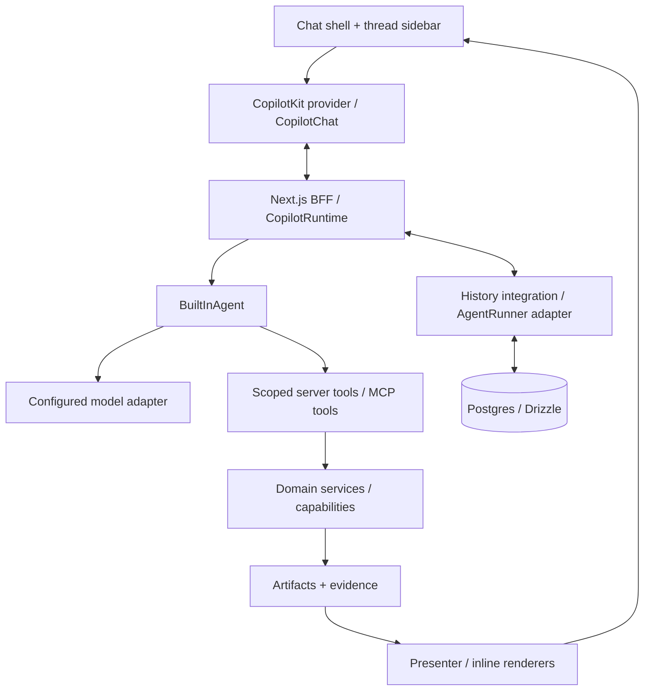

# PRD — AI-native Chat Core

Ngày cập nhật: **2026-10-05**. Sản phẩm: **Hackathon Starter Kit**. Phạm vi bản này: **yêu cầu sản phẩm và catalog feature; chưa triển khai core chat**.

Đây là PRD hiện hành cho phần platform mình xây. Core là một app chat AI kiểu ChatGPT: có khung chat, lịch sử hội thoại, agent gọi tools và kết quả xuất hiện ngay trong cuộc trò chuyện. Các problem templates do bạn xây sẽ cắm vào core này. Đọc [phân công](build-ownership.md) và [problem templates](problem-templates.md) để ghép hai phần.

## 1. Mục tiêu sản phẩm

Khi nhận đề thi, team có sẵn một app chat hoạt động và một nền tảng dùng chung. Để đổi bài toán, team bổ sung **schema + prompt + workflow + sources + rules + presenter + 1–2 custom tools + branding**; không phải dựng lại chat, runtime, history hay transport.

Người dùng có thể:

- Tạo cuộc trò chuyện, gửi câu hỏi và thấy câu trả lời stream.
- Quay lại hội thoại cũ sau reload hoặc restart server và hỏi tiếp đúng context.
- Đưa tài liệu/dữ liệu vào cuộc trò chuyện khi adapter tương ứng được bật.
- Theo dõi agent gọi tool, đọc nguồn, xem kết quả và xác nhận hành động khi cần.
- Dùng cùng core cho nhiều domain; xem card, bảng, biểu đồ hoặc report do template cung cấp.

Core không cam kết tự giải mọi đề bằng một prompt. Khả năng xử lý domain phụ thuộc tools, dữ liệu, rules và capabilities đã được tích hợp.

### Kết quả cần đạt

| Kết quả | Cách nghiệm thu |
|---|---|
| Có app chat dùng được | Gửi câu hỏi → stream → hoàn tất; stop/error/retry có hành vi rõ |
| Có lịch sử bền vững | Tạo hai thread, reload và restart, mở lại đúng messages và hỏi tiếp |
| Agent làm việc được | Gọi một server tool thật, thấy tiến trình và kết quả trong chat |
| Đổi domain dễ | Thêm domain config/tool/presenter mà không sửa chat shell hoặc protocol |
| Demo độc lập | Không cần secrets/tài liệu repo thi; no-env mode báo unavailable hoặc demo rõ ràng |

## 2. Phạm vi và quyết định nền tảng

- **Chat-first**: live chat và durable history đi trước custom workflow engine, ingestion hoặc analytics đầy đủ.
- **CopilotKit OSS làm nền mặc định**: tái sử dụng chat UI, runtime, agent loop, tool calling, shared state và HITL. Intelligence là extension tùy chọn có điều kiện, không là prerequisite. [OSS vs Intelligence](https://docs.copilotkit.ai/concepts/oss-vs-enterprise).
- **Next.js App Router + TypeScript + Next.js BFF**; **Postgres local Docker + Drizzle** là đích lưu trữ của app. Docker project, ports và volumes riêng cho starter.
- **CopilotKit v2** khi tích hợp; kiểm tra release ổn định và compatibility trước khi pin. Không tự nâng packages hiện có trong lần cập nhật PRD này.
- Luồng mặc định: **CopilotChat → CopilotRuntime → BuiltInAgent → configured model + tools**. Dùng model instance tương thích AI SDK trước khi chọn Factory mode; Factory chỉ khi cần kiểm soát model loop đặc biệt. [Runtime](https://docs.copilotkit.ai/backend/copilot-runtime), [model selection](https://docs.copilotkit.ai/model-selection), [custom agent](https://docs.copilotkit.ai/backend/custom-agent).
- App tự sở hữu tích hợp Postgres/history và thread sidebar cho baseline OSS. Không giả định CopilotKit đã có Postgres runner dựng sẵn. [AgentRunner](https://docs.copilotkit.ai/backend/agent-runner).
- **pgEdge MCP host local** là connector tùy chọn, bật sau chat/history. Không phải database driver hay điều kiện để chat text hoạt động.
- Starter dùng cấu hình riêng. BTC Gateway chỉ là binding tùy chọn nếu sau này chủ động cấu hình; không đọc key, tài liệu hay config của repo thi.
- Mình xây shared platform; bạn xây FE composition và backend flow của problem templates. Generic cards là phần mở rộng của platform, không phải điều kiện để hoàn tất chat core.

## 3. Đọc trạng thái feature cho đúng

**Ưu tiên:** P0 = bắt buộc để nghiệm thu chat core; P1 = bổ sung khả năng plug-and-play sau core; P2 = tùy chọn theo đề.

**Trạng thái repo:** `Có implementation` = code đã tồn tại; `Contract/validator` = đã có schema hoặc boundary, chưa có luồng chạy hoàn chỉnh; `Fixture` = dữ liệu giả có nhãn; `Chưa xây` = chưa có implementation.

**Nguồn cung cấp:** `SDK` là khả năng đã có trong hệ sinh thái CopilotKit, cần cài/wire/config; `App` là phần starter phải xây; `Intelligence` có điều kiện entitlement/license. **SDK có feature không có nghĩa repo đã triển khai feature đó.**

### Inventory thực tế của repo hôm nay

| Phần hiện có | Trạng thái và giới hạn |
|---|---|
| Next.js/React/TypeScript bootstrap | Có implementation; trang `/` là landing skeleton, chưa có chat |
| `/api/health`, `/api/domains` | Có implementation; health báo `mode: skeleton`, domains trả bốn manifests |
| `/api/demo/:domainId`, dataset rows API | Fixture có validation/pagination; production từ chối fixture API |
| `/playground` | Danh sách link tới fixture JSON; chưa phải gallery React cards |
| `src/contracts` | Contract/validator cho artifacts, documents, datasets, evidence, sources, runs, domains, errors, result views và UI blocks |
| UI block registry | 19 block schemas; chưa có `BlockRenderer` hoặc generic card implementations |
| Artifact schema registry | Có implementation cho đăng ký kind/version và validation dữ liệu JSON; chưa persist artifacts |
| Workflow/domain validation | Có implementation kiểm tra cấu trúc/dependencies/catalogs; chưa execute workflow |
| Capability/ports/services/agent definitions | Interface/boundary; chưa có executor, agent loop, repositories hoặc model calls |
| Source catalog | Có constructor/duplicate validation; catalog mặc định rỗng, chưa có source profiles/crawler |
| Bốn domain seeds | Dataset analysis, document review, research report, risk analyzer; workflows rỗng, dùng synthetic fixtures |
| `/api/runs` | Placeholder trả `501 feature_unavailable`; chưa tạo business run |
| Feature flags | Server container đang tắt runs/artifacts/uploads/datasets/storage/model/sources/parsers |
| Toolchain checks/tests | Đã có scripts check/test/build/e2e/domain validation và tests skeleton; không phải bằng chứng live chat hoạt động |

**Chưa có trong repo:** packages CopilotKit/AI SDK/MCP SDK, chat UI/provider/runtime, live model, thread storage/history, Postgres migrations/compose, pgEdge MCP integration, workflow runner, generic cards và reusable capability algorithms. Các bảng feature dưới đây đều là **yêu cầu cần tích hợp/xây**, trừ inventory nêu trên.

## 4. Trải nghiệm người dùng

### Luồng chính

1. Mở app: sidebar có New chat và danh sách hội thoại; vùng chat mới có hướng dẫn ngắn và composer.
2. Gửi câu hỏi: app tạo thread khi cần, hiện user message, stream assistant response và cho phép Stop.
3. Agent cần tool: hiện tên/trạng thái tool; kết quả được dùng để trả lời hoặc render inline.
4. Tool có tác động cần xác nhận: hiện nội dung hành động; chỉ execute sau approval hợp lệ.
5. Reload/mở lại app: chọn thread cũ, đọc lịch sử và hỏi tiếp; không nhân đôi messages/tool calls.
6. Chọn domain hoặc đưa input: tools/context/presenter của pack được đăng ký; giữ nguyên chat shell.

### Bố cục

- Sidebar trái: New chat, lịch sử, rename/archive/delete; search history bổ sung ở P1.
- Trung tâm: transcript, Markdown/code, tool progress, citations và inline result blocks.
- Composer: multiline, gửi, Stop khi đang chạy; attachments/microphone chỉ hiện khi feature sẵn sàng.
- Result/source panel tùy chọn: xem artifact/report/evidence mà vẫn giữ conversation context.
- Responsive: sidebar đóng/mở trên mobile; bàn phím, focus, scroll và contrast đủ dùng.

Đây là kiến trúc đích. `threadId` xác định hội thoại; agent execution ID xác định lần agent chạy; business `runId` xác định workflow nghiệp vụ. Không dùng ba ID thay thế nhau. Tool nhẹ có thể gọi service trực tiếp; chỉ tạo business run khi thực sự cần workflow/artifacts.

## 5. Catalog feature của core

### A. Chat UI và hội thoại — tất cả chưa xây trong repo

CopilotKit có chat/popup/sidebar và điểm tùy biến giao diện; app chọn **CopilotChat trong workspace shell** cho trải nghiệm toàn màn hình. [Prebuilt components](https://docs.copilotkit.ai/prebuilt-components).

| ID | Feature / yêu cầu | Dùng lại / phần app xây | Ưu tiên |
|---|---|---|---|
| CHAT-01 | Chat toàn màn hình, multiline composer, Enter gửi/Shift+Enter xuống dòng | SDK chat; App shell, layout, labels và responsive | P0 |
| CHAT-02 | Stream assistant message; hiện trạng thái đang trả lời/tool đang chạy | SDK transport/chat; App states và scroll behavior | P0 |
| CHAT-03 | Stop execution; giữ nội dung nhận được với trạng thái interrupted | SDK lifecycle; App đồng bộ status/history và hủy tác vụ con | P0 |
| CHAT-04 | Markdown/code, copy nội dung, empty/loading/error/unavailable states | SDK renderer/customization; App cấu hình actions và thông báo | P0 |
| CHAT-05 | Retry lượt lỗi theo hành động rõ ràng, không tạo messages trùng | App policy và stable IDs; kiểm chứng hành vi SDK khi tích hợp | P0 |
| CHAT-06 | Suggested prompts/follow-up và domain-aware empty state | SDK extension points; App nội dung theo pack | P1 |
| CHAT-07 | Edit message, regenerate, branch conversation | App semantics/history/versioning; không giả định tự có đủ trong SDK | P2 |

### B. Threads và durable history — tất cả chưa xây trong repo

`InMemoryAgentRunner` không bảo toàn history sau restart. SDK có SQLite runner bền vững, nhưng baseline đã chọn Postgres nên cần integration riêng. Transcript gửi lên mỗi turn và history lưu server phải có một policy tránh lặp. [Runners](https://docs.copilotkit.ai/backend/agent-runner), [message history](https://docs.copilotkit.ai/backend/message-history).

| ID | Feature / yêu cầu | Dùng lại / phần app xây | Ưu tiên |
|---|---|---|---|
| HIST-01 | New chat; list/switch threads; active thread có URL ổn định | App thread repository/BFF/sidebar + SDK thread binding | P0 |
| HIST-02 | Persist user/assistant messages, tool calls/results và execution status | App Postgres integration với runner/event lifecycle | P0 |
| HIST-03 | Reload/restart mở lại đúng transcript và hỏi tiếp đúng context | App hydrate/reconcile; giữ tool call/result pairs hợp lệ | P0 |
| HIST-04 | Rename, archive, delete hội thoại; xác nhận delete trong UI | App thread metadata/actions và lifecycle dữ liệu liên quan | P0 |
| HIST-05 | Scope theo owner/workspace; một thread active execution tại một thời điểm | App server identity, access checks, concurrency policy | P0 |
| HIST-06 | Search history, pagination và sort theo lần cập nhật | App indexed queries + sidebar search | P1 |
| HIST-07 | Reconnect/replay execution đang chạy khi mất kết nối | App/runner khả năng resume; không đánh đồng reopen transcript với resume | P1 |
| HIST-08 | Export conversation; retention policy; multi-device sync | App storage/API policy; sync chỉ khi auth/deployment hỗ trợ | P2 |

**Threads Drawer có sẵn trong hệ sinh thái nhưng cần Intelligence/entitlement**, nên không là sidebar mặc định của bản OSS. Có thể thay sidebar riêng bằng nó sau khi chủ động chọn integration phù hợp. [Threads Drawer](https://docs.copilotkit.ai/prebuilt-components/copilot-threads-drawer).

### C. Runtime, agent, model và độ tin cậy — tất cả chưa xây trong repo

| ID | Feature / yêu cầu | Dùng lại / phần app xây | Ưu tiên |
|---|---|---|---|
| AGENT-01 | Runtime self-host trên Next BFF; AG-UI streaming frontend/backend | SDK `CopilotRuntime`/handler/provider; App endpoint và server config | P0 |
| AGENT-02 | Một BuiltInAgent mặc định, system prompt và tools theo domain | SDK agent loop; App config/registration | P0 |
| AGENT-03 | Multi-step tool → result → assistant answer có giới hạn | SDK `maxSteps`; App chọn budget phù hợp, không để mặc định một bước khi cần tool loop | P0 |
| AGENT-04 | Model/gateway adapter dùng endpoint/model đã cấu hình | SDK custom language model; App server-only settings và compatibility | P0 |
| AGENT-05 | Timeout, cancellation, transient retry và trạng thái lỗi trung thực | SDK `maxRetries`/lifecycle; App deadline, error mapping và storage | P0 |
| AGENT-06 | Theo dõi token/call/time, cap output và chặn vượt budget | SDK params/usage khi có; App cost guard, usage records | P1 |
| AGENT-07 | Chọn model từ allowlist theo pack hoặc UI | App router/config; không nhận arbitrary provider credentials từ client | P1 |
| AGENT-08 | Fallback đổi model/provider theo cấu hình rõ ràng | App policy riêng: trigger, allowed targets, budget, audit; mặc định tắt | P2 |
| AGENT-09 | Nhiều agent và delegation log | SDK agent routing/shared state; App roles/delegate tools và giới hạn vòng lặp | P2 |
| AGENT-10 | Factory/custom framework khi BuiltInAgent không đủ | SDK adapter/factory; App tự wire model calls/tools/MCP/state cần thiết | P2 |

`maxRetries` là retry, **không phải bằng chứng automatic model/provider failover**. PRD không coi AGENT-08 là feature dựng sẵn đã xác nhận. [Advanced configuration](https://docs.copilotkit.ai/advanced-configuration). Delegation qua tools là pattern có ví dụ chính thức, cần app quản lý scope/cancellation/budget. [Sub-agents](https://docs.copilotkit.ai/multi-agent/subagents).

### D. Tools, MCP và approval — contracts liên quan đã có; execution chưa xây

| ID | Feature / yêu cầu | Dùng lại / phần app xây | Ưu tiên |
|---|---|---|---|
| TOOL-01 | Server tool có schema input/output và execute server-side | SDK `defineTool`; App registration, service binding, output validation | P0 |
| TOOL-02 | Hiện tool arguments/status/result trong chat | SDK `useRenderTool`; App typed renderer, giới hạn nội dung hiển thị | P0 |
| TOOL-03 | Tool Registry theo domain/capability/readiness; enforce permissions | App registry/scope/budgets; không viết lại SDK tool protocol | P0 |
| TOOL-04 | Frontend tools cho selection/navigation hoặc UI interaction | SDK `useFrontendTool`; App allowlisted UI actions | P1 |
| MCP-01 | Kết nối MCP server cấu hình server-side; discover/call tools | SDK `mcpServers` hoặc `mcpClients`; App auth/lifecycle/timeout/name collisions | P1 |
| MCP-02 | pgEdge Postgres MCP chạy local, chỉ expose tools cần cho domain | App local service/permissions/allowlist; tắt khi service chưa sẵn | P1 |
| MCP-03 | MCP Apps tương tác khi server cung cấp UI tương thích | SDK runtime middleware; App sandbox/render policy; khác MCP tools thông thường | P2 |
| HITL-01 | Approval trước tool có external side effect | SDK HITL UI; App server enforcement với pending/approve/reject/expiry | P1, bắt buộc trước khi bật tool có side effect |

Server tools dùng schema/backend handler; renderers chỉ hiển thị. MCP có lựa chọn connection per-run hoặc client do app sở hữu; không cần tự viết JSON-RPC client. [Server tools](https://docs.copilotkit.ai/server-tools), [frontend tools](https://docs.copilotkit.ai/frontend-tools), [MCP servers](https://docs.copilotkit.ai/mcp-servers).

HITL SDK cung cấp giao diện tương tác; app phải kiểm tra approval gắn đúng owner/thread/action/arguments trước khi execute. Tool chỉ đọc không bị chặn bởi approval không cần thiết. [Human-in-the-loop](https://docs.copilotkit.ai/human-in-the-loop).

### E. Context, memory, knowledge — chưa xây; domain/source contracts đã có

| ID | Feature / yêu cầu | Dùng lại / phần app xây | Ưu tiên |
|---|---|---|---|
| CTX-01 | Context hội thoại gồm messages hợp lệ trong token budget | SDK history input; App history projection/trimming | P0 |
| CTX-02 | Publish selected domain/record/UI context cho agent đọc | SDK `useAgentContext`; App values; identity gửi từ UI không là quyền server | P1 |
| CTX-03 | Shared state để UI thấy tiến trình/summary/selection | SDK `useAgent`; App schema/reconciliation; business status do server quyết định | P1 |
| MEM-01 | Memory explicit: preferences/facts, xem/sửa/forget, scope owner/workspace | App Memory service; optional Intelligence integration | P2 |
| RAG-01 | Retrieval docs/web/database → context có source/evidence | App indexing/retrieval tools; vectors tùy chọn | P1 theo Knowledge Assistant |
| SRC-01 | Source profiles cho legal/stats/web/uploads và domain-specific sources | App catalogs/adapters; source profile mặc định hiện rỗng | P1 |

Chat history, shared state, long-term memory và RAG là bốn nhu cầu khác nhau. SDK có context/state channels; **User Memories dài hạn thuộc Intelligence có điều kiện entitlement và backend tương ứng**. Baseline không giả định memory tự bật. [Read-only context](https://docs.copilotkit.ai/shared-state/agent-readonly), [shared state](https://docs.copilotkit.ai/shared-state), [User Memories](https://docs.copilotkit.ai/intelligence/memories).

### F. Kết quả inline, attachments và voice — schemas/fixtures có; UI/live adapters chưa xây

| ID | Feature / yêu cầu | Dùng lại / phần app xây | Ưu tiên |
|---|---|---|---|
| RESULT-01 | Một typed inline result renderer để chứng minh tool integration | SDK `useRenderTool`/`useComponent`; App renderer tối thiểu | P0 |
| RESULT-02 | Evidence/citations mở đúng nguồn/locator, phân biệt thiếu evidence | App evidence store/presenter; SDK hỗ trợ chỗ render | P1 |
| RESULT-03 | Domain result → generic UI blocks → chat/dashboard/report | App artifact/presenter/BlockRenderer contracts; cards xây sau chat | P1 |
| FILE-01 | Attach picker/drag-drop/previews; giới hạn file theo config | SDK attachment UI; App upload/storage/scope/readiness | P1 |
| FILE-02 | Parse PDF/DOCX/TXT/CSV/XLSX/JSON/URL thành input typed | App ingestion adapters; không coi attachment UI là parser | P1 theo adapter |
| VOICE-01 | Microphone → transcript → composer | SDK transcription flow; App transcription service/model config | P2 |
| VOICE-02 | TTS hoặc hội thoại voice hai chiều | App abstraction/integration riêng; chưa xác nhận là full flow dựng sẵn | P2 |

Generative UI có thể render component đã đăng ký với schema; app không chạy model-generated JS/JSX. Attachments phụ thuộc model và storage; STT cần transcription provider. [Your components](https://docs.copilotkit.ai/generative-ui/your-components/display-only), [attachments](https://docs.copilotkit.ai/multimodal-attachments), [voice](https://docs.copilotkit.ai/voice).

### G. Vận hành và extension ecosystem

| ID | Feature / yêu cầu | Trạng thái repo / nguồn cung cấp | Ưu tiên |
|---|---|---|---|
| OPS-01 | No-env boot; model/MCP chưa config → unavailable rõ, demo có nhãn | Skeleton/fixture gating có; chat readiness chưa xây | P0 |
| OPS-02 | Thread/tool/storage authorization và server-only credentials | Scope contracts có; server identity/enforcement chưa xây | P0 |
| OPS-03 | Preflight: DB/model/MCP/feature readiness chỉ kiểm tra phần bật | Chưa xây script tổng hợp; health skeleton có | P1 |
| OPS-04 | Pre-submit, smoke, secret scan, provider/network verification | Checks/tests nền có; readiness/scan scripts chưa xây | P1 |
| OPS-05 | Debug runtime/agent/tool errors và usage/cost | SDK debugging ecosystem; App structured logs/status/monitor | P1 |
| OPS-06 | Intelligence AG-UI Streams / User Memories | Optional, có điều kiện; chưa tích hợp | P2 |
| OPS-07 | Automatic Learning / Product Analytics / Channels | Optional Intelligence ecosystem; ngoài baseline, chưa tích hợp | P2 |
| OPS-08 | A2UI/declarative hoặc MCP Apps surfaces | Optional SDK runtime middleware; ngoài renderer baseline, chưa tích hợp | P2 |

Các extension Intelligence không được bật ngầm hoặc coi là yêu cầu bắt buộc của starter local. [Ecosystem boundary](https://docs.copilotkit.ai/concepts/oss-vs-enterprise), [runtime middleware](https://docs.copilotkit.ai/backend/copilot-runtime).

## 6. Data và plugin contract của app

Đây là yêu cầu logic, chưa là migrations hoặc routes đã tồn tại:

| Entity / boundary | Nội dung cần lưu hoặc cung cấp |
|---|---|
| Thread | ID, owner/workspace, title, domain, created/updated timestamps, archive/delete lifecycle |
| Message / parts | Stable ID/order/role, text/attachments/tool call/result references, status, timestamps |
| Agent execution | Thread, agent/model, start/end/status, lỗi, usage; event/checkpoint data theo runner integration đã chọn |
| Attachment | Owner/thread/storage reference, filename/type/size, upload/parse status |
| Approval | Thread/execution/action/arguments identity, requester, decision/expiry, execution record |
| Business run / artifact | Contracts hiện có; chỉ tạo khi tool/workflow nghiệp vụ cần |
| Memory | Scoped explicit entry và lifecycle; optional |
| Domain Pack | Manifest + input schema + prompts + tools + optional workflow/sources/rules + presenter + feature requirements |

App repositories/BFF và runtime persistence phải dùng cùng stable identities và một policy append/reconcile, không ghi một transcript thành hai bản độc lập. Nếu custom Postgres runner chưa hỗ trợ reconnect/resume, feature đó phải báo unavailable; không âm thầm thay durable history bằng InMemory.

Tool output là JSON typed hoặc artifact reference. Presenter là pure projection; không gọi model/network. UI state không được tự sửa authoritative business result. Domain pack chỉ thấy tools/sources được đăng ký cho scope hiện tại.

Artifact envelope hiện có giữ `id`, `kind`, `version`, `runId`, `workspaceId`, `data`, `sourceIds`, `evidenceIds`, `createdAt` và `provenance`; `stepId` nằm trong provenance khi có. Khi triển khai phải tương thích contracts, không tạo shape song song tùy component.

## 7. Delivery slices và acceptance

Đây là thứ tự sản phẩm, **không phải implementation plan đã execute**. Các P0 trong catalog phải đạt trước khi gọi core hoàn tất.

| Slice | Deliverable | Acceptance chính |
|---|---|---|
| 1. Chat chạy được | Workspace chat + runtime + BuiltInAgent + configured model | Gửi text → stream → hoàn tất; Stop và model unavailable hoạt động; không cần workflow engine |
| 2. History bền vững | Postgres integration + thread sidebar/lifecycle | Hai thread độc lập; reload/restart giữ lịch sử; hỏi tiếp đúng context; không trùng messages |
| 3. Một tool thật | Scoped registry + deterministic server tool + inline result | Tool được validate/execute/render; assistant dùng result trả lời; failure và budget rõ |
| 4. MCP local | MCP adapter + pgEdge local query/read use case | Tools đúng allowlist/scope; service down/timeout có lỗi rõ; reconnect không leak connections |
| 5. Domain plug-in | Một representative domain pack | Đổi schema/prompt/tools/presenter qua pack; không sửa chat transport/history; capability chưa có báo unavailable |

Slice 1–3 là release **chat core P0**. Slice 4–5 là release **plug-and-play P1**, cùng context/result/attachment extensions cần cho domain được chọn. Không bắt triển khai đủ 15 problem templates trước khi core có thể dùng.

### Gate nghiệm thu P0

- Chat keyboard/mobile dùng được; empty/loading/error/interrupted/unavailable states rõ.
- Model/tool streaming không làm treo composer; Stop hủy execution và các tác vụ con đã khởi tạo.
- History giữ đúng message order, tool call/result pairing và execution status sau refresh/restart.
- Rename/archive/delete có semantics rõ; archived thread không mất transcript; deleted thread không còn được hydrate/access qua API.
- Owner/workspace được xác định và kiểm tra server-side. Local single-operator mode phải khai báo rõ; client không tự nhận trusted operator.
- Tool input/output hợp lệ; timeout/retry không lặp side effect ngoài policy. P0 mẫu dùng tool deterministic chỉ đọc.
- Thất bại provider không trở thành fake success; không auto dùng fixtures trong production.
- Có smoke coverage cho chat → history → tool result, test scope/concurrency và failure paths cần thiết; existing skeleton tests không thay thế các checks này.

### Gate P1 quan trọng

- Trước khi bật side-effect tool: HITL server enforcement phải đạt, reject/expired/mismatched approval không execute.
- MCP kết nối local đúng config, query/read được giới hạn; unrestricted raw SQL không expose cho ordinary client.
- Citations resolve đúng source/locator; insufficient evidence không bị đổi thành verdict false.
- Attachment chỉ hiện supported formats; parse fail/limit/provider unavailable có trạng thái rõ.

## 8. Platform extensions giữ lại từ backlog trước

Những phần này vẫn do mình xây; chúng là machinery để templates reuse, **không làm đổi ưu tiên chat-first**. Trạng thái hiện tại chủ yếu contracts/fixtures hoặc chưa xây.

### Generic UI / frontend blocks

`WorkspaceShell`, `ChatPanel` wrapper quanh SDK, `MetricCard`, `ChartCard`, `DataTable`, `InsightCard`, `RecommendationCard`, `RiskScoreCard`, `WarningCard`, `EvidenceCard`, `SourceCard`, verdict renderer, `TimelineCard`, `ProgressCard`, `ActionCard`, `ComparisonCard`, `MapCard`, `PlaceCard`, `UploadPanel`, `ReportView`, Markdown/media và Loading/Empty/Error/Success/Partial/Unavailable states.

Thêm `BlockRenderer` + registry và `/playground` gallery thực với fixtures/interactions. Canonical 19 block types: `metric`, `chart`, `table`, `insight`, `recommendation`, `risk`, `warning`, `source`, `evidence`, `verdict`, `timeline`, `progress`, `action`, `map`, `place`, `comparison`, `report-section`, `markdown`, `media`.

Props lấy từ `src/contracts/ui/blocks.ts`; render context cung cấp datasets/artifacts/claims/evidence/sources/callbacks. Renderer không tự tính business scores, rank candidates hoặc parse tài liệu. [Frontend handoff](frontend-handoff.md).

### Backend reusable capabilities

| Capability | Input → output / gate |
|---|---|
| Ingestion | PDF/DOCX/TXT/CSV/XLSX/JSON/URL → documents/datasets; formats theo adapter readiness |
| Structured Extraction | Input + Zod schema + instructions → validated data; bounded repair |
| Research | Search → fetch/crawl → clean → dedupe → rank; source limits/deadline và fetch guards |
| Evidence/Citation | Claim ↔ source/locator/excerpt; phân biệt support với thiếu evidence |
| Analysis Engine | Artifacts/config → findings; tách fact/inference/calculation/recommendation |
| Risk/Score Engine | Signals/rules → score/factors/method/completeness; range/direction do domain quyết định |
| Recommendation Engine | Preferences/candidates/criteria → rank/reasons/actions; hard constraints/ties/no-match |
| Dataset Analytics | Dataset → stats/trends/outliers; deterministic calculation và partial-data policy |
| ChartSpec Generator | Metadata/analytics → validated chart spec; columns/aggregation đúng |
| Report Generator | Artifacts/evidence → sections/export data; provenance giữ nguyên |
| Verification | Claim/evidence → verdict/explanation; thiếu evidence không đồng nghĩa false |
| Planner/Optimizer | Goal/constraints → plan/timeline/violations; không gọi heuristic là proven optimum |
| Retrieval/Indexing | Documents/database → chunks/index; query → relevant evidence; pgvector optional |
| Geo utilities | Locations → places/distance; provider availability rõ |
| Memory | Scoped preferences/facts với inspect/update/forget lifecycle |
| Privacy/Redaction | Input/policy → redacted result; tránh raw sensitive logs |
| Voice abstraction | STT/TTS provider boundary; không là prerequisite boot |

### Core business machinery và infra

- `Capability<Input, Output>`, artifact/schema registry, executor validation/persistence.
- Workflow runner: sequential dependencies, budget/abort/retry và partial/failed status; parallel DAG/workers/durable business resume là extension sau.
- Domain Pack registry/validation, tool registry, presenter, run/session state và approval service.
- Source profiles: government/statistics, legal/VBPL, tourism, education, company/public sites, news/search, uploaded documents.
- Feature flags: RAG/voice/crawler/geo/MCP/models/storage; provider chưa có thì unavailable.
- Postgres Docker/Drizzle migrations/repositories; optional pgvector/pgEdge MCP; services/ports/volumes riêng.
- `AGENTS.md`, optional Codex/provider config, preflight/pre-submit, secret scan, network/provider verification, smoke checks, Git checklist và cost/token monitor.

Không crawl sẵn một kho lớn chỉ để đủ checklist. Ưu tiên adapter/source profile có thể cấu hình theo đề; templates dùng capabilities thực khi chúng sẵn sàng. Sáu archetype đầu tiên và mười lăm archetype tổng thể nằm trong [problem templates](problem-templates.md).

## 9. Ngoài baseline và tài liệu liên quan

Baseline không bao gồm full ChatGPT feature parity, billing, public share, organization admin, multi-agent swarm mặc định, autonomous external actions, production HA, mọi parser/provider cùng lúc hoặc Intelligence license setup. Các mục này chỉ bổ sung khi có nhu cầu cụ thể.

PRD này thay thế thứ tự workflow-first trong [Core P0 design cũ](superpowers/specs/2026-10-05-core-p0-design.md) và [Core P0 plan cũ](superpowers/plans/2026-10-05-core-p0-implementation-plan.md). Hai tài liệu đó giữ để tham khảo business machinery, **chưa execute và không là plan triển khai chat hiện hành**. Trước khi code core cần viết implementation plan theo slices và acceptance ở đây.

Đọc thêm: [CopilotKit research và caveats](research/2026-10-05-copilotkit-chat-core.md), [code structure](code-structure.md), [API contracts hiện có](api-contracts.md), [dependency pins hiện có](dependencies.md), [docs index](README.md).

Lần cập nhật này chỉ ghi PRD/docs. **Không cài SDK, không sửa product code, không tạo database/runtime/chat và không thao tác repo thi.**
