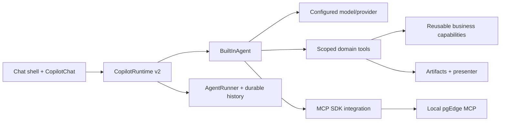

# CopilotKit ecosystem — research cho chat core

Ngày kiểm tra: 2026-10-05. Đây là kết quả đọc tài liệu chính thức, chưa phải implementation hoặc compatibility test trên SDK đã cài.

User muốn core là app chat AI như ChatGPT: chat chính, sidebar history, hội thoại lưu được, tools/MCP và reusable capabilities cắm vào phía dưới. Generic cards và problem templates vẫn là phần riêng. Repo starter hiện chưa cài CopilotKit SDK.

## Kết luận cho kiến trúc

CopilotKit đã có chat UI, runtime, built-in agent loop, tools, MCP integration và shared-state/HITL primitives. Nên dùng chúng làm nền của core. Không cần dựng agent framework hoặc streaming protocol riêng để có cuộc trò chuyện đầu tiên. Open-source TypeScript runtime hoạt động không cần Intelligence. [Runtime](https://docs.copilotkit.ai/backend/copilot-runtime), [OSS vs Intelligence](https://docs.copilotkit.ai/concepts/oss-vs-enterprise)

Core P0 spec/plan trước đó ưu tiên custom workflow machinery rồi hoãn chat. Thứ tự này không còn đúng với yêu cầu mới; chưa execute plan đó. Phần artifact/domain contracts vẫn hữu ích khi nối business tools.

## Có gì sẵn, mình cần làm gì

| Nhu cầu | Ecosystem có gì | Phần app còn cần |
|---|---|---|
| Khung chat | `CopilotChat`, sidebar/popup variants, style slots | Layout chat toàn trang, branding, responsive shell |
| Runtime | Fetch-native handler, routing agents, AG-UI middleware/transport | Mount trong Next.js BFF, bind auth/scope và cấu hình |
| Agent | `BuiltInAgent`, tool-call loop có `maxSteps` | Domain prompt, chọn model, limits và business tools |
| Server tools | `defineTool` với schema validators | Logic capabilities, scoped permissions, artifact validation/persistence |
| MCP | `mcpServers` hoặc `mcpClients` | Server endpoints, role/query policy, lifecycle cho persistent client |
| History | Runner abstraction, in-memory/SQLite/Intelligence runners | Chọn durable backend và tích hợp conversation list theo deployment |
| Long-term memory | User Memories trong Intelligence | Chọn Intelligence hoặc app-owned explicit memory service |
| Retry/fallback | Retry option, factory/custom model extension | Failover policy nếu muốn đổi model/provider khi lỗi |
| Gen UI/HITL | Tool rendering, shared state và human-input hooks | Ráp component của template, enforce action permissions ở backend |

Nguồn cho từng nhóm nằm trong các sections dưới; bảng là mapping cho starter, không phải cam kết mọi feature có sẵn ở mọi deployment.

## Chat UI và sidebar history

`CopilotChat` từ `@copilotkit/react-core/v2` dùng cho chat toàn trang; có các slots để tùy biến giao diện. Không cần tự dựng message transport/input lifecycle. [Prebuilt components](https://docs.copilotkit.ai/prebuilt-components)

`CopilotThreadsDrawer` có list/switch/new/archive/delete thread và shared chat configuration. **Drawer này yêu cầu Intelligence hoặc entitlement/license hợp lệ theo deployment**, không được mặc định rằng OSS runtime local tự có sidebar history hoàn chỉnh. Nếu giữ app độc lập, mình làm conversation sidebar của app và nối persistent storage. [Threads Drawer](https://docs.copilotkit.ai/prebuilt-components/copilot-threads-drawer)

## Built-in agent và model adapter

Simple mode hỗ trợ model string hoặc custom AI SDK `LanguageModel`. Vì vậy endpoint OpenAI-compatible riêng có thể đi qua provider model object; chưa cần factory nếu shape này đủ. Với gateway chỉ hỗ trợ Chat Completions, phải chọn đúng model API, không mặc định gọi Responses. Tài liệu CopilotKit hiện mô tả AI SDK 6 và provider 3.x; cần verify peer metadata rồi pin exact versions khi triển khai. [Model selection](https://docs.copilotkit.ai/model-selection)

Factory mode dùng khi cần kiểm soát LLM call/custom backend. CopilotKit vẫn quản lifecycle, stream conversion và cancellation; factory phải wire tools/state/MCP cần dùng vào model call. Không nên chọn factory rồi vô tình viết lại toàn bộ agent loop nếu simple mode đã đáp ứng. [Factory mode](https://docs.copilotkit.ai/backend/custom-agent)

`maxSteps` mặc định là 1; phải cấu hình nhiều bước nếu muốn tool → đọc kết quả → trả lời/tiếp tục gọi tool. `maxRetries` là retry transient failures. [Advanced configuration](https://docs.copilotkit.ai/advanced-configuration)

## MCP client và pgEdge local

BuiltInAgent kết nối MCP qua HTTP/SSE. `mcpServers` tạo connection theo run; `mcpClients` cho phép đưa persistent client/provider vào và app quản lý close/auth/cache. Có thể dùng SDK MCP client, không cần tự viết JSON-RPC transport cho happy path. Dynamic auth/tool caching vẫn cần lifecycle policy của app. [MCP Servers](https://docs.copilotkit.ai/mcp-servers)

`mcpApps` của runtime là middleware cho MCP Apps; nó không đồng nghĩa toàn bộ MCP tools của mọi server được scope/allowlist tự động. pgEdge DB permissions và curated queries vẫn do starter/server cấu hình. [Runtime MCP Apps](https://docs.copilotkit.ai/backend/copilot-runtime#mcpapps)

`defineTool` có schema-validated parameters; backend implementation trả plain JSON. Trong factory mode, `tools` config không được tự đọc: phải chuyển/wire tools vào factory. App-owned artifact schemas vẫn cần parse output trước khi persist hoặc present. [Server tools](https://docs.copilotkit.ai/server-tools)

## Ba khái niệm memory khác nhau

1. **Conversation context:** transcript gửi vào model ở mỗi turn. CopilotKit hỗ trợ message forwarding/filtering; nếu backend đã lưu context thì tránh đưa cùng history hai lần. Tool-call/result pairs phải giữ hợp lệ. [Message history](https://docs.copilotkit.ai/backend/message-history)
2. **Durable chat history:** giữ hội thoại khi refresh/restart. `InMemoryAgentRunner` mất history khi restart; `SqliteAgentRunner` là first-party file-backed runner cho single instance. Shared Postgres backend cần custom runner/persistence integration; chưa thấy first-party Postgres runner được liệt kê trong docs đã đọc. SQLite runner không tự cung cấp đầy đủ thread-list HTTP APIs. [AgentRunner](https://docs.copilotkit.ai/backend/agent-runner)
3. **User Memories:** facts/preferences dùng xuyên hội thoại. Đây là Intelligence feature; self-hosted cần memory-enabled license và embedder. Chat history lưu được không có nghĩa tự có semantic long-term memory. [User Memories](https://docs.copilotkit.ai/intelligence/memories)

## Fallback cần hiểu đúng

Đã xác nhận `maxRetries` trên built-in agent. Chưa xác nhận một option CopilotKit core tự động failover qua danh sách model/provider: các trang runtime/model selection/advanced config/factory đã đọc không nêu contract này. Không suy từ chữ fallback chung thành model failover có sẵn. [Advanced config](https://docs.copilotkit.ai/advanced-configuration), [Factory](https://docs.copilotkit.ai/backend/custom-agent)

Nếu cần failover, đề xuất policy ở model adapter/gateway: chỉ thử candidates đã cấu hình, hạn chế attempts/deadline/cost, không replay external tools đã có effect và không nối output hai model sau khi stream đã hiển thị. Đây là **đề xuất của starter**, chưa được implement hoặc chứng minh bằng test.

## Shared state, UI tools và human input

CopilotKit có primitives cho tool rendering và human input ngay trong chat. Mình vẫn cần map artifact/result sang components và enforce permissions cho business actions ở server. Frontend confirmation không tự tạo durable business approval system. [HITL](https://docs.copilotkit.ai/human-in-the-loop), [Server tool rendering](https://docs.copilotkit.ai/server-tools)

## Hướng phù hợp với starter độc lập

Đề xuất giữ **OSS TypeScript runtime + BuiltInAgent + CopilotChat**, chưa yêu cầu Intelligence. Khi giữ Postgres stack đã chọn, cần triển khai history adapter/conversation endpoints và custom sidebar; nếu muốn giảm code persistence cho single instance, có thể chọn first-party SQLite runner nhưng đó là thay đổi storage strategy phải phản ánh trong spec.

Phần mình thực sự cần xây: chat shell/history integration, auth/scope, model configuration/budget policy, domain pack composition, business tools, artifact/presenter pipeline. Workflow runner riêng chỉ đưa vào khi business flow cần deterministic checkpoints; không là prerequisite cho basic chat/tool calling.

Thứ tự delivery đề xuất: **chat chạy → history durable → một server tool → MCP local → ráp domain pack**. Long-term memory/failover chỉ bật khi requirements và adapter đã xác nhận.

## Ảnh hưởng đến tài liệu hiện có

- [Master spec §14](../superpowers/specs/2026-10-05-hackathon-plug-and-play-design.md): có nền CopilotKit nhưng history in-memory không còn đủ cho yêu cầu mới.
- [Agent plan 03](../superpowers/plans/2026-10-05-03-agent-playground.md): C2/C3 hữu ích, cần bỏ dependency bắt buộc document/dataset/pgEdge trước chat; bổ sung durable history và sidebar.
- [Core P0](../superpowers/specs/2026-10-05-core-p0-design.md): chưa triển khai; giữ làm reference cho business-run machinery, không execute trước chat.

Research này không cài dependencies, khởi động services hoặc sửa product code. API names ở đây theo docs hiện hành; compatibility của release thực tế vẫn là bước kiểm tra trước implementation.
