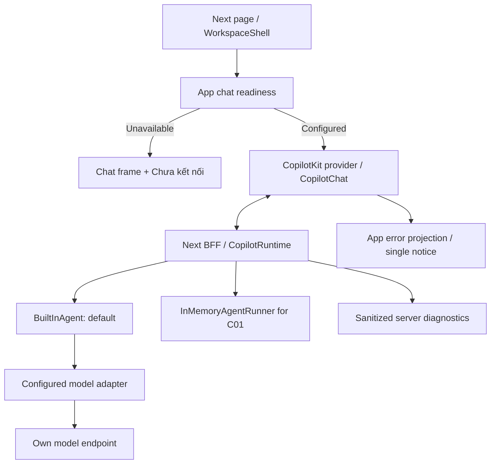

# C01 — Chat Foundation Design Spec

Ngày: **2026-10-05**. Trạng thái: **user đã cho chuyển sang writing-plans; plan C01 đã viết; chưa triển khai**.

PRD: [AI-native Chat Core](../../platform-build-spec.md), phần C01 và notice/error policy ở mục 4. Đây là technical spec cho **C01**, không thay thế specs của C02–C05. User đã yêu cầu viết plan từ spec này; [implementation plan C01](../plans/2026-10-05-chat-foundation-implementation-plan.md) ghi chi tiết task/interfaces/checks, chưa execute.

## 1. Ý định và kết quả

User muốn một starter độc lập có core chat AI kiểu ChatGPT, dùng CopilotKit và ráp domain sau. Bản đầu phục vụ **một người local**, chưa cần login hoặc multi-tenant. Khung chat hoạt động được về giao diện khi chưa có model, với notice chính xác **`Chưa kết nối`**. Mọi technical failure dùng cùng notice; không in raw errors lên UI.

C01 tạo vertical slice: **mở `/` → gửi text → assistant stream → hoàn tất**, cùng Stop, manual Retry và New chat trong phiên. Không yêu cầu database để boot. C02 bổ sung durable history/sidebar; C03 bổ sung custom business MCP tools qua official SDK, context và inline results; C05 bổ sung domain packs. Theo quyết định user ngày 2026-10-06, C04 cũ không còn là phase riêng; pgEdge local trong Compose chỉ phục vụ coding agent, không thuộc app runtime.

Repo duy nhất: `E:/thucchienai/hackathon-starter-kit`, origin `baominh5xx2/template-codesdas`. Không đọc hoặc thao tác repo thi `aitc2026-team-939-triplepeek`, secrets, tài liệu BTC hoặc cấu hình của nó.

## 2. Phương án kiến trúc được đề xuất

| Hướng | Đánh giá cho C01 |
|---|---|
| **CopilotChat + TypeScript runtime + BuiltInAgent với configured model instance** | Chọn: reuse UI/transport/agent loop, giữ model adapter riêng và extension points cho các phần sau |
| Headless CopilotKit + tự dựng toàn bộ transcript/composer | Có thể tùy biến sâu nhưng tăng UI work; chỉ thay slots cần thiết trong C01 |
| Factory/custom agent backend ngay từ đầu | Có thêm quyền kiểm soát model loop nhưng tăng wiring/lifecycle work; chưa cần cho text chat baseline |

SDK có chat components và slots; runtime v2 có fetch-native handler và agent registration. BuiltInAgent nhận custom language model nên model adapter riêng không bắt buộc Factory mode. [Prebuilt UI](https://docs.copilotkit.ai/prebuilt-components), [runtime](https://docs.copilotkit.ai/backend/copilot-runtime), [model selection](https://docs.copilotkit.ai/model-selection).

Use v2 imports from `@copilotkit/react-core/v2` and `@copilotkit/runtime/v2`. Runtime route dùng `createCopilotRuntimeHandler`, multi-route transport với provider `useSingleEndpoint={false}`. Routing key thống nhất **`default`**. [Runtime wiring](https://docs.copilotkit.ai/backend/copilot-runtime).

SDK versions phải là exact stable pins, cùng generation và tương thích Next/React/Node hiện có. Model provider/AI SDK version chọn theo CopilotKit compatibility, không lấy latest major tùy ý. Kiểm tra package exports/types trước khi viết plan gọi APIs; spec không giả định tên slot/error hook chưa xác minh. Không cài packages trong bước viết spec.

## 3. Phạm vi C01

**Có:** chat shell responsive, multiline composer, transcript text/Markdown/code và Copy, SDK streaming, local identity boundary, model/runtime config, New chat trong phiên, Stop, Retry, app-owned availability/error presentation và meaningful smoke tests.

**Chưa có:** durable history, thread listing/search/archive/delete, Postgres/Docker migrations, generic cards, uploads/voice, tools/MCP, RAG/memory, workflow execution, multi-agent, automatic model failover, Intelligence, billing, login hoặc tenant management.

Không sửa Artifact/Run/Domain contracts chỉ để chat text hoạt động. `src/core` vẫn không phụ thuộc React/Next/CopilotKit SDK. Existing fixture APIs và `/playground` tiếp tục giữ skeleton semantics; fixtures không làm fallback cho assistant.

## 4. Chat shell và tương tác

- Route `/` chuyển từ landing skeleton thành chat workspace giống bố cục ChatGPT theo reference user: sidebar shell có branding/New chat/thu gọn, header mỏng, transcript giữa và composer dưới. Sidebar history có dữ liệu/actions dành cho C02, không dựng danh sách hội thoại giả trong C01.
- Dùng `CopilotChat` và SDK styles làm nền; app tùy biến slots/controller cho branding, state, composer và error surfaces cần thiết. **Theme trắng cố định theo yêu cầu user**, kể cả browser dark preference; không thêm theme settings product trong C01. Kích thước/tokens/interaction theo [White UI design](2026-10-05-chat-white-ui-design.md).
- Welcome/empty state copy: **`Bạn muốn hỏi gì?`**. Placeholder: **`Nhập tin nhắn…`**. Buttons: **`Gửi`**, **`Dừng`**, **`Thử lại`**, **`Cuộc trò chuyện mới`**, **`Sao chép`**.
- Enter gửi; Shift+Enter xuống dòng. Không gửi khi IME đang composing. Whitespace-only input không tạo execution; draft giữ nguyên khi send không được chấp nhận.
- Gửi một lần tạo một user message stable ID và một execution mới. Trong lúc chạy, Send bị khóa và Stop xuất hiện; không tạo hai executions từ double-click/Enter lặp.
- Khi đang đọc ở cuối transcript, tự scroll theo stream. Khi user cuộn lên đọc, không kéo họ xuống; có action về cuối. Keyboard focus không nhảy theo từng token.
- New chat tạo ephemeral thread mới, không copy transcript cũ. Nếu execution đang chạy, abort và chờ terminal trước khi reset; không để late events của thread cũ chui vào thread mới.
- Mobile giữ composer trong viewport, không có horizontal overflow; controls có accessible labels và focus visible. Notice dùng status live region, không đọc lại mỗi token.

## 5. Readiness và configured model

### App endpoint

`GET /api/chat/readiness` trả public shape **`{ available: boolean, agentId: "default" }`**. Không trả base URL, model credentials hoặc raw reason. `available` chỉ có nghĩa config hợp lệ để thử chạy, không cam kết provider đang online. Readiness không gọi model hoặc tính phí lúc mở app.

Khi readiness đang tải, UI có loading state. Nếu unavailable hoặc request lỗi, render chat frame + notice **`Chưa kết nối`**; không mount provider có agent discovery lỗi. Có thể nhập draft, Send bị disable. Action `Thử lại` ở notice kiểm tra readiness lại; không append message. Runtime endpoint cũng xử lý unavailable bằng public error đã mask nếu bị gọi trực tiếp.

### Config server-side đề xuất

| Variable | Semantics |
|---|---|
| `CHAT_MODEL_BASE_URL` | Explicit HTTP(S) base URL cho endpoint OpenAI-compatible; không tự chọn public provider |
| `CHAT_MODEL_ID` | Explicit model ID của endpoint đó |
| `CHAT_MODEL_API_KEY` | Credential riêng nếu endpoint yêu cầu; optional cho endpoint hỗ trợ no-auth |

Adapter C01 dùng **Chat Completions** qua custom AI SDK language model instance, dành cho endpoint OpenAI-compatible. Không mặc định dùng Responses API, không đòi provider account cụ thể. [Custom model / API selection](https://docs.copilotkit.ai/model-selection).

Missing/invalid chat config làm chat unavailable, không làm app crash. Không đọc các key names hoặc config ngoài nhóm này để tự fallback; không lấy cấu hình repo thi. Provider config đọc lúc server khởi tạo; thay đổi env cần restart server rồi Retry readiness.

Không đổi `APP_MODE` thành công tắc bật mọi business features: chat readiness tách khỏi skeleton container; các features chưa implement vẫn disabled. Existing environment loading phải giữ no-env boot.

## 6. Transcript, identity và execution lifecycle

- C01 dùng SDK message state trong phiên và `InMemoryAgentRunner` cho lifecycle runtime. Không persist localStorage/DB và không cam kết giữ history sau reload/restart. C02 thay bằng integration durable, không phải rebuild chat UI. [Runner boundary](https://docs.copilotkit.ai/backend/agent-runner).
- `threadId` là opaque UUID của ephemeral conversation; SDK message IDs giữ ổn định. Agent execution `runId` khác business run ID; C01 không tạo business run/artifacts.
- Server cấp fixed local operator scope qua một resolver riêng; không login/tenant endpoints, không nhận owner/workspace/provider quyền từ browser. Contracts có workspace IDs không buộc xây multi-tenant storage trong C01.
- Baseline chạy Node server local, bind loopback. Runtime wrapper kiểm tra browser mutation Origin cùng app; không expose secrets hoặc forward client-supplied provider auth/identity headers tới model. Đây là local deployment boundary, không phải multi-user auth system.
- Một active model execution trên local runtime tại một thời điểm. UI khóa send; server cũng từ chối concurrent execution kể cả tab thứ hai. Không queue ngầm. Runtime singleton có thể dùng cho single-user serialized baseline; C02 phải giữ runner state/lifecycle khi mở rộng concurrency. [Agent concurrency](https://docs.copilotkit.ai/backend/copilot-runtime).
- Internal statuses: `idle`, `running`, `completed`, `failed`, `interrupted`. Availability/notice là state riêng, không đồng nghĩa tất cả lỗi phải ghi thành network disconnection.

### Stop

Stop abort SDK/model execution, bỏ loading, giữ text đã nhận và terminal `interrupted`. Stop chủ động không tạo notice lỗi. Late tokens sau terminal bị bỏ qua; generation/execution IDs bảo vệ state. Execution slot chỉ mở lại khi run cũ đã kết thúc/được fence, tránh Stop rồi Send tạo overlap.

### Retry

Retry lượt failed/interrupted giữ nguyên user message ID, tạo execution ID mới; partial assistant attempt cũ được thay bởi attempt mới trong active transcript. Model input cho retry là conversation trước lượt lỗi + user message của lượt đó, không gồm failed partial answer hay notice. Không tự gửi retry trong background.

New chat hoặc gửi lượt mới sau lỗi bỏ khả năng retry lượt cũ. C01 không có branching/edit message; SDK defaults gây duplicate phải được điều chỉnh ở app controller boundary.

### Giới hạn baseline

- Execution deadline **120_000 ms**; timeout abort và ghi failed, UI dùng notice chung.
- Model `maxOutputTokens` **2_048**, `maxRetries` **0**; chỉ Retry chủ động của user trong C01.
- `maxSteps` **1** vì C01 chưa có tools; C03 tăng giới hạn khi cần tool → result → answer. Đây không phải thay đổi acceptance multi-step của whole core.
- Input user tối đa **8_000 ký tự**; request body tối đa **256 KiB**. UI chặn input vượt limit bằng validation, server validate tương ứng; direct malformed/oversized runtime requests bị từ chối và error text mask.
- Context trimming bền vững thuộc CTX-01/C02. C01 không tự summarise history bằng model; request vượt budget/khả năng model kết thúc failed với notice, không xóa transcript để giả thành success.

SDK có step/retry/output controls; các con số trên là quyết định baseline của app. [Advanced configuration](https://docs.copilotkit.ai/advanced-configuration).

## 7. Notice/error projection — yêu cầu bắt buộc

**Public technical copy duy nhất: `Chưa kết nối`.** Đặt notice trong chat frame, một instance, có Retry phù hợp. Notice là app state, không phải assistant message, không đưa vào model context/history.

| Tình huống | Nội bộ | Khung chat |
|---|---|---|
| Missing/invalid config; readiness lỗi | Unavailable với cause riêng | Một notice `Chưa kết nối`, không mount failing provider |
| Provider/network/runtime/discovery/rate-limit failure | Failed + diagnostic code | Một notice `Chưa kết nối`; không render raw error |
| Stream lỗi giữa chừng hoặc timeout | Failed, giữ partial text, kết thúc loading | Partial text + cùng notice; không fake completion |
| Concurrent execution bị từ chối | Conflict, không thêm accepted execution | Cùng notice; không duplicate user message |
| Render/SDK exception | App boundary ghi sanitized diagnostic | Chat fallback frame + cùng notice |
| User Stop | Interrupted | Giữ partial, không thêm notice lỗi |
| Retry/reconnect thành công | Running/ready; terminal theo result | Xóa notice cũ, không spam transcript |

Error handling áp dụng trước SDK error rendering và tại runtime public response/event boundary. Không dùng raw `toPublicError` message hiện có cho chat vì copy của contract đó khác policy này. Chat có projection riêng, không đổi lỗi của fixture/business APIs ngoài scope.

Không render HTTP codes, provider endpoint, stack trace, default SDK error bubbles/toasts hoặc model-generated technical fallback. Error events vẫn giữ protocol semantics để SDK kết thúc execution đúng; không nuốt mọi events hoặc biến lỗi thành text response thành công. Exact SDK hooks/middleware chọn và kiểm chứng ở plan, không patch JSON strings tùy tiện trong stream.

Diagnostics chỉ ghi allowlisted code, trace/execution ID, phase, duration; không ghi credentials, raw provider bodies hoặc full prompts. Client logs/error displays do app phát không được chứa raw errors. Browser vẫn có thể báo network status trong DevTools; acceptance tập trung app UI và dữ liệu do app cung cấp, không cam kết kiểm soát browser internals.

Policy này tiếp tục áp dụng tool/MCP/history failures khi C02–C04 tích hợp; không cần thêm các dependencies đó trong C01 để chứng minh text-chat error handling.

## 8. File boundaries và handoff

Đây là file map đề xuất cho plan, chưa scaffold:

| Unit | Đường dẫn | Trách nhiệm |
|---|---|---|
| Entry/layout | `src/app/page.tsx`, `src/app/layout.tsx`, `src/app/globals.css` | Chat workspace entry, SDK styles và responsive layout |
| Client-safe chat contract | `src/contracts/chat.ts` | Readiness/status DTOs và notice constant; không chứa SDK types |
| UI shell/controller | `src/ui/chat/{workspace,chat-panel,connection-notice,controller}.tsx` | Slots, draft/transcript actions, generation fence, app notice |
| Model config | `src/server/chat/config.ts` | Parse own env, readiness; invalid config không throw làm app crash |
| Local identity | `src/server/chat/identity.ts` | Fixed local scope; future identity replacement boundary |
| Model adapter | `src/adapters/llm/chat-model.ts` | Config → AI SDK model instance; server-only |
| Runtime adapter | `src/adapters/agents/chat-runtime.ts` | SDK runtime/agent/runner wiring, serialization/cancellation boundary |
| Error projection | `src/server/chat/errors.ts` | Public copy + sanitized diagnostics, preserve protocol terminal semantics |
| HTTP endpoints | `src/app/api/chat/readiness/route.ts`, `src/app/api/copilotkit/[[...slug]]/route.ts` | App readiness và SDK handler wrapper; Node runtime |
| Tests | `tests/chat/*`, `tests/integration/chat-runtime.test.ts`, `tests/e2e/chat.spec.ts` | State/config/error/runtime/browser acceptance |

UI controller là adapter cho SDK message/lifecycle state, không phải agent loop thứ hai. Runtime/model SDK imports giữ trong adapter/server boundaries; không sửa existing `AgentProjection` để nhét chat message SDK objects vào business contracts.

Public app interfaces cần plan định nghĩa cụ thể: `ChatReadiness`, `ChatExecutionStatus`, `loadChatConfig`, `resolveLocalChatIdentity`, `createChatModel`, `createChatRuntime`, notice projection và controller actions `send/stop/retry/newChat`. Exact signatures phải nhất quán giữa tasks; SDK callbacks dựa trên installed stable types.

Handoff C02: stable message/thread/execution IDs, one active execution policy, readiness/identity/runtime boundaries và active transcript projection. Handoff C03: agent configuration extension point + public failure policy; chưa đăng ký tool mẫu trong C01.

## 9. Acceptance và verification khi triển khai

- No env: app boot/build, `/` hiện chat frame và đúng một `Chưa kết nối`; không discovery error/toast, không model request.
- Config hợp lệ: provider connect qua own endpoint; gửi hai lượt, lượt sau dùng conversation context; user message không duplicate.
- Missing/invalid config, provider rejection, network error, rate limit, runtime/discovery error và render exception: cùng public copy, không chứa injected raw sentinel/stack/provider body.
- Mid-stream failure/timeout: giữ partial text, terminal failed, loading kết thúc và một notice. Late token không sửa terminal state.
- Stop: abort xảy ra; không error notice, không fake completion; Send/New chat sau Stop không overlap execution cũ.
- Retry: một user message, execution mới; model input loại failed partial/notice; repeated failures vẫn một notice.
- New chat reset transcript/IDs; event cũ không xuất hiện trong session mới; reload không bị quảng bá như durable history.
- Keyboard/IME/mobile/scroll/focus behavior ở mục 4 được browser test.
- Server concurrent request và client header spoofing không tạo overlap hoặc đổi local identity/provider auth; public response mask.
- Unit/runtime/browser tests dùng controlled stream/provider fixtures chỉ trong test harness; live integration riêng dùng configured endpoint khi có. Không cần key để chạy unit/no-env checks; không gọi test fixtures là live model.
- Existing check/test/build/fixture gating tiếp tục pass. Plan phải có exact commands/tests cho các cases trên; spec không tuyên bố chúng đã pass.

## 10. Trạng thái và bước sau

C01 spec hiện đã có nội dung cụ thể về architecture, UX, config, state, errors, boundaries và acceptance. User đã chốt product scope/local/error policy và yêu cầu chuyển sang writing-plans ngày 2026-10-05.

[Implementation plan C01](../plans/2026-10-05-chat-foundation-implementation-plan.md) đã viết. Chưa cài SDK hoặc code UI/runtime/model adapter. C02–C05 vẫn trong hàng chờ riêng; plan workflow-first cũ không được dùng làm plan thực thi C01.
