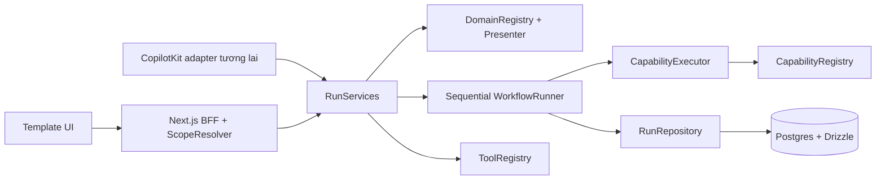

# Core P0 — spec cho shared execution platform

Ngày: 2026-10-05. Trạng thái: **đề xuất để review, chưa triển khai**.

**Ưu tiên đã thay đổi:** user muốn chat AI + durable chat history làm core trước. Bản này giữ làm reference business-run machinery, không còn là slice đầu tiên. Đọc [CopilotKit research](../../research/2026-10-05-copilotkit-chat-core.md); SDK/runtime integration cần đưa lên trước workflow machinery.

Repo duy nhất: `E:/thucchienai/hackathon-starter-kit`, origin `baominh5xx2/template-codesdas`. Không thao tác repo thi đấu `aitc2026-team-939-triplepeek`.

## 1. Kết quả cần đạt

Một domain pack đăng ký schema, capabilities, workflow và presenter là có thể tạo run, execute, đọc tiến độ, cancel và lấy generic UI blocks. Core chạy được bằng capabilities deterministic, Postgres local và BFF, không cần model, API key hoặc tài liệu BTC.

P0 chứng minh machinery hoạt động bằng `core-demo`: `{ numbers: [2, 3, 5] }` → validate → cộng thành `10` → artifact → metric block. Đây là demo kiểm tra tích hợp, không được quảng bá như Analysis Engine đã hoàn thiện.

Mình xây core và shared platform. Bạn xây problem templates theo [build ownership](../../build-ownership.md), compose FE và backend flow từ interfaces này. P0 không xây sáu templates, React cards, parser/crawler, RAG hay model adapter.

## 2. Ranh giới kiến trúc



`src/contracts` chứa DTO và Zod schema dùng chung. `src/core` chứa logic và ports; không import React, Next.js, Drizzle, CopilotKit SDK hoặc đọc `process.env`. `src/adapters/postgres` hiện thực persistence. `src/server` cấu hình dependency injection, scope và BFF. `src/domains` là nơi pack compose workflow/presenter; `src/problem-templates` chưa cần tạo cho P0.

Agent và BFF gọi cùng service layer. Agent không gọi vòng lại HTTP của chính app. Business run ID độc lập với chat thread ID và AG-UI run ID.

Một pack mới có thể giữ `manifest.ts`, `schemas.ts`, `capabilities.ts`, `workflow.ts`, `presenter.ts`, `index.server.ts` và fixtures trong thư mục domain của nó. Composition root register artifact schemas → capabilities → tools → domain. Template UI đọc manifest/input fields và render ResultView; không cần biết capability dùng thuật toán gì. Không load code từ JSON, URL hay prompt để đăng ký workflow.

## 3. Những phần có sẵn và thay đổi contract cần làm

Skeleton đã có artifact registry, workflow/domain validators, ports, DTO và 19 UIBlock types. Các contract sau **chưa có implementation**; plan sẽ thêm implementation và migrate consumers.

| Hiện tại | Quyết định P0 |
|---|---|
| `Step.capability` giữ capability object | Đổi thành `CapabilityRef = { id: string; version: number }`; resolve qua registry |
| Cả `Step.run` và `Capability.run` | Bỏ `Step.run`; chỉ executor gọi registered `Capability.run` |
| `Step.retry: number` | Đổi thành `retry: { maxAttempts: 1 \| 2 }`; tính cả lần đầu |
| Capability chưa khai báo retry safety | Thêm `retrySafety: "safe" \| "never"`; chỉ `safe` được cấu hình 2 attempts |
| `RunContext.ports` có cả write repositories | Đổi thành `CapabilityPorts` chỉ có scoped readers và integration ports; runner giữ quyền commit |
| Repository mutations không có execution fence | Step mutations nhận `StepFence = { stepId: string; attempt: number }` |
| `CoreServices` khai báo toàn bộ platform | P0 factory trả `RunServices`, là subset run/result/artifact; phần còn lại chưa triển khai |

Giữ nguyên **Artifact envelope thật trong repo**: `id, kind, version, runId, workspaceId, data, sourceIds, evidenceIds, createdAt, provenance`. `provenance` gồm `capabilityId, capabilityVersion, stepId?, inputArtifactIds?`. Không chuyển source/evidence IDs vào provenance; không thêm top-level `stepId`.

Giữ nguyên `RunSnapshot` và `ResultView` DTO. `userId` dùng cho ownership trong DB, không thêm vào public snapshot. Existing empty domain seeds và fixture APIs vẫn hoạt động như hiện tại.

## 4. Registry và validation

`CapabilityRegistry.register<I,O>(capability)` từ chối trùng `(id, version)`, ID rỗng, version không phải số nguyên dương. Resolve trả internal `RegisteredCapability` có `input/output: Schema<unknown>` và `run(ctx, input: unknown): Promise<ArtifactDraft<unknown>>`; generic erasure chỉ nằm ở registration wrapper sau validation.

`DomainRegistry` giữ nhiều version. `get(id, version?)` chọn version lớn nhất khi không truyền version; run lưu version tại create và luôn dùng đúng version đó. Missing version khi execute là `feature_unavailable`, không tự chuyển sang pack mới.

Domain registration kiểm tra workflow, capability refs, artifact schemas, source profile IDs, tool allowlist và input examples. Zod parse input xong vẫn phải parse `JsonValueSchema` để chặn schema transform trả Date, function, NaN hoặc object không serialize được.

Workflow là ordered DAG chạy tuần tự: `dependsOn` chỉ được trỏ step trước, không duplicate/cycle/forward reference. Tối đa **32 steps**, timeout nguyên trong **1–30_000 ms**, attempts **1 hoặc 2**. Empty seeds hợp lệ để hiển thị catalog nhưng create run trả `feature_unavailable`.

`StepBindingContext.get(stepId, kind, schema)` chỉ đọc artifact của dependency đã khai báo và succeeded; schema phải parse được data. Trả bản copy để binder không sửa snapshot gốc. Không tìm artifact ngẫu nhiên ngoài run/scope.

## 5. Executor, budget và lỗi

Executor parse input, chạy capability, parse output, kiểm tra ArtifactDraft và artifact schema theo `(kind, version)`, sau đó tạo canonical envelope bằng server UUID/time/run/scope. Kind/version và capability provenance khai báo sai bị reject. Server gắn authoritative step ID và dependency artifact IDs. Output transform cũng phải qua JSON validation.

Một run có deadline **120_000 ms**; một attempt tối đa `min(step.timeoutMs, remaining run time)`. Timer chủ động abort và race promise. Capability không tuân thủ AbortSignal có thể còn chạy nền; kết quả đến muộn bị bỏ và không thể commit. Core không hứa preempt JavaScript hoặc undo external effects.

`RunBudget` hiện thực contract `consume("model" | "repair" | "fetch" | "tool")` và `remainingMs()`. Default maxima theo run: **model 8, repair 1, fetch 8, tool 16**. Consume vượt giới hạn throw `resource_limit`; integration wrappers và tool registry consume trước operation tương ứng, dùng cùng budget qua các attempts. Executor không tự charge thêm một model/tool operation cho capability deterministic. P0 demo không gọi model/fetch/repair. Runtime counters nằm trong execution hiện tại; P0 không resume nên không cần durable budget ledger.

`CoreError` có public code an toàn và retryable flag. Public HTTP codes: `invalid_request` 400, `unauthorized` 401, `forbidden` 403, `not_found` 404, `conflict` 409, `resource_limit` 429, `feature_unavailable` 503, `timeout` 504, `cancelled` 409, `internal_error` 500. Skeleton `POST /api/runs` giữ 501 khi chưa bật live mode. Không đưa raw exception, SQL, connection URL, input hoặc secret vào response/log.

Chỉ retry lỗi `retryable: true`, capability `retrySafety: "safe"`, chưa hết deadline và còn attempts. Không retry invalid input/output, timeout, cancellation, exhausted budget hoặc lỗi không rõ nguồn gốc. Retry tuần tự, không backoff trong P0; attempt mới được persist trước khi gọi capability. Mỗi run tối đa một repair, chưa hiện thực repair engine.

## 6. Run state và kết thúc workflow

```text
queued -> running -> completed | partial | failed | cancelled | interrupted
queued -> cancelled
```

Claim là compare-and-set `queued -> running`. Hai execute đồng thời: một request thắng claim, request còn lại nhận 409. Execute lại run terminal trả snapshot, không chạy capabilities lần nữa. POST create hai lần tạo hai run khác nhau; P0 chưa có idempotency key.

Step attempt bắt đầu ở 1. Pending → running → succeeded/failed; retry cho phép failed → running với attempt tăng đúng 1. Skipped chưa chạy có attempt 0. Mỗi mutation hợp lệ tăng `revision` một lần; no-op hoặc CAS thất bại không tăng.

| Điều kiện | Terminal status |
|---|---|
| Tất cả required steps và required artifacts hợp lệ; không optional failure | `completed` |
| Chỉ optional steps failed/skipped, required outputs đầy đủ | `partial` |
| Required step thất bại, required dependency bị thiếu hoặc required artifact thiếu | `failed` |
| User cancel hoặc execute request bị abort | `cancelled` |
| Running run hết deadline, được phát hiện qua read sau khi executor bị mất | `interrupted` |

Runner đang hoạt động gặp run deadline kết thúc `failed` với warning `run_deadline_exceeded`, trừ khi một concurrent read đã thắng conditional transition `interrupted`; terminal state đầu tiên được giữ. Optional step timeout có thể tiếp tục nếu run còn thời gian. Required failure dừng workflow; steps chưa chạy được marked skipped với `upstream_failed`. Optional failure chỉ skip descendants phụ thuộc nó; độc lập vẫn chạy. Runner đánh giá lại required artifact kinds là union từ workflow và domain trước khi finish.

Cancel ghi terminal state trước và idempotent. Nếu executor còn cùng process, local AbortController abort ngay. Across processes, durable run state và commit fence chặn writes; P0 không có pub/sub để abort một remote process ngay lập tức.

Read running run quá deadline thực hiện conditional transition `interrupted`, đánh dấu running steps failed và pending steps skipped với `run_interrupted`. Không tự restart/resume. Có thể tạo run mới từ input cũ. Không sweep toàn bộ running runs khi app start vì có thể làm hỏng executor còn hoạt động ở process khác.

## 7. Persistence và atomicity

Postgres là source of truth cho business state. Drizzle tables:

| Table | Fields cần có |
|---|---|
| `runs` | UUID PK, user/workspace IDs, domain ID/version, JSONB input, status, revision, deadline, warnings, created/updated timestamps |
| `run_steps` | `(run_id, step_id)` PK, position, status, attempt, artifact IDs, started/finished timestamps, error code |
| `artifacts` | UUID PK, run/workspace IDs, producing step/attempt columns, canonical envelope JSONB; unique `(run_id, step_id)` |
| `dev_sessions` | SHA-256 token hash PK, server-owned user/workspace IDs, expiry timestamp |

Artifact envelope dùng JSONB; producing step/attempt columns dùng để enforce unique/fence, không thay public DTO. FKs cascade chỉ trong starter DB; không dùng cascade để xóa dữ liệu khác. UUID không thay thế authorization.

Mọi read/write kiểm tra cả `userId` và `workspaceId`. Artifact query join owning run. Scope mismatch trả not_found hoặc no-op phù hợp, không tiết lộ resource tồn tại. `trustedOperator` không bypass ownership trong P0.

`commitStep` lock owning run row trong short transaction, kiểm tra running, deadline bằng DB clock, đúng step status/attempt, insert artifact và update step/revision atomically. `startStep` cũng cần deadline còn hiệu lực. `finishStep`, terminal `finish` và `cancel` dùng row lock/status/attempt guard nhưng được ghi failure/cancellation sau deadline; không ghi success sau deadline. Không giữ transaction trong lúc bind/network/capability chạy.

Postgres repo không nhận `completed` trước khi mọi required step/artifact điều kiện đã được service runner kiểm tra; repository vẫn enforce transitions. Terminal state không được đổi sang terminal khác. Deadline/cancel/stale attempt làm write bị reject với `conflict`; runner đọc snapshot mới thay vì overwrite.

## 8. Services, presenter và tool registry

`RunServices` là `Pick<CoreServices, "createRun" | "executeRun" | "getRun" | "cancelRun" | "getResult" | "getArtifact">`. Factory dependency-inject registries, repos, executor, scoped capability ports, clock/ID generator và local execution controllers. Không giả lập upload/ingestion/dataset service thành công.

Presenter chạy trên snapshot và `ResultMetadataProvider.resolve(scope, snapshot)` trả `{sources, evidence}`. Default provider chỉ chấp nhận artifacts không có source/evidence IDs, trả hai arrays rỗng; referenced metadata chưa có provider thì fail `feature_unavailable`. Domain-specific provider sau này phải resolve trong cùng scope; core không import risk/legal/tourism schemas.

`getResult` gọi đúng domain version, typed artifact getter và presenter rồi parse `ResultViewSchema`. P0 presenter chỉ chấp nhận blocks không cần external dataset/claim/action catalog; `assertCoreResultReferences` reject nonempty unresolved source/evidence/claim/dataset/factor references và check progress step/artifact actions trong snapshot. Report references/cycles vẫn dùng schema hiện có. Đây là gate rõ ràng trước khi bổ sung metadata/dataset capabilities, không tuyên bố đầy đủ evidence renderer.

Presenter lỗi hoặc result invalid → public `internal_error`; không thay terminal business status đã lưu. Queued/running run vẫn có thể render progress nếu presenter hỗ trợ.

`ToolDefinition<I,O>` gồm name, input/output schemas, `effect: "read" | "internal-write" | "external-write"`, `run(context, input)`. ToolContext có authenticated scope, domain ID/version, signal và budget. Registry execute kiểm tra exact manifest allowlist **trước** khi gọi handler; parse input/output và JSON boundary. Domain không được tool do client tự đăng ký.

Read và internal-write tools được phép khi có scope + allowlist. External-write trả `feature_unavailable`: approval/HITL chưa có P0. Không tạo tool gửi email, đăng bài, write SQL hoặc external action. pgEdge MCP tương lai chỉ read/query bằng DB role riêng; P0 không khởi động MCP server.

## 9. BFF và scope local

Route handlers dùng Node runtime. Body JSON giới hạn **256 KiB** trước parse, strict object schemas reject unknown fields. Request ID tạo trace ID riêng, không dùng constant `runs`.

`ScopeResolver.resolve(request): Promise<Scope>` do server cung cấp. Client không truyền userId/workspaceId/trustedOperator ở body, custom headers hay query. Production muốn bật live phải inject real auth resolver; thiếu resolver thì container không bật run routes.

Local mode dùng `POST /api/session/dev` chỉ khi `NODE_ENV=development`, `APP_MODE=live`, origin đúng configured loopback `http://127.0.0.1:3000`. Server tạo random token **32 bytes**, DB chỉ lưu SHA-256, TTL **24 giờ**; cookie HttpOnly, SameSite=Lax, Path=/, Max-Age=86400. Scope cố định server-owned `dev-user` / `dev-workspace`, `trustedOperator=false`. Production không đăng ký endpoint này. Mutating requests cần Origin khớp configured origin, session hợp lệ; cookie không phải nguồn role do browser khai báo.

| Endpoint live | Response |
|---|---|
| `POST /api/runs` `{domainId,input}` | 201 RunSnapshot queued |
| `POST /api/runs/:runId/execute` empty body | 200 terminal RunSnapshot; **await execution** |
| `GET /api/runs/:runId` | 200 scoped RunSnapshot |
| `POST /api/runs/:runId/cancel` empty body | 204, idempotent với owned terminal run |
| `GET /api/runs/:runId/result` | 200 ResultView |
| `GET /api/artifacts/:artifactId` | 200 Artifact; missing/scope mismatch 404 |

Execute không trả 202 rồi bỏ một Promise chạy nền. UI poll GET trong lúc execute request còn mở. Hosting phải cho phép request 120 giây; chưa thiết kế cho serverless timeout ngắn. No durable queue, parallel steps, durable SSE hay distributed worker trong P0.

## 10. Container, Docker và versions

Default `APP_MODE=skeleton`: app vẫn boot không .env, DB hay key; run route trả unavailable. `APP_MODE=live` chỉ bật runs/artifacts khi DB + resolver ready. Model, uploads, parsers, sources, RAG, voice, MCP giữ false. Missing feature có typed unavailable error.

Giữ exact dependencies hiện có: Next.js **16.3.8**, React **19.3.0**, Zod **4.6.5**, Drizzle **0.45.3**, pg **8.23.1**, drizzle-kit **0.31.11**, TypeScript **6.0.3**, Bun **1.4.2**; Node **24 LTS** theo compatibility repo. Không thêm dependency cho CopilotKit, model hoặc parser vào P0. Khi triển khai phải recheck stable/peer compatibility nếu registry thay đổi, không bump chỉ vì số version lớn hơn.

Docker project `hackathon-starter-core`, image dự kiến **postgres:18.6**, publish **127.0.0.1:55432:5432**, named volume riêng mount **/var/lib/postgresql** theo PostgreSQL 18 Docker layout. Verify image manifest và ghi digest thực tế lúc triển khai. Healthcheck `pg_isready`, không expose ra LAN. Password tạo local và chỉ ghi vào ignored .env; .env.example có placeholder. Không stop, remove, prune hoặc đổi config container đang có.

Postgres 18.6 là stable được listed ở [PostgreSQL versioning](https://www.postgresql.org/support/versioning/). Mount path theo [official Docker image documentation](https://github.com/docker-library/docs/blob/master/postgres/content.md). **Lượt viết docs này chưa pull/start image hoặc test migration.**

## 11. CopilotKit: dùng skills, tách implementation phase

Repo [CopilotKit/skills](https://github.com/CopilotKit/skills) đã archive và chuyển sang [CopilotKit/CopilotKit/skills](https://github.com/CopilotKit/CopilotKit/tree/main/skills). Đã cài 9 skills từ nguồn mới, đọc skill `copilotkit` version 3.1.0 để thiết kế boundary.

Theo [Copilot Runtime docs](https://docs.copilotkit.ai/backend/copilot-runtime), TypeScript runtime dùng được độc lập với Intelligence. Future integration dùng v2 subpaths và fetch-native handler, bind frontend agent name đúng runtime map key. Không cần Intelligence project/key cho kiến trúc standalone này. API cụ thể sẽ được verify lại khi chọn SDK stable ở phase tích hợp.

P0 chỉ thêm pure `projectRun(snapshot): AgentProjection` và `toUiSession(snapshot): UiSessionState` theo contracts hiện có. Business state vẫn từ Postgres; browser/AG-UI state là projection. Chat SDK, streaming, LLM gateway và real tools bridge có plan riêng sau P0.

## 12. Acceptance và bàn giao

- Domain pack mới không sửa runner hoặc Postgres adapter; chỉ register schema/capabilities/domain/presenter.
- Core demo sum chạy live end-to-end; restart app đọc lại completed run/artifact/result.
- Hai execute requests không chạy cùng run hai lần; cancelled/expired/stale attempts không commit output muộn.
- Required failure → failed; optional failure với required outputs đủ → partial; scope khác không đọc/ghi được.
- Body quá giới hạn, malformed JSON, invalid transformed output và presenter references bị reject an toàn.
- Default skeleton, domain fixtures và 19 block contracts không regress.
- Không key/model/network call cần thiết để chạy demo; không sửa repo thi đấu hoặc dựng friend templates.

Plan thực thi: [Core P0 implementation plan](../plans/2026-10-05-core-p0-implementation-plan.md). Đây là backlog mới cho core; master starter plan cũ không được coi là đã thực thi.
