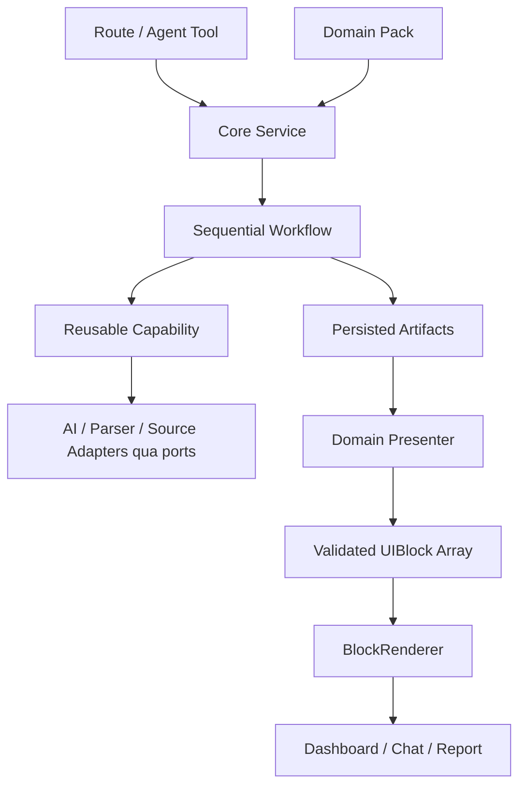

# Spec: Hackathon Starter Kit — cấu trúc gọn để ráp theo đề

Ngày: 2026-10-05. Phiên bản: 0.3. Trạng thái: thiết kế để review, chưa scaffold app.

Các đoạn TypeScript là contract dự kiến của dự án, không phải mã đã triển khai hay API có sẵn của CopilotKit.

## 1. Mục tiêu và lựa chọn

Mục tiêu là chuẩn bị machinery dùng chung trước ngày thi; lúc nhận đề thay Domain Pack để ráp sản phẩm trong 2–3 giờ. Starter tập trung vào document analysis, research, dataset analytics, risk, recommendation và report.

Chọn modular monolith: một app Next.js + TypeScript + BFF + CopilotKit runtime, Postgres Docker + Drizzle, mọi lời gọi model qua optional AI Gateway. pgEdge Postgres MCP được chọn làm service host local cho database exploration/query; mỗi domain chỉ bật các database tools thực sự cần.

Ba cách tổ chức đã cân nhắc:

| Cách | Lợi ích | Chi phí |
|---|---|---|
| Modular monolith + Domain Packs | Ráp nhanh, một build, đầu nối rõ | Cần chốt schema và registration |
| Một app riêng cho mỗi domain | Dễ viết domain đầu | Dễ copy logic và lệch contracts |
| Monorepo nhiều service/package | Tách triển khai độc lập | Nhiều wiring và vận hành khi thi |

Giữ bốn abstraction chính: Capability, Workflow, Artifact và UIBlock. Domain Pack là cấu hình ghép chúng. Các registry là danh mục tĩnh trong TypeScript; không xây plugin marketplace, expression language hay một orchestration framework.

Artifact là primitive trung tâm: capability tạo dữ liệu artifact; workflow lưu artifact; chat và dashboard cùng đọc artifact; presenter chuyển artifact sang UIBlock.

Repo chuẩn bị ở E:/thucchienai/hackathon-starter-kit. Repo thi aitc2026-team-939-triplepeek nằm ngoài phạm vi thao tác. Không tự chuyển source, cấu hình remote hay push sang repo thi.

## 2. Những thay đổi từ v0.1

| Góp ý | Quyết định |
|---|---|
| Gộp application vào core/services | Áp dụng; services là entry point chung cho route và agent |
| Artifact làm trung tâm | Áp dụng; executor gắn metadata và lưu, tránh mỗi capability tự ghi DB |
| Domain entry chỉ registration/config | Áp dụng; không đặt business implementation trong index.server.ts |
| Chuẩn bị archetypes thay vì nhiều domain dự đoán | Áp dụng; hai archetypes chạy thật trước, các ví dụ khác thêm sau |
| Workflow đơn giản | Áp dụng; runner tuần tự, dependency chỉ tham chiếu step trước |
| UIBlock có 15–20 type cố định | Chốt 19 type, runtime props schema và fixture rõ ràng |
| Shared source profiles | Đưa thành source-profiles/; domain chọn profile và override trong app policy |
| Giữ playground | Giữ; preview UI bằng fixtures, không cần model live |

Source profiles đã có trong v0.1 ở domain config; v0.2 đưa phần dùng chung thành thư mục riêng. Không thêm một crawler khác chỉ vì thay vị trí config.

Bỏ worker/queue/lease/DAG scheduling khỏi P0. P0 chạy workflow trong request được await; lưu trạng thái và artifacts sau từng step. Chạy bền vững khi đóng tab hoặc restart là P1, không phải cam kết ngầm của P0.

## 3. Luồng hệ thống



Route và agent gọi cùng core services. Capability không import UI hoặc domain cụ thể. Presenter không gọi model hay DB. Một artifact được hiển thị ở nhiều bề mặt mà không chạy lại analysis.

Trải nghiệm mặc định là workspace có input, dashboard và chat bên cạnh. Chat-first dùng cùng renderer; chỉ thêm shell đó khi một archetype hoặc đề cần.

## 4. Cây thư mục đích

Cây này là cấu trúc sẽ triển khai sau khi thiết kế được duyệt. Repo hiện chỉ chứa tài liệu.

```text
hackathon-starter-kit/
├── README.md
├── package.json
├── bun.lock
├── next.config.ts
├── drizzle.config.ts
├── compose.yaml
├── Dockerfile
├── .env.example
├── docs/
│   ├── domain-authoring.md
│   ├── gateway-compatibility.md
│   ├── playbooks/
│   └── superpowers/specs/
├── infra/
│   ├── pgedge/                   # config/token examples, không commit secrets
│   └── postgres/init/            # DB roles và analytics grants khi scaffold
├── scripts/
│   ├── doctor.ts
│   ├── validate-domain.ts
│   └── seed.ts
├── src/
│   ├── app/
│   │   ├── layout.tsx
│   │   ├── providers.tsx
│   │   ├── workspace/[domainId]/page.tsx
│   │   ├── playground/page.tsx
│   │   └── api/
│   │       ├── copilotkit/[[...slug]]/route.ts
│   │       ├── domains/route.ts
│   │       ├── uploads/route.ts
│   │       ├── runs/route.ts
│   │       ├── runs/[runId]/route.ts
│   │       ├── runs/[runId]/execute/route.ts
│   │       ├── runs/[runId]/cancel/route.ts
│   │       ├── artifacts/[artifactId]/route.ts
│   │       └── datasets/[datasetId]/rows/route.ts
│   ├── contracts/
│   │   ├── common.ts
│   │   ├── documents.ts
│   │   ├── datasets.ts
│   │   ├── artifacts.ts
│   │   ├── evidence.ts
│   │   ├── runs.ts
│   │   ├── errors.ts
│   │   ├── sources.ts
│   │   └── ui/
│   │       ├── blocks.ts
│   │       ├── result-view.ts
│   │       └── schemas/           # một schema props cho mỗi block type
│   ├── core/
│   │   ├── capabilities/          # definition + registry + executor
│   │   ├── workflows/             # definition + sequential runner
│   │   ├── tools/                 # definition + registry + dispatcher
│   │   ├── services/
│   │   │   ├── runs.ts
│   │   │   ├── artifacts.ts
│   │   │   ├── tools.ts
│   │   │   ├── approvals.ts       # chỉ tạo khi có action cần approval
│   │   │   └── memory.ts
│   │   ├── domains/               # definition + server catalog
│   │   └── ports/                 # LLM, repositories, sources, storage, MCP
│   ├── capabilities/
│   │   ├── ingestion/
│   │   ├── extraction/
│   │   ├── research/
│   │   ├── evidence/
│   │   ├── analysis/
│   │   ├── scoring/
│   │   ├── recommendation/
│   │   ├── analytics/
│   │   └── report/
│   ├── adapters/
│   │   ├── llm/btc/
│   │   ├── parsers/
│   │   ├── sources/
│   │   ├── postgres/
│   │   │   ├── schema/
│   │   │   ├── repositories.ts
│   │   │   └── client.ts
│   │   ├── storage/
│   │   └── mcp/pgedge/
│   │       ├── client.ts          # HTTP JSON-RPC + auth + protocol negotiation
│   │       ├── tools.ts           # allowlist và mapping tool names
│   │       └── normalize.ts       # MCP result → typed data/artifact draft
│   ├── source-profiles/
│   │   ├── official-web.ts
│   │   ├── legal.ts
│   │   ├── statistics.ts
│   │   ├── general-web.ts
│   │   └── uploaded-documents.ts
│   ├── agents/
│   │   ├── runtime.ts
│   │   ├── tool-bridge.ts
│   │   └── state.ts
│   ├── server/
│   │   ├── env.ts
│   │   └── container.ts
│   ├── ui/
│   │   ├── primitives/
│   │   ├── blocks/
│   │   ├── registry/
│   │   ├── renderers/            # BlockRenderer, ResultRenderer, ReportView
│   │   ├── shells/
│   │   ├── forms/
│   │   ├── agent/
│   │   ├── states/
│   │   ├── hooks/
│   │   └── fixtures/
│   └── domains/
│       ├── catalog.client.ts
│       ├── _template/
│       └── examples/
│           ├── document-review/
│           ├── dataset-analysis/
│           ├── research-report/
│           └── risk-analyzer/
├── tests/
│   ├── contracts/
│   ├── workflows/
│   ├── integration/
│   └── e2e/
└── .data/                        # upload/runtime files, gitignored
```

Không tạo module rỗng chỉ để khớp cây. Optional adapters, approvals và examples được thêm khi có consumer thật. pgEdge client được dựng khi nối database tools vào dataset-analysis. Các folder ui/ là cách nhóm component; không cần một service hoặc một facade riêng cho mỗi folder.

## 5. Vai trò từng lớp và dependency rules

| Vị trí | Chịu trách nhiệm |
|---|---|
| app | Route, request/response, pages và shell composition |
| contracts | Zod schemas, inferred TS types, dữ liệu JSON-safe |
| core/services | Entry points: create/execute/get run, upload, tool dispatch, memory |
| core/workflows | Chạy steps, dependency validation, status, deadline và retry |
| core/capabilities | Registry, schema validation, artifact finalization/persistence |
| capabilities | Thuật toán hoặc orchestration nhỏ cho một khả năng |
| adapters | Model/network/file/DB SDK cụ thể |
| source-profiles | Chính sách nguồn dùng chung |
| agents | CopilotKit runtime và bridge đến cùng core services |
| server/container.ts | Chọn adapters và inject dependencies |
| domains | Schema, prompt, workflow, profile selection, rules và presenter |
| ui | Nhận block props đã validate, render và điều khiển UI |

Luật import:

- Contracts không import React, env, Next.js runtime, adapters hoặc server handlers.
- Core services dùng core definitions và injected ports; không biết domain cụ thể.
- Capabilities không import domain, React, server container hoặc gateway client trực tiếp.
- Adapters implement ports; không chứa domain rules.
- Domain server definition chỉ ghép schemas, capabilities qua registry IDs, profiles, rules và tools.
- Generic UI chỉ import client-safe contracts và UI modules.
- Agent tool bridge gọi services; không sao chép business flow.
- Server container là composition root, không export vào client bundle.

Không tạo một barrel vừa export manifest vừa export prompts/server handlers. Chỉ dùng public module entry; hạn chế import sâu internals.

Server Components gọi core services trực tiếp; client gọi BFF hoặc CopilotKit transport. [Next.js BFF](https://nextjs.org/docs/app/guides/backend-for-frontend)

## 6. Primitive trung tâm: Artifact

```ts
type Artifact<T> = {
  id: string;
  kind: string;                   // ví dụ analysis, risk, dataset
  version: number;                // phiên bản schema data
  workspaceId: string;
  runId: string;
  stepId: string;
  data: T;
  provenance: {
    sourceIds: string[];
    evidenceIds: string[];
    derivedFrom: string[];        // artifact IDs dùng để suy ra kết quả
  };
  createdAt: string;              // ISO UTC
};

type ArtifactDraft<T> = Pick<
  Artifact<T>,
  "kind" | "version" | "data" | "provenance"
>;
```

Capability trả ArtifactDraft; executor validate và hoàn thiện Artifact trước khi lưu. Metadata như workspaceId, runId, stepId, id và createdAt do server gắn, không cho model hoặc client tự khai báo.

Provenance envelope luôn có, các mảng có thể rỗng cho dữ liệu chưa có evidence. Không nhân bản toàn bộ Evidence vào mọi artifact. Evidence/source lưu một nơi, artifact tham chiếu IDs.

Schema được đăng ký theo (kind, version). Kind dùng namespace khi data schema phụ thuộc domain, ví dụ document-review/extracted-data; hai domain không đăng ký cùng kind/version với hai schema khác nhau. Data mang kiểu cụ thể; không biến artifact thành túi unknown không validate.

| Capability | Artifact chính |
|---|---|
| ingestion | document hoặc dataset collection |
| extraction | extracted-data theo schema của domain |
| research | research-sources |
| evidence | evidence-set |
| analysis | analysis |
| scoring | risk |
| recommendation | recommendations |
| analytics | dataset-analysis |
| report | report |

Capability có thể tạo supplementary artifacts qua executor helper khi cần; một primary artifact là mặc định. Module không tự mint IDs hoặc tự ghi DB để lách executor.

ArtifactStore là repository interface, không phải một storage engine mới. Query/filter quan trọng nằm ở metadata; data dùng JSONB.

## 7. Capability, step và workflow contracts

```ts
type Capability<I, O> = {
  id: string;
  version: number;                // phiên bản implementation
  input: Schema<I>;
  output: Schema<O>;             // validate artifact.data
  run(ctx: RunContext, input: I): Promise<ArtifactDraft<O>>;
};

type Step<I, O> = {
  id: string;
  dependsOn: string[];
  input: Schema<I>;
  output: Schema<O>;
  bind(ctx: StepBindingContext): I;
  run(ctx: RunContext, input: I): Promise<ArtifactDraft<O>>;
  timeoutMs: number;
  retry: { maxAttempts: number };
  required: boolean;
};
```

Schema<T> là type abstraction nhỏ trên Zod. RunContext chứa run/workspace/step IDs, AbortSignal, injected ports và budget. StepBindingContext chỉ đọc input ban đầu và artifacts của các dependency đã khai báo.

Step adapter gọi CapabilityRegistry/executor chung. Không tự viết thêm logic validate/save cho từng step. Capability version và artifact schema version là hai khái niệm khác nhau.

Workflow là ordered steps:

```text
ingest → extract → research → evidence → analyze → score → recommend
                         (optional)           (chọn theo archetype)
```

P0 chạy tuần tự. Dependency chỉ được tham chiếu một step trước đó. Validator bắt duplicate ID, missing/later dependency, unknown capability và schema mismatch. Không có branch scheduler, parallel DAG engine, distributed locks, durable resume hay workflow DSL.

Bind là typed TypeScript function, không phải string expression hoặc eval. Mỗi bind đọc artifact qua helper có schema; không chuyền một object state chung rồi đoán field. Domain có thể skip step qua condition thuần nếu dependencies còn hợp lệ.

Presenter chạy sau workflow hoặc khi đọc partial snapshot. Nó không phải capability và không phải step gọi model.

Retry tối đa hai attempts cho transient read/model failure trong deadline; invalid input và permission failure không retry. JSON repair tối đa một call và tính vào cùng budget; adapter không cộng thêm một vòng retry riêng ngoài runner policy. Không giữ DB transaction mở trong lúc gọi network/model.

## 8. P0 execution lifecycle: gọn và tường minh

BFF có hai thao tác:

1. POST /api/runs tạo một run queued, trả 201 và runId.
2. POST /api/runs/:runId/execute claim run rồi await workflow tới terminal state.

Không tạo detached Promise, không trả 202 rồi hy vọng workflow tiếp tục chạy sau khi handler kết thúc. UI nhận runId trước khi execute, có thể poll GET /api/runs/:runId để hiển thị progress/artifacts trong lúc request execute đang mở.

Agent gọi cùng runs.create + runs.execute qua service, không HTTP gọi lại BFF của chính app. Business runId tách khỏi chat runId của CopilotKit.

Run states: queued, running, completed, partial, failed, cancelled, interrupted. Step states: pending, running, succeeded, skipped, failed. Domain khai báo requiredArtifactKinds trong server definition để kiểm tra output tối thiểu. Required step lỗi làm run failed; optional step lỗi chỉ được trả partial nếu các required artifacts còn đủ và validate thành công.

Mỗi step commit artifact + step state cùng transaction ngắn. Database chỉ cho một execute request claim queued → running; execute lần nữa trả snapshot/conflict phù hợp, không chạy model lần thứ hai.

Default deadline toàn run 120 giây, mỗi step tối đa 30 giây trong ngân sách còn lại; cấu hình server có thể đổi theo môi trường. Request disconnect hoặc cancel truyền AbortSignal và giữ artifacts đã commit. Hạ tầng restart có thể ngắt execution; run quá deadline còn running được đánh dấu interrupted khi đọc.

Reload sau khi run completed đọc lại snapshot. Run interrupted không tự resume; người dùng tạo run mới với input đã lưu. Không retry side effect bên ngoài khi chưa có idempotency/reconciliation.

P0 triển khai trên Node/Docker để chủ động deadline. Host serverless có thể giới hạn thời gian handler; kiểm tra trước khi chọn host. [Next.js deployment caveats](https://nextjs.org/docs/app/guides/backend-for-frontend)

P1 mới thêm worker + queue + durable events/reconnect/resume nếu một flow cụ thể cần. P0 không có bảng jobs, lease hoặc streaming business event log.

## 9. UIBlock: 19 loại cố định

Danh mục canonical:

```text
metric              chart               table
insight             recommendation      risk
warning             source              evidence
verdict             timeline            progress
action              map                 place
comparison          report-section      markdown
media
```

```ts
type Block<T extends string, P> = {
  id: string;
  type: T;
  props: P;
};

type ResultView = {
  runId: string;
  revision: number;
  title: string;
  status: RunStatus;
  blocks: UIBlock[];
};
```

UIBlock là discriminated union của đúng 19 block schemas, TypeScript type infer từ Zod definitions. Block type dùng singular source, không trộn với sources từ v0.1. Source block có thể nhận nhiều source IDs. [Zod schemas](https://zod.dev/api)

Mỗi type có props schema, renderer registration và fixture. UI registry tĩnh ánh xạ type → schema + component. Agent không generate JSX, component path hay executable JavaScript.

Presenter nhận read-only artifacts + run snapshot + source/evidence metadata đã load, trả UIBlock[]. Read-only artifact helper parse data theo schema trước khi presenter sử dụng. Presenter là function thuần, không có model/network/DB access.

Core artifacts service tạo ResultView và validate blocks trước khi trả client. ReportView ghép cùng blocks; không tạo một result system thứ hai. Layout/order do presenter và shell quyết định.

Quy tắc props:

- Chart/Table tham chiếu dataset ID + valid column keys + filters + aggregation allowlist; rows lấy qua BFF có pagination.
- Risk có score/null, range, direction, level, factor refs và method; missing input không đồng nghĩa risk thấp.
- Insight/Verdict link claim/evidence IDs; Source/Evidence mở đúng source viewer.
- Progress lấy trạng thái run/step; không dùng text model tự phỏng đoán.
- Action dùng action ID đã đăng ký và validated payload, không chứa handler code.
- Markdown sanitize và tắt raw HTML; Media chỉ dùng URL/storage ref được phép, không embed script.
- Report-section nhóm block IDs hiện có, không tự tham chiếu hoặc tạo vòng lặp.
- Block sai props/unknown type có fallback cục bộ; các block hợp lệ vẫn hiển thị.

Optional map/voice/media feature phải có trạng thái unavailable rõ ràng khi adapter hoặc policy chưa hỗ trợ. Playground vẫn preview fixture và unavailable state; không dùng dữ liệu giả như kết quả live.

## 10. Domain Pack chủ yếu là cấu hình

```text
domains/<domain-id>/
├── manifest.ts                  # client-safe metadata + branding + input UI
├── index.server.ts              # defineDomain registration
├── schemas.ts                   # input và các artifact data schemas
├── prompts.ts
├── workflow.ts                  # step selection + bindings
├── sources.ts                   # chọn shared profiles, override giới hạn
├── presenter.ts                 # ArtifactSet → UIBlock[]
├── scoring.ts                   # chỉ thêm khi dùng scoring
├── tools/                       # chỉ thêm custom tool cần thật
├── ui/                          # chỉ thêm custom UI cần thật
└── fixtures/
```

index.server.ts chỉ import và đăng ký schema, workflow, prompt, profiles, presenter và optional tools. Không đặt parse, fetch, scoring algorithms hoặc model loop trong entry file.

Manifest tách khỏi server entry: ID/version, title, description, branding, surface, inputFields và examples. Không export credentials/prompts/server tools vào client bundle.

Domain chủ yếu thay năm file schemas, prompts, workflow, sources, presenter; branding ở manifest, rules/tools chỉ thêm khi bài cần.

Đăng ký server pack tại core/domains/catalog.server.ts và public manifest tại domains/catalog.client.ts. Đây là wiring tĩnh, không tải arbitrary code từ browser.

Input form spec chỉ hướng dẫn UI. Backend dùng Zod validate input, ownership của upload/run IDs và constraints độc lập.

## 11. Archetypes và playbooks

Chỉ hai archetypes bắt buộc chạy thật trong vòng build nền tảng đầu:

- document-review: document → extraction → analysis → recommendation → report.
- dataset-analysis: CSV/XLSX → dataset → deterministic statistics → chart/table → report.

Sau đó thêm research-report và risk-analyzer khi shared capabilities đã có. Không prepare một scam product hoàn chỉnh trong starter.

Ví dụ risk-analyzer dùng RiskSignalSchema, scoring rules và presenter có risk/insight/recommendation/evidence blocks. Khi nhận đề scam, tạo domains/scam-check từ archetype và thay schema, prompt, sources/rules/presenter. Các engine giữ nguyên.

Playbooks đặt trong docs/playbooks cho scam, privacy, finance, education, healthcare admin, public service, tourism, marketing/SME, food safety, fake news và logistics. Mỗi playbook có user journey, capability mapping, nguồn gợi ý, missing-data cases và fixtures; chưa phải một runnable product.

Không cam kết mọi đề chỉ cần đổi prompt. Video deepfake detection, optimization chuyên sâu và real-time processing có thể cần capability mới với cùng đầu nối.

## 12. Shared source profiles

```text
source-profiles/
├── official-web.ts
├── legal.ts
├── statistics.ts
├── general-web.ts
└── uploaded-documents.ts
```

Profile là config: ID, adapter ID, allowed domains, query hints, limits, freshness attributes và citation requirement. Domain chọn profile và có thể giảm giới hạn hoặc override trong app policy.

Adapter là implementation: search, fetch, parse, paginate và normalize. Nguồn có query/navigation đặc thù dùng adapter phù hợp; đổi profile không tự khiến crawler đọc được một site động hoặc trang cần login.

Các field profile phải được adapter hỗ trợ/enforce. Chỉ dùng maxDepth khi có traversal; unsupported field làm validation lỗi thay vì bị bỏ qua.

Research: query planning giới hạn → search → fetch → clean → normalize → dedupe → rank → candidate evidence. Defaults maxSources 8, fetch concurrency 3, deadline mỗi fetch 15 giây, response max 5 MB.

Fetch chỉ HTTP/HTTPS, kiểm tra destination/redirect, chặn private/localhost/metadata addresses và giới hạn kích thước. Không có connector hay nguồn bị policy chặn thì trả unavailable/partial.

Sources do AI/network policy quyết định. official-web là source profile, không phải nhãn bảo đảm mọi kết luận là đúng. Phân biệt retrievedAt, publishedAt và contentHash.

## 13. Ingestion, evidence và calculation

PDF/DOCX/TXT/HTML thành document có source ID, segment text và locator. CSV/XLSX thành dataset có typed columns, stable row IDs và original source metadata. JSON parse theo schema. Không flatten dataset thành text để model tự cộng số.

Locator hỗ trợ text offsets end-exclusive, PDF page 1-based, sheet/row/column cho bảng và web section. Offset luôn dựa trên normalized segment text với quy ước được lưu.

Artifact data cho analysis gồm claims/findings với evidence refs. Claim kinds: fact, inference, calculation, recommendation. Support states: supported, contradicted, insufficient, unchecked.

Evidence kiểm tra source ID tồn tại, excerpt khớp text và locator hợp lệ. Citation integrity không tự chứng minh claim đúng; verification đánh giá evidence support riêng.

Analytics tính statistics/trend/outlier bằng code hoặc allowed queries. Model diễn giải kết quả đã tính. Score dùng rule set có version và traceable factors; missing signal làm giảm completeness hoặc score null.

Report ghép artifacts và UI blocks; model chỉ viết prose dựa trên claim refs. P0 web/print view + Markdown/JSON export; PDF/DOCX exporter là P1.

## 14. CopilotKit và optional AI Gateway

agents/runtime.ts đăng ký runtime + domain-aware tool bridge. agents/tool-bridge.ts expose các core services/capabilities được phép. agents/state.ts giữ active business run/artifact IDs và summaries cần thiết.

CopilotKit runtime/protocol là integration adapter, không phải chủ sở hữu business workflows. Runtime catch-all/provider pair dùng v2 SDK đã pin. [Copilot Runtime](https://docs.copilotkit.ai/agno/backend/copilot-runtime)

Factory mode phù hợp để đưa AI transport riêng và nối tools/instructions một cách tường minh. [Factory mode](https://docs.copilotkit.ai/agno/backend/custom-agent)

gateway adapter là đường model duy nhất cho chat/extraction/analysis/recommendation/report/verification. doctor probe protocol và features thật: streaming, structured JSON, tool calls, vision, embeddings và audio. Không mặc định hỗ trợ chỉ dựa vào tên model.

Feature thiếu: JSON parse + validate + tối đa một repair; non-stream message nếu thiếu streaming; validated ActionIntent + allowlist nếu thiếu native tools; full-text retrieval nếu thiếu embeddings. Không fallback sang model provider khác.

Frontend tools chỉ chọn tab/artifact/filter và điều khiển UI; server kiểm tra quyền khi chạy business tool. CopilotKit frontend handler chạy trong browser. [Frontend tools](https://docs.copilotkit.ai/reference/hooks/useFrontendTool)

P0 CopilotKit chat transport state có thể in-memory; persisted artifacts/run state ở Postgres. Restart không có durable chat/workflow continuation. State projector đưa summaries từ persisted artifacts vào phiên mới khi cần, không tuyên bố đã phục hồi phiên đang dở.

## 14.1. pgEdge Postgres MCP host local

Chọn upstream [pgEdge Postgres MCP](https://github.com/pgedge/pgedge-postgres-mcp). Chỉ dùng MCP server cho database tools; phần chat/product UI và model orchestration vẫn thuộc starter.

Deployment đích có ba service local: Next.js app, Postgres và pgedge-mcp. Dùng base image ghcr.io/pgedge/postgres-mcp, pin release tag/digest đã test khi scaffold. Upstream có image riêng cho web client; starter không cần image đó. [Docker deployment](https://github.com/pgEdge/pgedge-postgres-mcp/blob/main/docs/guide/deploy_docker.md)

Topology dự kiến:

```text
Browser → Next.js / CopilotKit → ToolRegistry
                                  ↓
                           pgEdge MCP adapter
                                  ↓
                         pgedge-mcp → Postgres

Next.js core services → Drizzle → cùng Postgres
optional AI Gateway ← model requests của starter
```

| Công việc | Đường thực thi |
|---|---|
| Migration, seed, upload rows, lưu run/artifact/evidence | Drizzle/repository |
| Agent đọc metadata và phân tích dataset bằng truy vấn | pgEdge MCP qua server adapter |
| Sinh SQL/giải thích kết quả/gọi model | optional AI Gateway adapter |
| Render chart/table/report | Persisted artifacts → presenter → UIBlock |

MCP không thay repository, scoring engine hoặc typed artifact contracts. Kết quả truy vấn đi qua normalizer/schema validator rồi executor lưu artifact; agent/dashboard không giữ một bản query result độc lập.

### Transport và tool bridge

HTTP endpoint của upstream là POST /mcp/v1, health check là GET /health. App chạy trong Docker gọi http://pgedge-mcp:8080/mcp/v1; Next.js chạy trên host gọi http://127.0.0.1:8080/mcp/v1 nếu publish port local. Client negotiate protocol/header theo phiên bản server đã pin, không mặc định mọi MCP SDK tương thích ngay. [MCP protocol](https://github.com/pgEdge/pgedge-postgres-mcp/blob/main/docs/developers/mcp-protocol.md)

Chỉ đăng ký các tool app cần: db.describe_schema và db.query_dataset; count/EXPLAIN có thể thêm khi có consumer. Mapping đến get_schema_info và query_database được kiểm tra qua tools/list của server thực tế. Metadata discovery diễn ra trước khi model tạo SQL; query_database nhận SQL đã được app/model chuẩn bị. [Tool reference](https://github.com/pgEdge/pgedge-postgres-mcp/blob/main/docs/reference/tools.md)

Doctor kiểm tra protocol negotiation, tool discovery, schema read và một truy vấn nhỏ; /health thành công chưa chứng minh MCP/tool integration hoạt động. Normalizer xử lý output của bản đã pin, bao gồm metadata text/TSV nếu có; không giả định mọi content là structured JSON.

Truy vấn có deadline, giới hạn rows/response size và source/dataset scope. Adapter kiểm tra truy vấn đọc qua SQL parser/allowed statement policy; không dùng regex như cơ chế quyền duy nhất. PostgreSQL role/grants là biên quyền thực thi. Result artifact lưu executedAt, SQL/query hash, dataset/source refs và truncation state để truy vết số liệu.

### Local configuration và gateway-only

Endpoint HTTP dùng Bearer token server-side. MCP service ở Docker network riêng; port debug nếu bật chỉ bind 127.0.0.1. Browser không nhận MCP token/DB password và không gọi MCP trực tiếp.

Các setting dự kiến, cần đối chiếu version đã pin lúc scaffold:

```text
PGEDGE_HTTP_ENABLED=true
PGEDGE_AUTH_ENABLED=true
PGEDGE_DB_ALLOW_WRITES=false
PGEDGE_LLM_ENABLED=false
PGEDGE_KB_ENABLED=false
PGEDGE_BUILTIN_TOOL_GENERATE_EMBEDDING=false
PGEDGE_BUILTIN_TOOL_SIMILARITY_SEARCH=false
PGEDGE_BUILTIN_TOOL_SEARCH_KNOWLEDGEBASE=false
```

Feature flags cho built-in tools được upstream hỗ trợ; llm_connection_selection giữ false. App tool allowlist vẫn kiểm tra riêng vì server có thể advertise tool khác. [Feature configuration](https://github.com/pgEdge/pgedge-postgres-mcp/blob/main/docs/guide/feature_config.md)

LLM proxy có setting riêng trong Compose của upstream. Tắt proxy, không chạy upstream agent CLI/web client, không cấp provider credentials ngoài AI. Embedding/knowledgebase tools chỉ được bật về sau khi có adapter/policy đáp ứng gateway-only. [Upstream Compose](https://github.com/pgEdge/pgedge-postgres-mcp/blob/main/docker-compose.yml)

### Database scope

pgEdge đọc bằng mcp_reader role riêng, không phải owner/superuser hoặc app_writer. Role chỉ có SELECT trên curated analytics tables/views của local demo; không cấp quyền đọc sessions/credentials/private app tables. Metadata tool luôn bind schema được server cho phép.

P0 database exploration dành cho trusted local operator trên dataset demo; generic workspace users không tự được raw SQL tool. Upstream định vị server cho môi trường nội bộ có người dùng được tin cậy. [Project scope](https://github.com/pgedge/pgedge-postgres-mcp)

Read-only không tự bảo đảm workspace isolation. Nếu cần dùng MCP query trong app nhiều workspace, phải có scope được PostgreSQL enforce qua role/grants hoặc RLS gắn identity; chưa có scope đó thì tool không được bật cho user flow. Không coi WHERE workspace_id do model viết là biên quyền.

Acceptance: role không ghi được; không đọc app-private data; disabled model tools bị từ chối; thiếu MCP làm các database tools unavailable rõ ràng nhưng các document/upload flows không phụ thuộc MCP vẫn chạy; query result trở thành artifact có schema và dùng cùng presenter.

## 15. Persistence và baseline policies

Drizzle schemas ở adapters/postgres/schema; migrations chỉ do developer viết. Domain artifact schema không tự sinh DB migrations. Drizzle hỗ trợ schema organization nhiều file. [Drizzle schema](https://orm.drizzle.team/docs/sql-schema-declaration)

P0 tables:

- workspaces/sessions: scope và owner.
- uploads/sources: metadata + hash + storage pointer.
- datasets/dataset_rows: columns, row IDs và paginated rows.
- runs/run_steps: execution snapshot, versions, deadline và step state.
- artifacts: JSONB data + provenance refs + indexed metadata.

Normalized document và evidence collection có thể lưu trong typed artifacts, source metadata dùng bảng sources. Chỉ tách document segments/claims/evidence thành bảng riêng khi retrieval/query pattern thật cần.

Explicit memory entries và approvals là optional tables khi tính năng đó được bật. Không dựng memory vector hoặc queue trước khi có use case.

File gốc ở .data volume gitignored; DB lưu storage key. Repository enforce workspace filter cho run/upload/artifact/dataset; client không tự chọn scope tùy ý.

P0 baseline: server secrets, upload ownership, log masking, request schema validation, source policy, budgets và deadline. File max 20 MB, parse resource limits, không execute macro. PDF scan báo thiếu text nếu chưa có OCR.

Advanced redaction, user memory và external action approval là modules bật theo đề. pgEdge MCP có sẵn trong local stack; mỗi domain bật database tools theo scope đã được xác nhận. P0 tools chỉ đọc/phân tích/tạo báo cáo; external side effects chưa bật thì không expose cho agent.

## 16. Playground và kiểm tra

/playground là nơi polish UI bằng fixtures:

- Preview 19 block types với schema-valid fixture hoặc unavailable state khi feature tắt.
- Loading, empty, error, complete, partial và disabled states.
- Chart/table với data fixture xác định, source/evidence drawer và report composition.
- Preview branding của archetypes và workspace shell.
- Fixture mode có nhãn demo, không giả gateway live.

Verification cần thiết khi triển khai:

- Contract reject output sai, artifact version sai và block props sai.
- Sequential workflow reject missing/later dependencies; timeout, retry budget, optional/required failure và cancel có status đúng.
- Duplicate execute request không chạy capability lần hai.
- Interrupted execution giữ artifact đã commit và không báo completed.
- Gateway model path chỉ đi qua gateway adapter.
- pgEdge handshake/tools/list/query probe với đúng image đã pin; read-only role, app-private data access và disabled model tools được kiểm tra.
- Dataset statistic/outlier fixture có expected numbers.
- Evidence ID giả/quote sai/locator sai bị phát hiện.
- Workspace A không đọc dữ liệu của B.
- Smoke E2E cho cả dashboard và chat dùng chung workflow/artifacts.

Không viết tests cho từng folder hay test chỉ mirror implementation; ưu tiên contract và failure behaviors.

## 17. Definition of Done

Starter phải chứng minh hai đường đi:

```text
Upload PDF hoặc URL
  → ingestion → extraction → analysis
  → persisted artifacts → presenter → UIBlock[] → dashboard

Upload CSV
  → ingestion → typed dataset → deterministic analytics
  → persisted artifacts → presenter → chart/table → dashboard

Chat → CopilotKit → tool bridge
  → cùng core runs service → cùng workflow
  → cùng artifact store → cùng presenter/renderers
```

CSV analytics không cần ép qua LLM extraction. Document extraction dùng schema và evidence; mỗi archetype chọn đúng steps.

Đạt mục tiêu khi thêm domain chủ yếu sửa domains/<id>/ + catalog registrations, không viết API analysis riêng, không copy cards và không hardcode domain vào core.

P0 không có worker, queue, leases, parallel DAG, automatic resume hoặc durable business SSE. Các giới hạn đó phải khớp hành vi UI và docs.

## 18. Thứ tự triển khai sau khi thiết kế được duyệt

P0-A: contracts + artifact executor/store + gateway adapter/doctor + sequential runner + upload/document parsing + analysis + presenter + generic result UI + document-review example.

P0-B: dataset ingestion/analytics + chart/table + evidence/source blocks + report/recommendation/scoring theo examples; pgEdge MCP local service + adapter + scoped database tools; CopilotKit bridge dùng cùng services; playground và dataset-analysis example.

Sau đó: research-report và risk-analyzer archetypes khi capabilities tương ứng đã sẵn sàng.

P1 theo nhu cầu: durable worker, SSE event replay, resumable workflows, geo/planner, expanded verification, voice, advanced redaction, PDF/DOCX export, AI embeddings, MCP query scope cho nhiều workspace và durable chat runner.

Nhận đề: chọn archetype → schemas → prompts → workflow → source profiles → rules/tools cần thiết → presenter → branding → validate-domain/doctor → happy path + missing-data/failure path.

Một layer chỉ được thêm nếu giảm công ráp của consumer thực tế. Giữ dependency injection ở biên I/O; không tạo abstraction cho mọi function.


**Execution update — user directive 2026-10-05:** Starter độc lập. Build/test/demo không cần API key hoặc tài liệu của BTC; không đọc repo thi hay cấu hình của họ. Demo adapter là default rõ nhãn cho local development; optional generic gateway adapter để cắm sau, không có live-AI gate bắt buộc trong baseline. Thiếu external gateway là unavailable, không phải lý do dừng triển khai. Production vẫn không tự bật fixture.
