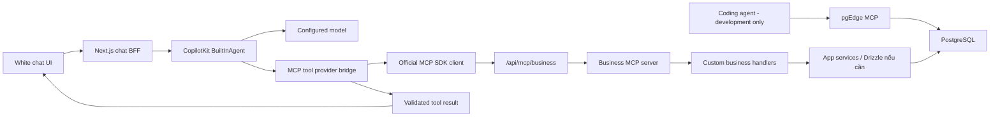

# C03 — Business MCP Tools, Context & Inline Results

Ngày: 2026-10-06. Trạng thái: **spec đề xuất để user review; chưa implement, chưa có implementation plan C03**.

Repo: `E:/thucchienai/hackathon-starter-kit`. Đây là tài liệu thiết kế; file tree và contracts bên dưới là đề xuất, không phải code đã tồn tại.

## 1. Mục tiêu và quyết định đã xác nhận

C03 giúp team tự viết logic bài toán thành MCP tools, để chat agent discover/call và hiển thị kết quả. Khi đổi đề, thêm handler + schemas + registration/allowlist; giữ nguyên chat, MCP transport và agent bridge.

User đã xác nhận:

- App local một người dùng; không cần multi-tenant hoặc login lúc này.
- Business MCP server host cùng Next.js tại `/api/mcp/business`, module riêng để có thể tách service sau.
- Thêm server qua backend config: URL, token và tool allowlist; không xây Settings UI.
- Dùng MCP TypeScript SDK chính thức; CopilotKit giữ chat và agent loop.
- pgEdge MCP **chỉ cho coding agent dùng khi phát triển**, không thuộc app tools/config/domain packs. App đọc/ghi PostgreSQL qua Drizzle/repositories.
- Technical failures trong chat chỉ hiện đúng `Chưa kết nối`; không in stack trace hoặc trả lời giả.
- Phiên này chỉ viết tài liệu; user tự handle product code.

Các lựa chọn kỹ thuật ở phần còn lại là đề xuất để review. Scope này không triển khai toàn bộ scoring, research, ingestion hoặc các problem templates.

## 2. Hiện trạng và ba cách triển khai

Đối chiếu source hiện tại: `chat-runtime.ts` dùng BuiltInAgent nhưng `toolChoice: "none"`, `maxSteps: 1`; MCP adapter mới có README. Client adapter/controller chỉ project user/assistant text, làm mất tool calls/results. HTTP boundary xóa browser-supplied tools/forwardedProps. C02 durable history chưa xây.

| Cách | Lợi ích | Chi phí / quyết định |
|---|---|---|
| Business MCP cùng Next.js + official SDK client bridge | Một app/container; handler tách khỏi transport; dùng MCP thật và kiểm soát policies | **Chọn theo user**; cần bridge và run lifecycle |
| Business MCP service/container riêng | Deploy độc lập, nhiều clients dùng chung | Để sau; thêm vận hành và auth/network config |
| Chỉ đăng ký trực tiếp CopilotKit server tools | Ít wiring, vẫn gọi được business functions | Không đáp ứng mục tiêu expose custom tools qua MCP; không là đường chạy của C03 |

P0 chỉ có một business connector Streamable HTTP. SSE cũ, stdio/process spawning và nhiều third-party servers không nằm trong bản đầu.

## 3. Kiến trúc và trách nhiệm



- **Business handler:** thực thi logic, nhận typed input/context, trả plain data đúng output schema. Không phụ thuộc React, CopilotKit hoặc MCP wire types.
- **Tool catalog:** lưu schemas, description, version và policy; không phải workflow engine. Handler có thể gọi reusable capability khi cần, không bắt mỗi call tạo business run/artifact.
- **MCP server:** bọc handler thành protocol tools, enforce schema/policy, encode kết quả.
- **MCP client/bridge:** connect, discover, lọc allowlist, ánh xạ schema/name, gọi `callTool`, validate output và cung cấp tools cho agent.
- **Run scope:** sở hữu client, AbortController, call budget, call/result records và cleanup cho một execution.
- **Chat UI:** render status/kết quả đã validate; không thực thi tool hoặc giữ bearer token.

Route dùng Next.js Node runtime và Web Request/Response. SDK v2 có `createMcpHandler`/`McpServer`; factory dựng instance cho mỗi HTTP request. App đặt auth/Host/Origin guards trước handler và giữ handlers độc lập để tách service sau. [SDK HTTP serving](https://github.com/modelcontextprotocol/typescript-sdk/blob/main/docs/serving/http.md).

## 4. Code structure dự kiến

```text
src/
  app/api/mcp/business/route.ts       # thin HTTP mount, Node runtime
  contracts/chat-tools.ts            # serializable call/result/status contracts
  core/tools/definition.ts           # BusinessTool + execution context
  server/mcp/
    config.ts                        # business URL/token/allowlist/limits
    catalog.ts                       # registrations, not tool logic
    business-server.ts               # official MCP server factory
    http.ts                          # bearer + Host/Origin + body bounds
    errors.ts                        # safe MCP errors + diagnostics
    tools/demo-budget/
      schemas.ts                     # input/output validators
      handler.ts                     # deterministic business calculation
      definition.ts                  # metadata + schemas + handler
  adapters/mcp/
    business-client.ts               # official client + HTTP transport
    tool-provider.ts                 # .tools() -> AI SDK ToolSet
    results.ts                       # MCP result decode/output validation
    run-scope.ts                     # cancellation, budgets, cleanup
  adapters/agents/
    run-scoped-agent.ts               # lifecycle delegate to BuiltInAgent
    chat-runtime.ts                  # register bridge, enable tool calling
    chat-client.ts                   # preserve full message/tool protocol
  ui/chat/
    tool-renderers.tsx               # render-only registrations
    tool-result-view.tsx             # bounded generic result preview
    controller.ts                   # preserve call/result pairs and statuses
```

Tên file có thể điều chỉnh khi viết plan theo API đã kiểm chứng; boundary/trách nhiệm phải giữ như trên. `src/server/mcp/tools/` là chỗ thêm tools trước C05. C05 có thể chuyển registrations sang pack catalog mà không sửa HTTP/client bridge. Business schemas/handlers không import pgEdge adapter.

## 5. Contract cho người viết tool

Definition tối thiểu:

| Field | Nghĩa |
|---|---|
| `name`, `version`, `description` | Stable tool identity và mô tả để model biết lúc nào dùng |
| `input`, `output` | Zod schemas, JSON-representable; không chứa functions/classes |
| `kind` | `read` hoặc `compute` trong C03 P0 |
| `execute(input, context)` | Handler trả output data; không trả MCP content blocks |
| `context` | Server-resolved local scope, correlation IDs, AbortSignal và deadline |

`threadId`, `runId`, `toolCallId` dùng để correlate, không cấp quyền. Owner lấy từ local identity trên server; không lấy từ model args, forwardedProps hay UI context. HTTP MCP requests dùng verified service credential của app và local identity; caller-provided IDs chỉ là trace metadata.

Server và bridge reuse cùng typed catalog cho connector business nội bộ. Server sinh JSON Schema từ validator; bridge đối chiếu discovered tool/schema với registration được phép trước khi expose cho agent. Tool/schema không khớp hoặc không hỗ trợ thì reject, không dùng fallback `any`. Không xây universal JSON-Schema converter cho mọi remote MCP trong P0.

Tên MCP gốc ví dụ `calculate_budget`; tên expose cho model/UI luôn `business__calculate_budget`. Namespace cố định theo connector ID, chỉ dùng chữ/số/underscore, tối đa 64 ký tự; reject collisions/reserved SDK names lúc load catalog. Không đổi tên tùy theo thứ tự discovery.

MCP output dùng `structuredContent` object theo output schema và text representation cùng nội dung để tương thích. Bridge kiểm tra `isError`, JSON shape và schema trước khi cho model/UI dùng. Không có structured output hợp lệ thì call fail; không suy đoán dữ liệu từ prose.

## 6. Tool mẫu để chứng minh plug-and-play

Chọn **`calculate_budget`**, một custom compute tool chạy logic thật và không cần provider, DB hoặc API ngoài. Đây là tool mẫu nhỏ, không phải Finance template đầy đủ.

Input:

```json
{
  "currency": "VND",
  "budgetMinor": 5000000,
  "items": [
    { "label": "Di chuyển", "amountMinor": 2000000 },
    { "label": "Lưu trú", "amountMinor": 1000000 },
    { "label": "Ăn uống", "amountMinor": 500000 }
  ]
}
```

Output:

```json
{
  "currency": "VND",
  "totalMinor": 3500000,
  "remainingMinor": 1500000,
  "overBudget": false,
  "itemCount": 3
}
```

Schemas giới hạn currency là ba chữ hoa, tối đa 100 items, label 1–120 ký tự, amounts/budget là safe nonnegative integers không quá `10^12`. Mọi amount cùng currency và minor unit; tool không đổi tỷ giá. Handler tính total, remaining và overBudget; kiểm tra safe arithmetic. UI dùng output xác nhận từ handler, không để model tự khai kết quả card. Thiếu budget/items thì agent hỏi bổ sung thay vì bịa input.

Budget bị vượt là **kết quả nghiệp vụ hợp lệ**, không phải technical error. Thêm tool thứ hai trong acceptance bằng một definition khác rồi register/allowlist; không sửa route, transport, agent loop hoặc transcript renderer.

## 7. HTTP server và config

- Endpoint `/api/mcp/business`; delegate protocol requests cho official handler. Không tự viết JSON-RPC dispatcher. Các methods không hỗ trợ trả đúng HTTP/MCP semantics; không yêu cầu GET mở subscription trong P0.
- `BUSINESS_MCP_ENABLED=false` mặc định: chat text vẫn dùng C01. Khi bật thì `BUSINESS_MCP_URL`, `BUSINESS_MCP_TOKEN` và allowlist là config server-only bắt buộc.
- URL do backend config chọn, không lấy từ browser/model args. Host dev có thể dùng `http://127.0.0.1:3100/api/mcp/business`; app container gọi endpoint cùng container `http://127.0.0.1:3000/api/mcp/business`. Port host phải theo dev config thực tế.
- Token riêng tự sinh local, không phải provider API key, không reuse `MCP_AUTH_TOKEN` của pgEdge. Không có `NEXT_PUBLIC_` credential. App và business route dùng cùng business credential; missing/bad token bị từ chối trước handler.
- Guard Host theo origins được cấu hình; Origin nếu có phải được phép. Internal requests không có Origin vẫn cần bearer hợp lệ. Không mở wildcard CORS hoặc forward browser auth/cookies tới MCP.
- Body tối đa 256 KiB; validation trước dispatch. Giới hạn result cần áp dụng trước gửi kết quả và trong client response reader để không buffer vô hạn. Không cho token theo redirect sang host khác.
- Catalog server chỉ advertise enabled/allowlisted `read`/`compute` tools. Unknown/disabled tools bị deny cả discovery lẫn direct call. Không suy ra quyền từ MCP annotations.

App không connect trong import/build. Model chưa cấu hình vẫn dùng `Chưa kết nối`, không dựng assistant fixture. Live agent acceptance cần configured model hỗ trợ native tool calls; test protocol/handler/bridge dùng local deterministic tests không cần key.

## 8. SDK-to-agent bridge và run lifecycle

Chọn official SDK v2 client/server stable. Exact patch pin khi lập plan/compatibility probe; không cài GitHub main hoặc prerelease. Repo hiện pin CopilotKit runtime/react-core `1.77.0` qua v2 subpaths và AI SDK `6.0.300`; C03 không yêu cầu upgrade toàn stack.

Official MCP `Client` có `listTools`/`callTool`; CopilotKit `mcpClients` cần provider có `.tools()` trả AI SDK ToolSet. Viết thin provider dùng local input validator và executor gọi official client. Không truyền thẳng MCP Client vào `mcpClients`. Client do app sở hữu/đóng; CopilotKit vẫn chạy model loop. [MCP SDK client](https://github.com/modelcontextprotocol/typescript-sdk/blob/main/docs/get-started/first-client.md), [CopilotKit MCP providers](https://docs.copilotkit.ai/mcp-servers).

Đề xuất per-run client trong bản đầu:

1. Acquire existing execution gate, tạo run scope.
2. Nếu business MCP enabled: connect/initialize/discover trong scope, verify schema/allowlist.
3. Tạo inner BuiltInAgent cho execution với provider đã bind scope; lifecycle delegate trả AG-UI stream, không tự viết model loop.
4. `toolChoice: "auto"`, `maxSteps: 4`, tối đa 3 tool executions tổng cộng mỗi run, tối đa 1 execution tool đồng thời. Requests song song từ model vào một queue của run scope; deadline tính cả thời gian chờ. Budget check atomic; vượt budget fail run, không tiếp tục tự gọi tool.
5. Model chọn tool → input validate → `callTool` → output validate → tool result → model trả lời.
6. Complete/error/unsubscribe/Stop/deadline đều abort in-flight work và close client một lần. Client không dùng chung mutable context giữa runs.

Wrapper gắn cancellation của outer AG-UI subscription với inner agent và MCP scope; phải thử với runner/clone semantics của version đã pin trước khi wire vào runtime. Không fallback sang agent loop tự viết nếu probe fail. AI SDK tool execute options có abort signal; ghép với run signal và call deadline, không giả định `defineTool.execute(args)` cung cấp execution context.

Limits đề xuất: connect/discovery 5 giây; mỗi tool call 15 giây hoặc remaining run deadline, tùy cái nhỏ hơn; whole run giữ 120 giây; tool input/result tối đa 32 KiB mỗi call; không tự retry MCP call. Handlers có async I/O phải honor signal/deadline; không dùng Promise.race rồi bỏ request chạy ngầm. Client close không đóng shared business HTTP handler của app.

Khi MCP enabled nhưng connector không sẵn hoặc discovery thất bại: run fail bằng notice chung trước model call, không âm thầm bỏ tools rồi để assistant bịa kết quả. Khi feature disabled: chat text bình thường. Persistent clients/cache hot-reload/reconnect streams để sau.

## 9. Error, Stop và UI

UI tối thiểu là tool status row và một result preview có text/field-value/table khi data phù hợp. Không yêu cầu ChartCard/RiskCard/ReportView/map hoặc full BlockRenderer. `useRenderTool` chỉ render server results theo tên exposed, không có browser executor. [CopilotKit server tool rendering](https://docs.copilotkit.ai/server-tools).

- `pending`: có call ID/name, đang nhận/validate arguments; không execute arguments chưa hoàn chỉnh.
- `running`: backend bridge đã dispatch `tools/call`; UI hiện “Đang xử lý”. Không khẳng định handler đã tới một stage nội bộ hoặc phần trăm progress.
- `completed`: render validated output; assistant tổng hợp sau kết quả. Có giới hạn rows/text hiển thị và label preview nếu rút gọn.
- `failed`: technical failure chỉ dùng `Chưa kết nối`; không render raw MCP content/error. Không thêm notice trùng với notice của chat controller.
- `interrupted`: user Stop giữ output/partial trước đó, không báo technical failure hoặc success. Late result không được append hoặc gửi cho model.

SDK AG-UI tool start/args/result events giữ nguyên protocol identity. Bridge emit thêm một validated `CUSTOM` event `business_tool_status` khi dispatch hoặc kết thúc lỗi/cancel, qua run-scoped event sink; merge vào stream trước UI projection. Payload chỉ gồm correlation IDs, exposed tool name và status; không chứa token/stack/raw transport. Duplicate status updates reconcile theo toolCallId, terminal state không regress. Không yêu cầu handler-level MCP progress notifications trong P0.

Decode failure, `isError`, transport exceptions, invalid schema, auth/deny/timeout đều đi qua tool failure boundary **trước model và browser**. Failure boundary latch run failed, abort inner agent/calls, suppress subsequent assistant text/normal success terminal và emit một sanitized failure terminal. Không chỉ rewrite RUN_ERROR trong khi raw TOOL_CALL_RESULT đã leak. Không chuyển lỗi thành success result để model giải thích.

Diagnostics chỉ có safe code + correlation IDs + phase/duration; không log token, full HTTP headers, raw args/output hay stack vào chat. Nội dung kết quả là data, không instructions có quyền bật tools hoặc đổi endpoint.

## 10. Context và C02 handoff

C03 P0 giữ protocol messages gồm assistant tool calls và tool results, stable `toolCallId` + `runId` + `threadId`, cùng UI projection typed. Không convert toàn bộ history thành text. Tool records không tạo assistant bubbles giả và không làm Copy vô tình copy JSON transport.

Client text projection hiện tại phải mở rộng. Run inputs chỉ có complete call/result pairs từ successful previous executions; orphan/interrupted calls không được replay như success. Transcript/token trimming giữ hoặc bỏ cả pair. Browser messages là untrusted conversational input, không cấp quyền hay xác nhận DB/business state; tool authority nằm ở server execute/validate, dữ liệu cần quyết định nghiệp vụ phải đọc lại qua tool khi cần.

Manual Retry dùng checkpoint của lượt thất bại và runId mới; không duplicate user message, không render tool event cũ như event run mới. Retry có thể tính lại read/compute tool; không tự resume side effects. Hydrate/re-render không execute handler lần nữa.

Contract persisted call record gồm: scope, threadId, runId, toolCallId, connectorId, toolName/version, validated input, status, validated output nếu completed, startedAt/finishedAt và safe error code nếu failed. Đây là handoff cho C02; không ghi một transcript thành hai kho độc lập. Result schema version cần lưu để renderer biết cách đọc.

Trước C02, records/transcript chỉ trong phiên/process hiện tại; reload/restart mất dữ liệu, không tuyên bố durable history. Sau C02 phải kiểm chứng call/result replay và access scope trong repository/runtime integration. UI selection context (`CTX-02`), shared business state (`CTX-03`) và frontend executors (`TOOL-04`) ở P1, không mở browser tools/forwardedProps tùy ý trong C03 P0.

## 11. Không nằm trong C03

pgEdge integration với app; multi-tenant/auth UI; external side-effect tools/HITL; MCP Apps/A2UI; RAG/long-term memory; document parsers/crawler; full business engines; multi-agent/model fallback; server-manager Settings; multi-server OAuth/stdio/SSE legacy; resumable in-flight executions.

Compose hiện còn truyền hai biến pgEdge chưa dùng vào app; việc bỏ chúng là cleanup infra riêng đã ghi trong [Docker doc](../../docker-local.md). Business MCP wiring không được đọc/reuse các biến đó. Docs-only phiên này không đổi compose, packages hoặc running services.

## 12. Acceptance và checks cần đưa vào plan

| Gate | Bằng chứng cần có |
|---|---|
| MCP server thật | SDK Client initialize → tools/list → callTool qua HTTP route; budget output đúng 3.5m total/1.5m remaining; không gọi handler trực tiếp để thay protocol check |
| Add tool | Tool thứ hai đăng ký/allowlist là agent dùng được; không sửa route/transport/agent loop; UI fallback đọc được output |
| SDK compatibility | v2 transport/server/client + schema/result mapping + provider .tools() + run delegate/runner/clone/Stop hoạt động với pinned CopilotKit/AI SDK |
| Agent path | Actual MCP endpoint + deterministic test model tool call → real handler output → tool result → assistant; thêm một smoke với configured live tool-capable model trước nghiệm thu live AI |
| Tool policy | Direct unknown/disabled call denied; invalid args/output denied; token/Host/Origin failures; UI cannot override connector/scope/tools |
| Errors | Secret-bearing MCP error, isError và malformed output không tới model/browser/log args; run failed, notice đúng một lần, không fake completed |
| Cancellation | Stop/disconnect/deadline abort outbound MCP request và cooperative handler; no late append; client closes, gate released; subsequent run works |
| Boundaries/budgets | Discovery/call deadline; max call count/concurrency; oversized request/response; business token không vào browser; pgEdge không được advertise/connected từ app |
| Chat regression | C01 Send/Stop/Retry/New chat/copy/white responsive UI còn đúng; hỏi tiếp nhận được tool context; không duplicate/orphan pairs |
| C02 dependent | Sau C02: reload/restart giữ call/result/status, replay không re-execute, scope checks pass; gate này không ngăn thiết kế/live session demo C03 trước C02 |

Không coi infrastructure pgEdge smoke là bằng chứng C03. Khi triển khai dùng Bun package/scripts với Node runtime đã chọn: `bun add --exact`, `bun run check`, `bun run test`, `bun run build` và targeted E2E; không dùng npm/pnpm hoặc Bun native test runner cho Vitest suite.

## 13. Trình tự để lập implementation plan

1. Compatibility probe local: official v2 server/client HTTP + AI SDK provider + run delegation/abort.
2. Typed definition/catalog, sample handler và business MCP HTTP endpoint/policies.
3. Per-run client/provider, input/output validation và fatal failure boundary.
4. Wire runtime; mở protocol messages/controller + inline result renderer.
5. Agent-path acceptance, cancellation/failure limits, docs/env handoff và C02 replay contract.

Đây là thứ tự kỹ thuật đề xuất, chưa phải implementation plan task-by-task. Chuyển sang writing-plans sau khi user review spec này; không tự triển khai product code.
