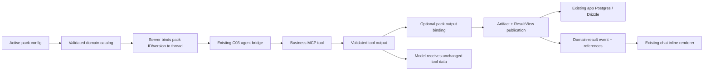

# C05 — Domain Plug-in & Artifact Bridge

Ngày: 2026-10-06. Trạng thái: **spec đề xuất để user review; chưa có implementation plan hoặc code C05**.

Repo duy nhất: `E:/thucchienai/hackathon-starter-kit`. C02/C03 đã được handle riêng; spec này định nghĩa integration với các phần đó, không mở lại hoặc tạo backlog trùng. Chỉ viết tài liệu trong phiên này.

## 1. Kết quả cần đạt

Khi nhận đề, team thêm một pack chứa **schema + prompt + tools + sources + rules + presenter + branding**; workflow là tùy chọn. Pack điều chỉnh agent và cách trình bày kết quả, không viết lại chat/history/MCP transport.

Một custom tool có thể trả JSON đơn giản như C03. Nếu pack cần một kết quả có thể mở lại/tra cứu, pack khai báo output binding để platform tạo typed artifact, lưu provenance và đưa ResultView vào chat. Presenter không gọi model, network hoặc database.

Giữ các quyết định đã chốt: Next.js + TypeScript + Bun package/scripts, Node runtime, CopilotKit giữ agent loop, business MCP cùng app tại `/api/mcp/business`, PostgreSQL/Drizzle cho app persistence, một người dùng local. **pgEdge MCP chỉ cho coding agent**, không thuộc app/domain packs. Technical failures trên chat dùng đúng `Chưa kết nối`.

Đề xuất kỹ thuật P0: **một active pack mỗi app deployment, chọn bằng backend config; mỗi thread pin pack ID/version**. Không thêm pack picker vào UI lúc này. Đây là lựa chọn để review, không phải quyết định user đã xác nhận trước đó.

## 2. Hiện trạng và lựa chọn kiến trúc

Đối chiếu checkout gốc:

- `DomainManifest` có identity/version/branding/inputFields/examples/toolNames và client-safe metadata.
- `DomainDefinition` hiện bắt buộc `workflow`, có input schema, prompt, sources và pure presenter.
- `validateDomain` chỉ kiểm tra artifact producers qua workflow steps.
- `ArtifactEnvelope`, schema registry, `RunSnapshot`, `UIBlock` và `ResultView` đã có contracts.
- `ArtifactRepository` hiện chỉ có get/list; chưa có write/publication contract cho chat tools.
- Các example packs vẫn là seeds/fixtures. Không coi chúng là engines hoặc production packs đã chạy.

Trạng thái checkout này không đại diện tiến độ implementation của các task C02/C03. Spec C03 là boundary đầu vào; implementation plan C03 đã xuất hiện trong worktree `chat-tools-mcp` và không bị chỉnh trong C05.

| Hướng | Lợi ích | Chi phí / lựa chọn |
|---|---|---|
| Extend DomainDefinition hiện có, workflow optional, thêm typed tool/result bindings | Reuse shared contracts, một pack interface; tool đơn lẻ không cần executor | **Đề xuất chọn**; cần cập nhật validation và migration consumers |
| Mỗi pack một app/agent riêng | Ít abstraction cho demo đầu tiên | Copy chat/history/transport và khó reuse |
| Plugin loader động/marketplace, mỗi pack một service | Deploy và tải pack độc lập | Không cần cho starter local; tăng vận hành và sandbox/versioning |

P0 đăng ký packs bằng imports server-side có chủ đích. Không tải code từ URL, evaluate prompt thành code hoặc tự scan thư mục để chạy module lạ.

## 3. Kiến trúc và ownership



**Platform C05:** pack registration/validation/resolution, runtime projection, artifact publication/read APIs, scope/version/idempotency, minimal result-renderer integration và handoff docs.

**Pack/template author:** business input/output schemas, prompt, custom tool definitions dùng C03 contract, rules/config, source requirements, output bindings và pure presenter. FE layouts/problem-template workflows vẫn do template owner xây.

**C02 owner:** thread lifecycle, authoritative transcript/execution identities, persistence/replay. C05 dùng các boundaries đó, không tạo kho transcript hay global execution gate thứ hai.

**C03 owner:** MCP transport, tool validation/execution, budgets, cancellation, error projection. C05 thêm integration hooks, không fork MCP client/provider hoặc tạo tool executor khác.

## 4. Pack contract — mở rộng, không tạo interface song song

Giữ `DomainDefinition`, `DomainManifest`, `PresentationContext`, `ArtifactDraft`, `RunSnapshot`, `UIBlock` và `ResultView` làm shared contracts. Thêm fields cho chat integration và biến workflow thành optional; không dựng một ChatDomainPack cạnh tranh với DomainDefinition.

| Field | Contract đề xuất |
|---|---|
| `manifest` | DomainManifest hiện có; ID/version bất biến, client-safe branding và examples |
| `inputSchema` | Structured domain input; parsed value phải JSON-safe |
| `systemPrompt` | Server-owned domain instruction, ghép sau base safety/error policy; không chứa credentials |
| `tools` | C03 BusinessTool definitions hoặc exact references tới shared registered tools; version bắt buộc |
| `sources` | Source profile IDs; không tự fetch hoặc bật crawler khi register |
| `rules` | Optional JSON-safe config cho handler qua server-resolved execution context; không là arbitrary expressions |
| `requirements` | Required/optional feature IDs cho model tools, artifact persistence, sources/parsers hoặc executor |
| `resultBindings` | Tool identity/version → typed output schema → ArtifactDraft + validated domain run input |
| `requiredArtifactKinds` | Artifact producer requirements; chat pack P0 có đúng một kind bằng output kind của binding, workflow packs giữ requirements của workflow |
| `workflow` | Optional WorkflowDefinition hiện có; chạy chỉ khi executor tương ứng sẵn, không dùng fake empty workflow để vượt gate |
| `present(context)` | Pure projection của validated snapshot/artifacts/reference data → UIBlock[] |

Tool schemas/execution vẫn do C03 sở hữu; pack không khai báo handler signature khác. `manifest.toolNames` phải khớp names derived từ registered tools; không dùng metadata client làm quyền execute. Nguồn/rules/requirements thuộc server definition, không gửi raw server config vào manifest.

`inputSchema` áp dụng cho structured pack submissions và `resultBinding.toRunInput(...)`, không parse nguyên free-text chat bằng một business object schema. Agent hỏi thêm dữ liệu khi thiếu tool inputs; không bắt mọi chat turn phải có form/workflow.

Workflow packs cũ vẫn giữ semantics hiện có. Validation chỉ gọi `validateWorkflow` khi workflow tồn tại; khi không có workflow, required artifact producers được kiểm tra qua resultBindings. Hai mode cùng reuse envelope/presenter, không duplicate schemas.

Chat pack P0 có một artifact-producing binding; các tools còn lại có thể trả JSON không tạo artifact. Một binding tạo một artifact và một result collection. Multiple-artifact/multiple-binding aggregation hoặc workflow result projection là mở rộng sau khi có consumer thật, không giả định một call đã hoàn thành mọi output của một workflow.

Artifact kinds có namespace, ví dụ `budget.summary@1`. Shared artifact definition chỉ register một lần; nhiều packs có thể reference cùng exported definition. Conflicting registrations cùng kind/version bị reject; không overwrite theo import order hoặc dedupe chỉ bằng JSON Schema nếu validators có transforms khác nhau.

## 5. Registration, readiness và thread lifecycle

- `ACTIVE_DOMAIN_ID` và `ACTIVE_DOMAIN_VERSION` chọn pack trên server. Hai biến unset giữ generic C01/C03 behavior; không tự bật sample pack trong production.
- Khi có active config, pack ID/version phải tồn tại và toàn bộ required features/registrations/schema bindings phải hợp lệ. Unknown/partial config không âm thầm fallback sang pack khác.
- Catalog validation là explicit initialization/readiness check, không connect DB/model/MCP trong module import hoặc Next build.
- Thread mới pin pack ID/version từ config server. Model/browser không được thay pack bằng forwardedProps, prompt, tool args hoặc custom headers.
- Không đổi pack trong một thread đã có messages/results. Đổi config tạo thread mới; thread cũ vẫn đọc được lịch sử và immutable result snapshots.
- Nếu active deployment pack/version khác thread đã pin, P0 chỉ mở thread cũ để đọc; gửi lượt mới báo `Chưa kết nối`, user có thể New chat. Không tự rebind hoặc migration lịch sử.
- Required feature thiếu: pack run unavailable. Optional feature thiếu: ẩn/disable phần tương ứng bằng readiness metadata, không tạo kết quả giả. Optional tool không sẵn thì không advertise.
- Branding đọc từ public manifest. Giữ theme trắng C01; accent chỉ nhận color token/hex hợp lệ, title/logo không chứa executable markup. Không đưa layout hoặc arbitrary CSS vào manifest.

P0 không có runtime hot-reload pack/version hoặc auto-upgrade history. Version cũ không bị presenter mới diễn giải lại; incompatible changes tăng pack/artifact version và có migration riêng khi thực sự cần.

## 6. Pack → agent/MCP integration

Runtime projection cung cấp prompt, exact tool set và server-resolved pack context cho C03. Tool được phép là intersection của **pack tools ∩ server catalog ∩ deployment allowlist ∩ readiness/scope**. Enforce cả ở discovery/provider lẫn MCP direct-call dispatch, không chỉ giấu UI.

Giữ exposed names ổn định theo C03 (`business__calculate_budget`), không tự thêm prefix thứ hai làm renderer đổi tên. Hai definitions cùng name/version khác implementation hoặc schemas bị reject ở catalog; hai packs được reference một shared tool khi contract giống nhau.

Business MCP server lấy active pack/rules từ server resolver. Context chỉ gồm local scope, pack ID/version, approved rules và execution IDs/deadline/signal. Không tin identity/pack/rules gửi từ browser/model. Rules đổi hành vi phải đi cùng pack version mới để replay/provenance không bị lệch.

C05 cần hook **sau MCP output validation, trước tool execute promise resolve** để publish artifact khi có binding. Hook không cần cho tool trả JSON đơn giản. Nếu binding/publication/presenter fail thì dùng fatal failure boundary C03; không gửi success result cho model trước khi publish xong.

SDK result-rendering chỉ là phần UI; execution vẫn server-side. C05 giữ model-facing tool data đúng schema C03; artifact/view references đi qua domain-result event riêng, không nhét fields ngoài schema vào MCP output. [CopilotKit server tools](https://docs.copilotkit.ai/server-tools).

UI context nếu dùng sau này là data tham khảo, không là permission hoặc server pack selection. P0 không cần mở browser tool executor/shared-state features để chọn pack. [Read-only context](https://docs.copilotkit.ai/shared-state/agent-readonly).

## 7. Artifact bridge và phân biệt identities

| Identity | Nghĩa |
|---|---|
| `threadId` | Hội thoại/lifecycle do C02 sở hữu |
| `agentRunId` | AG-UI execution ID của C03; không gọi nhầm là business run |
| `toolCallId` | Một invocation trong agent execution |
| `businessRunId` | Result collection khi một bound tool output được publish |
| `artifactId` | Một immutable typed business result |

**P0 chọn một business result run cho mỗi bound tool call thành công.** Unbound tool hoặc chat turn bình thường không tạo business run. Snapshot reuse `RunSnapshot`: pack ID/version, validated domain input từ binding, `steps: []`, artifact list và status/revision. Đây là result collection không có workflow executor; không tạo fake workflow steps. Nếu workflow thật có sẵn, nó giữ run/steps riêng và có adapter sau.

Reuse ArtifactEnvelope nguyên shape. `runId` trong envelope và ResultView là **businessRunId**, không phải agentRunId. Ownership/thread/execution/tool/pack association lưu ở server publication records:

```text
ArtifactBinding
  workspaceId, userId, threadId, agentRunId, toolCallId
  packId, packVersion, bindingId
  businessRunId, artifactId, artifactKind, artifactVersion
```

IDs/timestamps/workspace và provenance do server tạo. Tool binding chuyển validated output thành ArtifactDraft; input/model không được chọn owner/run IDs. `provenance.capabilityId` có thể là `tool.business.calculate_budget` với tool version, không giả định capability executor đã chạy. `stepId` bỏ trống khi không có workflow step. source/evidence/inputArtifact references phải resolve cùng scope; sample compute có arrays rỗng, không bịa citations.

Publication pipeline:

1. Kiểm tra run chưa terminal/cancelled và thread binding khớp pack.
2. Validate tool output theo C03, `toRunInput` theo pack inputSchema và ArtifactDraft theo registered kind/version + JSON-safe data.
3. Dựng candidate result snapshot, load required reference data, gọi pure presenter và validate view/references.
4. Một DB transaction ghi result run, artifact, binding, immutable ResultView và publication outbox; rollback toàn bộ nếu có lỗi.
5. Sau commit, return original validated tool data cho agent và emit safe `domain_result` event/references cho chat.

Unique publication key: `(workspaceId, userId, threadId, agentRunId, toolCallId, bindingId)`. Retry delivery cùng key/payload trả cùng IDs/view, không tạo artifact mới; cùng key khác fingerprint là conflict. Manual Retry với agentRunId mới có thể tạo result mới, đúng là invocation mới.

Outbox chỉ reconcile domain-result references/events vào C02, không tạo transcript store thứ hai hoặc chạy lại business handler. C02 vẫn là nguồn message/tool-call status; consumer append/dedupe theo publicationId. Persisted ResultView cho phép đọc history khi pack version không còn active hoặc presenter đã đổi.

Cancel và publication phải serialize qua execution lifecycle/transaction boundary của C02: cancel đã thắng thì không publish; commit đã thắng trước Stop thì artifact vẫn là kết quả hợp lệ của tool đã hoàn tất, nhưng không append late event. Chỉ unsubscribing frontend không đủ để khẳng định transaction đã cancel.

Completed tool result run độc lập với assistant execution sau đó: model failure/Stop không biến phép tính đã publish thành giả hoặc xóa result. Chat execution giữ failed/interrupted như C03; UI có thể giữ những results đã xác nhận trước đó.

## 8. Persistence và read APIs

C05 dùng cùng Postgres/Drizzle connection, migrations, local identity và thread ownership của C02. Không setup Docker/DB mới hoặc thay history runner. Thêm minimal write/publication port cạnh read ArtifactRepository hiện có; workflow `commitStep` không phải đường ghi của một tool không có steps.

Persistence cần result-run records, artifacts, scoped publication bindings, immutable view snapshots và outbox. Publication record lưu thêm `viewSchemaVersion: 1` và public pack metadata snapshot để decode/gắn nhãn lịch sử mà không phụ thuộc active catalog. Tên tables/files cụ thể theo conventions C02 lúc lập plan; semantic fields/uniqueness ở phần 7 là bắt buộc. Không lưu token/raw transport; input/output chỉ là data đã validate và có giới hạn kích thước.

HTTP handoff đề xuất:

| API | Nội dung |
|---|---|
| `GET /api/chat/domain` | Public active manifest/pack reference, availability, supported result types; không có handlers/secrets |
| `GET /api/chat/threads/:threadId/results/:businessRunId` | Scoped validated ResultView + snapshot + required rendering references |
| `GET /api/chat/threads/:threadId/artifacts/:artifactId` | Scoped typed artifact và public correlation metadata |

Read scope kiểm tra owner/workspace **và thread binding**, không chỉ UUID/workspace. Data không thuộc thread hiện tại hoặc đã xóa không được resolve. Archive giữ kết quả readable; thread delete tuân theo C02 retention semantics, đồng thời revoke result access ngay. Nếu C02 hard-delete thì cascade publications/artifacts/results thuộc thread; nếu soft-delete thì deny reads và purge theo policy đó. Không chọn policy thread lifecycle thứ hai.

Không biến `GET /api/domains`/demo routes cũ thành production pack readiness bằng fixture. Nếu reuse route/catalog hiện có phải thêm explicit availability/kind; seeds chưa có tools/features không được advertise như working business pack.

## 9. Presenter và UI handoff

Reuse `PresentationContext` với validated RunSnapshot; `get(kind, schema)` chỉ đọc artifact đã preload. sources/evidence preload trước presenter. Thêm claims/datasets vào context khi consumer có feature thật, không fetch trong `get()` hoặc card.

Presenter trả UIBlock[]; service dựng immutable ResultView có businessRunId, `revision: 1`, completed status và title cho một successful result publication. Delivery retries giữ nguyên view/revision. Không thêm mutable view updates trong P0; workflow/incremental view revisions có adapter riêng sau này. Validate `UIBlockSchema`, `ResultViewSchema` và cross-references: artifact/source/evidence/claim/dataset/action IDs, report missing refs/cycles. Không reuse demo label/synthetic bundle làm production result DTO; reuse thành phần schemas và tách cross-reference validator dùng chung thay vì copy logic.

`domain_result` event gồm publicationId, threadId, agentRunId, toolCallId, pack ID/version và businessRunId/artifact references. Event không chứa bearer token hoặc unrestricted URLs. Chat nhận event rồi đọc result qua scoped BFF; model-facing tool output vẫn nguyên data schema.

Nếu preview fetch thất bại sau publication thành công, giữ trạng thái tool/business result đã hoàn tất; preview báo unavailable với notice chung và manual refetch. Không đổi execution đã completed thành failed, không rollback artifact hoặc chạy lại handler để sửa lỗi đọc UI. Failure trong validation/publication trước commit vẫn làm run fail qua C03 như phần 6.

Presenter là authoritative server projection của validated data. Model không tự sinh JSX, block props hoặc artifact IDs được coi như business truth. Unknown result references/schema versions là technical failure, không render dummy cards. Browser render plain data/Markdown đã sanitize, không evaluate code.

C05 chỉ cần adapter/rendering cho **metric, warning, markdown** của pack mẫu, trong trắng UI hiện có; không xây đủ 19 cards, ChartSpec/report exporter hoặc problem-template FE. Dùng shared UIBlock props, không chép types vào UI. Full generic result library là X07.

History render từ persisted validated ResultView, không gọi lại presenter/handler/model. Nếu pack không còn active, giữ public pack metadata snapshot đủ để gắn đúng nhãn lịch sử. Unsupported saved block type/version đi qua notice chung, không tự tính lại kết quả.

## 10. Pack mẫu và cách thêm pack mới

### Budget Review v1

- Pack ID `budget-review`, version 1; branding “Budget Review”, theme trắng.
- Dùng shared `calculate_budget@1` từ C03, exposed name `business__calculate_budget`.
- Input schema cùng shape budget/currency/items của tool; prompt hỏi budget/costs còn thiếu và dùng tool để tính.
- Rules chứa presentation thresholds/config khi cần, không định nghĩa model-generated executable rules. Bản đầu không cần custom scoring rules.
- Sources rỗng; không yêu cầu crawler/RAG/pgEdge. Requirements: native model tools, business MCP và result persistence/history integration.
- Binding output → `budget.summary@1` artifact; schema giữ currency, totalMinor, remainingMinor, overBudget, itemCount theo validated C03 output.
- Presenter tạo metrics “Tổng chi phí”, “Còn lại”; nếu overBudget thì warning nghiệp vụ, không technical notice. `sourceIds: []`, không fake evidence.
- Không cần workflow. Tool input 5,000,000 VND và costs 2,000,000 + 1,000,000 + 500,000 phải cho total 3,500,000 / remaining 1,500,000, đúng từ handler.

### Acceptance pack thứ hai

Thêm `budget-compact@1`, reference cùng tool/artifact schema nhưng prompt, branding và presenter khác (một Markdown summary). Đổi active config và tạo thread mới phải đổi behavior/result presentation mà không sửa chat transport, controller, repositories hoặc MCP bridge.

Đây là acceptance variant, không là problem template thứ hai phải xây đầy đủ. Khi cần tool mới theo đề, author thêm C03 BusinessTool definition + schemas/handler + pack registration/binding + deployment allowlist; HTTP transport giữ nguyên.

Pack author làm theo thứ tự:

1. Copy `_template` và đặt manifest ID/version/branding.
2. Viết structured input và artifact schemas.
3. Viết prompt và reference/custom tools theo C03 contract.
4. Khai báo feature/source requirements và optional rules/workflow.
5. Viết output bindings và pure presenter; thêm fixtures đúng nhãn + focused checks.
6. Register trong server catalog, validate; chọn active ID/version bằng backend config.

## 11. Code structure đề xuất

```text
src/
  contracts/domains.ts                  # reuse manifest, add serializable pack reference
  contracts/domain-results.ts          # bindings/publication event DTOs
  core/domains/
    definition.ts                      # extend DomainDefinition; workflow optional
    validation.ts                      # tool/result/features/workflow validation
    resolution.ts                      # active + thread-pinned pack resolution
    runtime-projection.ts              # prompt/tools/rules/readiness for C03
  core/artifacts/
    publication.ts                     # validated output -> atomic result publication
    definition.ts                      # write/publication port; reuse envelope
  domains/
    catalog.server.ts                  # explicit validated registrations
    catalog.client.ts                  # public metadata only
    _template/                         # update authoring example, no fake executor
    examples/budget-review/            # manifest/schema/prompt/tools/binding/presenter
  adapters/postgres/domain-results/     # transaction, records/outbox; follow C02 conventions
  server/domains/                       # composition/config/scoped read service
  ui/chat/domain-result-view.tsx        # ResultView handoff, minimal supported blocks
  app/api/chat/domain/route.ts
  app/api/chat/threads/[threadId]/results/[businessRunId]/route.ts
  app/api/chat/threads/[threadId]/artifacts/[artifactId]/route.ts
```

Đây là planned locations, không là source đã scaffold. Tên C03/C02 integration hook/port files chốt theo implementation đã bàn giao lúc lập plan. Không sửa worktree owner khác, không tạo domain-specific API routes khi generic scoped routes đáp ứng được.

## 12. Limits, errors và phạm vi loại trừ

Kế thừa C03 input/result limit 32 KiB mỗi call và run deadline/budget. Giới hạn đề xuất thêm: tối đa 32 blocks, published ResultView + inline reference data 64 KiB, tối đa một artifact mỗi binding trong P0. Dữ liệu lớn phải dùng paged artifact/dataset reference khi feature tương ứng được triển khai, không nhét blob vào transcript. Không tự truncate authoritative output để vượt schema/limit.

Registration/feature/scope/schema/reference/DB/presenter failures fail closed, diagnostic safe code/IDs; chat chỉ `Chưa kết nối`. Over-budget hoặc kết quả nghiệp vụ bất lợi là valid result. Không tự fallback sang fixture, pack khác hoặc alternate provider.

Không thuộc C05: full workflow executor, general artifact dependency graph, evidence research/RAG implementation, ingestion/parsers, full cards/templates, multi-tenant/login, pack picker, dynamic plugin loading/marketplace, version migration engine, external side effects/HITL, export/report pipeline, long-term memory, pgEdge app integration.

## 13. Acceptance cần đưa vào implementation plan

| Gate | Bằng chứng |
|---|---|
| Pack contract | Existing workflow seeds vẫn validate; chat pack không workflow hợp lệ; duplicate IDs/versions/schemas và required producer thiếu bị reject |
| Config/lifecycle | Active config server-only; thread mới pin đúng version; config change không rebind old thread; không silently fallback |
| Tool policy | Agent/discovery/direct MCP dispatch cùng pack allowlist; browser/model không đổi pack/rules/scope; missing optional tool bị loại |
| Real result path | Budget tool thật qua C03 MCP → binding → validated artifact + ResultView → inline chat; không thay handler bằng fixtures |
| Add/switch pack | Budget compact đổi config/prompt/presenter và tạo thread mới; không sửa generic transport/history/repository code |
| Identity/provenance | Envelope.runId là businessRunId; binding resolve thread/agentRun/toolCall đúng; source/evidence refs không được bịa |
| Persistence/replay | C02 integration reload/restart giữ result refs/view; hydrate không execute/present lại; không có transcript store thứ hai |
| Transaction/idempotency | Failure rollback; duplicated publication/outbox delivery không duplicate artifacts/views/events; conflicting same-key output denied |
| Cancellation | Cancel-before-commit không publish; committed-before-Stop result vẫn valid; late events không append; không tạo failed/success giả |
| Scope/lifecycle | Cross-thread/owner reads denied; archive/delete tuân C02; historical pack không còn active vẫn đọc saved view được |
| Rendering | Pure presenter; shared schemas/ref checks; invalid output/reference/unknown block có notice chung; không execute JSX/model-generated UI |
| Regression | C01/C02/C03 tests relevant còn pass; generic chat/unbound tools không tạo business runs; pgEdge không vào app |

Plan sau user review nên chia: contract/catalog + compatibility với C02/C03 → pack resolution/policy → sample pack → publication/persistence/outbox → scoped APIs/inline rendering → end-to-end pack switching/history/errors. Dependency/version upgrades chỉ khi integration evidence cần; dùng Bun scripts/Node như repo hiện tại.

## 14. Tài liệu tham chiếu

- [PRD — C05 và ownership boundaries](../../platform-build-spec.md)
- [C03 Business MCP spec](2026-10-06-chat-tools-context-design.md)
- [Build ownership](../../build-ownership.md)
- [Frontend handoff](../../frontend-handoff.md)
- Shared source contracts: `src/core/domains/definition.ts`, `src/contracts/artifacts.ts`, `src/contracts/runs.ts`, `src/contracts/ui/blocks.ts`, `src/contracts/ui/result-view.ts`.

Chỉ viết implementation plan sau khi user review spec; phiên này không code và không mở lại C02/C03.
